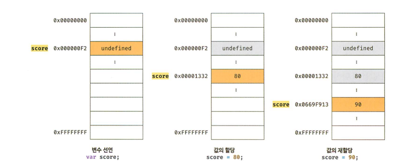
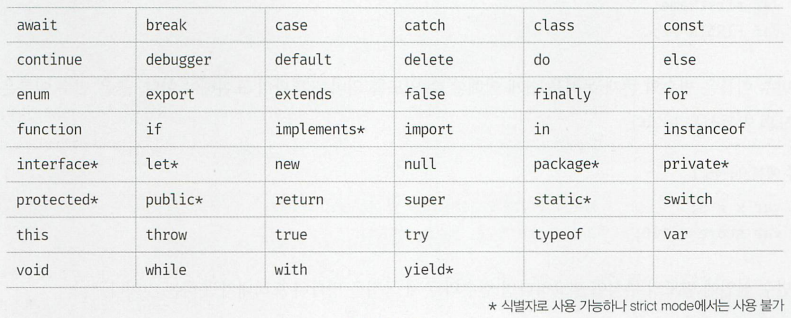

## 4장 변수

#### [1. 변수란 무엇인가? 왜 필요한가?](#1-변수란-무엇인가?-왜-필요한가?-1)
#### [2. 식별자](#2-식별자-1)
#### [3. 변수 선언](#3-변수-선언-1)
#### [4. 변수 선언의 실행 시점과 변수 호이스팅](#4-변수-선언의-실행-시점과-변수-호이스팅-1)
#### [5. 값의 할당](#5-값의-할당-1)
#### [6. 값의 재할당](#6-값의-재할당-1)
#### [7. 식별자 네이밍 규칙](#7-식별자-네이밍-규칙-1)

***

### 1. 변수란 무엇인가? 왜 필요한가?

- 메모리 : 데이터를 저장할 수 있는 메모리 셀 의 집합체
- 메모리 셀 : 하나의 크기는 1바이트
- 메모리주소 : 메모리 공간의 위치를 나타냄 (0x000000000 ~ 0xFFFFFFFF)
- 컴퓨터 :  
1바위트 단위로 데이터를 저장하거나 읽음  
모든 데이터를 2진수로 처리
- 변수 :  
하나의 값을 저장하기 위해 확보한 <u>메모리 공간 자체</u>  
또는 <u>**메모리 공간을 식별**</u>하기 위해 붙인 이름임  
여러 개의 값을 저장하려면 여러 개의 변수를 사용해야함  
배열이나 객체 같은 <u>자료구조를 사용</u>하면  
**관련이 있는 여러 개의 값**을 <u>그룹화</u>해서 <u>하나의 값</u>처럼 사용 가능

- 메모리주소 

> 값이 저장될 *메모리 주소*는 코드가 실행될 때 메모리의 상황에 따라 임의로 결정됨  
동일한 컴퓨터에서 동일한 코드를 실행해도 코드가 실행될 때마다 값이 저장될 메모리 주소는 변경됨  
<u>코드가 실행되기 이전</u>에는 <u>값이 저장된 메모리 주소를 알 수 없으며</u>, 알려주지도 않음  
따라서 메모리 주소를 통해 값에 직접 접근하려는 시도는 올바른 방법이 아님

- 변수

> 변수는 프로그래밍 언어에서 값을 저장하고 참조하는 메커니즘으로 값의 위치를 가리키는 상징적인 이름  
상징적 이름인 변수는 프로그래밍 언어의 컴파일러 또는 인터프리터에 의해 값이 저장된 메모리 공간의 주소로 치환되어 실행됨  
따라서 개발자가 직접 메모리 주소를 통해 값을 저장하고 참조할 필요가 없고 변수를 통해 안전하게 값에 접근할 수 있다.

- var result = 10 + 20;  
> 10 + 20은 연산을 통해 새로운 값 30을 생성하고 메모리 공간에 저장됨  
변수는 메모리 공간에 저장된 값 30을  
다시 읽어 들여 재사용할 수 있도록 상징적인 이름을 붙인 것


- 할당(대입, 저장) : 변수에 값을 저장하는 것
- 참조(reference) : 변수에 저장된 값을 읽어 들이는 것
- 변수 이름 : 값이 저장된 메모리 공간의 상징적인 이름
- 변수 참조 요청 : 자바스크립트 엔진은 변수 이름과 매핑된 메모리 주소를 통해 메모리 공간에 접근해서 저장된 값을 반환

### 2. 식별자(identifier)

메모리 공간에 저장되어 있는 값을 구별해서 식별해야함  
이를 위해 식별자는 메모리 주소를 기억(저장)해야 함

식별자 result는  
값 30이 저장되어있는 메모리주소 0x0669F913을 기억해야함  
**식별자**는 값이 아니라 <u>**메모리 주소를 기억**</u>하고 있음


변수, 함수, 클래스 등의 이름 모두 식별자로 불림  

### 3. 변수 선언

- 변수 선언이란 변수를 생성하는 것  
> 값을 저장하기 위한 <u>메모리 공간을 확보</u>하고  
변수 이름과 확보된 메모리 공간의 <u>주소를 연결</u>해서  
<u>값을 저장</u>할 수 있게 준비하는 것

- 변수를 선언할 때는 <u>var, let, const</u> 키워드를 사용
> var 키워드의 여러 단점을 보완하기 위해  
<u>ES6에서 let과 const 키워드를 도입</u>  
let과 const 키워드가 도입된 이유를 정확히 파악하려면  
먼저 <u>var 키워드의 단점</u>부터 정확히 이해해야함  
- var 키워드의 단점을 이해하려면  
> 먼저 <u>스코프</u>와 같은 자바스크립트의 <u>핵심 개념을 살펴봐야함</u>

- var score;  
> 변수를 선언한 이후, 변수에 값을 할당하지 않았음  
변수 선언으로 확보된 메모리 공간은 자바스크립트 엔진에 의해 undefined라는 값이 암묵적으로 할당되어 초기화됨
- undefined : 원시 타입의 값

- 자바스크립트 엔진이 변수를 선언하는 방법
> 1. <u>**변수 이름을 등록**</u>해서 자바스크립트 엔진에 변수의 존재를 알림
> 2. 값을 저장하기 위한 메모리 공간을 확보하고  
암묵적으로 <u>**undefined를 할당해 초기화**</u>함

- 변수 이름이 등록되는 곳
> 변수 이름을 비롯한 모든 식별자는 실행 컨텍스트에 등록됨  
자바스크립트 엔진은 <u>실행 컨텍스트</u>를 통해 <u>식별자</u>와 <u>스코프</u>를 관리함  
<u>**변수 이름**</u>과 <u>**변수 값**</u>은 실행 컨텍스트 내에 <u>**키(key) / 값(value)**</u> 형식인 <u>**객체로 등록**</u>되어 관리됨  

- <u>var</u> 키워드를 사용한 변수 선언은  
<u>선언 단계</u>와 <u>초기화 단계</u>가 **동시에** 진행됨
> var score; 는 선언 단계를 통해 <u>**변수 이름**</u> score를 <u>등록</u>하고, 초기화 단계를 통해 score 변수에 암묵적으로 <u>**undefined**</u>를 할당해 <u>초기화</u> 함 

- 초기화란 변수가 선언된 이후 최초로 값을 할당하는 것  
> 따라서 var 키워드로 선언한 변수는 어떠한 값도 할당 하지 않아도  
undefined라는 값을 가짐

- 변수를 사용하려면 반드시 선언이 필요함  
> 만약 선언하지 않은 식별자에 접근하면 <u>ReferenceError(참조에러)</u>가 발생함
레퍼런스에러는 식별자를 통해 값을 참조하려 했지만 자바스크립트 엔진이 등록된 식별자를 찾을 수 없을 때 발생하는 에러  


### 4. 변수 선언의 실행 시점과 변수 호이스팅

```js
console.log(score); // undefined
var score; // 변수 선언
```

> 자바스크립트 코드는 인터프리터에 의해 한 줄씩 순차적으로 실행되므로 console.log(score);가 가장 먼저 실행되고 순차적으로 다음 줄에 있는 코드를 실행  
따라서 console.log(score);가 실행되는 시점에는 아직 score 변수의 선언이 실행되지 않았으므로 참조에러(ReferenceError)가 발생할 것처럼 보임  
하지만 참조에러가 발생하지 않고 <u>**undefined**</u>가 출력됨  

> 그 이유는 변수 선언이 런타임(소스코드가 한 줄씩 순차적으로 실행되는 시점)이 아니라  
그 이전 단계에서 먼저 실행되기 때문

- 자바스크립트 엔진은 소스코드를 순차적으로 실행하기에 앞서  
소스코드를 실행하기 위한 준비를 먼저 함
- 즉 변수 선언이 소스코드의 어디에 있든 상관없이 다른 코드보다 먼저 실행함  
따라서 위치와 상관없이 어디서든지 변수를 참조할 수 있음
- 변수 선언문이 코드의 선두로 끌어 올려진 것처럼 동작하는 자바스크립트 고유의 특징을 변수 호이스팅이라고 함

**변수 선언뿐 아니라 var, let, const, function, function\*, class 키워드를 사용해서 선언하는 모든 식별자는 호이스팅 된다.**  
> <u>**모든 선언문은 런타임 이전 단계에서 먼저 실행되기 때문**</u>


### 5. 값의 할당

변수에 값을 할당(대입, 저장)할 때는 할당 연산자 = 를 사용함
할당 연산자는 우변의 값을 좌변의 변수에 할당함
```js
[1] var score;      // 변수 선언
    score = 80;     // 값의 할당

[2] var score = 80; // 변수 선언과 값의 할당을
                    // 하나의 문(statement)으로 표현
```

```js
console.log(score); // undefined(초기화)

var score;  // 변수 선언(런타임 이전에 먼저 실행)
score = 80; // 값의 할당(런타임에 실행)

console.log(score); // 80 (undefined에서 80으로 재할당 됨)
```
변수에 <u>**값을 할당할 때**</u>는 이전 값인 undefined가 저장되어 있던 메모리 공간을 지우고 그 메모리 공간에 할당 값 80을 새롭게 저장하는 것이 아니라 <u>**새로운 메모리 공간을 확보**</u>하고 그곳에 <u>할당 값</u> 80을 <u>저장</u>함

```js
console.log(score);
score = 80;
var score;
console.log(score); // 80
```

### 6. 값의 재할당

이미 값이 할당되어 있는 변수에 새로운 값을 또다시 할당하는 것
```js
var score = 80; // 변수 선언과 값의 할당
score = 90;     // 값의 재할당
```

- var 키워드로 선언한 변수는 선언과 동시에 undefined로 초기화되기 때문에  
변수에 처음으로 값을 할당하는 것도 사실은 재할당이다!
- 상수(constant)  
값을 재할당할 수 없어서 변수에 저장된 값을 변경할 수 없음  
단 한 번만 할당할 수 있는 변수임  
const 키워드를 사용해 선언한 변수는 재할당이 금지됨  



- 가비지 콜렉터 (Garbage collector)  
> 애플리케이션이 할당한 메모리 공간을 주기적으로 검사하여 더 이상 사용되지 않는 메모리를 해제하는 기능  
어떤 식별자도 참조하지 않는 메모리 공간을 의미함  
자바스크립트는 가비지 콜렉터를 내장하고 있는 매니지드 언어로서 가비지 콜렉터를 통해 메모리 누수를 방지함


### 7. 식별자 네이밍 규칙

- 값을 구별해서 식별해낼 수 있는 고유한 이름  
- 특수문자를 제외한 문자 언더스코어(_), 달러기호($)를 포함할 수 있다.  
- 변수는 쉼표(,)로 구분해 하나의 문에서 여러 개를 한번에 선언할 수 있지만  
가독성이 나빠지므로 권장하지는 않음 `var $elem, _name;`
- 예약어는 식별자로 사용할 수 없음



- 식별자는 명명 규칙에 위배되므로 변수 이름으로 사용할 수 없다.

```js
var first-name; // SyntaxError: Unexpected token -
var 1st;        // SyntaxError: Invalid or unexpected token
var this;       // SyntaxError: Unexpected token this
```

- 자바스크립트는 대소문자를 구별하므로 같은 이름이라도 각각의 변수로 인식됨

```js
var firstname;  // 소문자
var FIRSTNAME;  // 대문자
var firstName;  // 카멜 케이스       (일반적으로 사용하는 네이밍 컨벤션)
var FirstName;  // 파스칼 케이스     (생성자 함수, 클래스 이름에 사용)
var first_name; // 스네이크 케이스
var strFirstName; // 헝가리언 케이스 (type + identifier)
var $elem;
var _name;
```


