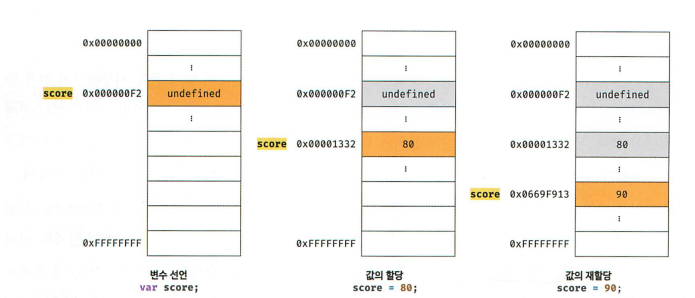
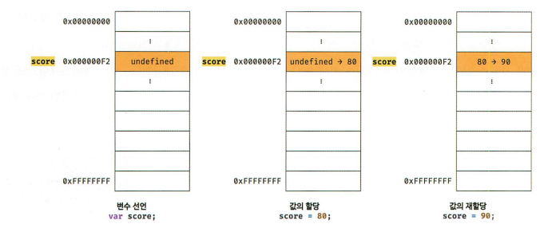
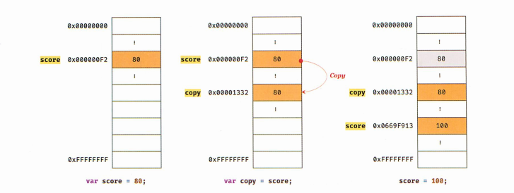
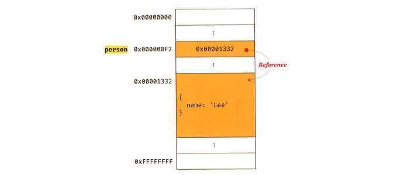
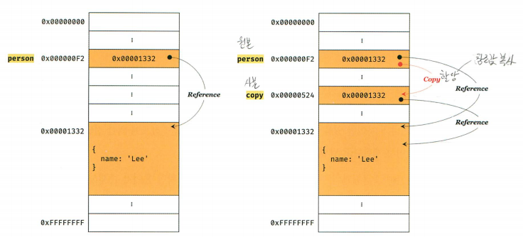

## 11장 원시 값과 객체의 비교

### [1. 원시 값](#1-원시-값-1)
### [2. 객체](#2-객체-1)

***

- 데이터 타입 (숫자, 문자, 불리언, null, undefined, Symbol, 객체 타입)
> 원시 타입 : 변경 불가능한 값
> 객체 타입 : 객체는 변경 가능한 값

### 1. 원시 값

- 변경 불가능한 값 (읽기전용 값)
- 상수
> 재할당이 금지된 변수 (값을 저장하기 위한 메모리 공간이 필요하므로 변수임)  
단 한번만 할당 허용 (값을 변경할 수 없음)

```js
// const 키워드를 사용해 선언한 변수는 재할당이 금지됨
const 0 = {};
o.a = 1;
console.log(o); // {a: 1}
```



- 변수가 참조하던 메모리 공간의 주소가 변경된 이유는  
변수에 할당된 원시 값이 변경 불가능한 값이기 때문임



- 변수 값을 변경하기 위해 원시 값을 재할당하면 새로운 메모리 공간을 확보하고 재할당한 값을 저장한 후,  
변수가 참조하던 메모리 공간의 주소를 변경함  
값의 이러한 특성을 불변성이라함
- 불변성을 값는 원시 값을 할당한 변수는 재할당 이외에 변수 값을 변경할 수 있는 방법이 없음

- 자바스크립트의 문자열은 원시타입 (변경 불가능한 값)

```js
var str = 'Hello';
str = 'world';
```

- 첫번쨰 문이 실행되면  
str은 문자열 'Hello'가 저장된 메모리 공간의 첫번째 메모리 셀 주소를 가리킴  
- 두번째 문이 실행되면  
이전에 생성된 문자열 'Hello'를 수정하는 것이 아니라 새로운 문자열 'world'를 메모리에 생성
- 'Hello'와 'world'는 모두 메모리에 존재함
- 식별자 str은 문자열 'Hello'를 가리키고 있다가 문자열 'world'를 가리키도록 변경되었을 뿐임
- 문자열은 유사 배열 객체이면서 이터러블 이므로 배열과 유사하게 각 문자에 접근할 수 있음

```js
// 유사 배열 객체란
// 마치 배열처럼 인덱스로 프로퍼티 값에 접근할 수 있고,
// length 프로퍼티를 갖는 객체를 말함
// for문으로 순회할 수 있음

var str = 'string';
console.log(str[0]);            // s      - 인덱스로 접근
console.log(str.length);        // 6      - 객체처럼 동작
console.log(str.toUpperCase()); // STRING - 객체처럼 동작

str[0] = 'S';     // 문자열은 원시 값이므로 변경할 수 없음
console.log(str); // string
```

```js
// 변수에 새로운 문자열을 재할당 하는 것은 가능함
// 기존 문자열을 변경하는 것이 아니라 새로운 문자열을 새롭게 할당하는 것
var score = 80;
var copy = score; // 새로운 숫자 값 80이 생성되어 copy 변수에 할당
                  // 값에 의한 전달 (변수에 원시 값을 받는 변수를 할당)
console.log(score); // 80
console.log(copy);  // 80

score = 100;

console.log(score);  // 100
console.log(copy);   // 80
```

- score 변수와 copy 변수의 값 80은 다른 메모리 공간에 저장된 별개의 값임

```js
var score = 80;
var copy = score;            // copy 변수에는 score 변수의 값 80이 복사되어 할당됨
console.log(score, copy);    // 80 80
console.log(score === copy); // true

score = 100;                 // score 변수의 값을 변경
console.log(score, copy);    // 100 80
console.log(score === copy); // false
```



- ECMAScript 사양에는 변수를 통해 메모리를 어떻게 관리해야 하는지 명확하게 정의되어 있지 않음

### 2. 객체

- 객체는 프로퍼티의 개수가 정해져있지 않음
- 동적으로 추가, 삭제 가능
- 원시 값과 같이 확보해야 할 메모리 공간의 크기를 사전에 정해 둘 수 없음
- 복합적인 자료구조  
- 자바스크립트는 클래스 없이 객체를 생성할 수 있지만 비효율적임(생성과 프로퍼티 접근에 비용이 많이 들어감)

- 객체는 변경 가능한 값임



- 원시 값을 할당한 변수를 참조하면 메모리에 저장되어 있는 원시 값에 접근함
- 객체를 할당한 변수를 참조하면 메모리에 저장되어 있는 참조 값을 통해 실제 객체에 접근함

```js
// 할당이 이루어지는  시점에 객체 리터럴이 해석/생성 됨
var person = {
  name: 'lee'
};
// person 변수에 저장되어 있는 참조 값으로 실제 객체에 접근함
console.log(person); // {name: "lee"}
```

- 객체를 할당한 변수의 경우 아래와 같이 표현함
> 변수는 객체를 참조하고 있다  
> 변수는 객체를 가리키고 있다

- **원시값**은 변경 불가능한 값이므로 <u>재할당</u>외에는 방법이 없음
- **객체**는 변경 가능한 값이라서 객체를 할당한 변수는 <u>재할당 없이 객체를 직접 변경 가능</u>

```js
// 객체를 할당한 변수에 프로퍼티를 동적으로 추가/갱신/삭제가능
var person = {
  name: 'Lee'
};
person.name = 'Kim';
person.address = 'Seoul';
console.log(person);      // {name: "Kim", address: "Seoul"}
```


```
객체를 변경할때마다 원시 값처럼 이전 값을 복사해서 새롭게 생성한다면
명확하고 신뢰성이 확보되겠지만

객체는 크기가 매우 클 수도 있고, 크기가 일정하지 않고,
프로퍼티 값이 객체일 수도 있어서 복사/생성 하는 비용이 많이들어서

메모리의 효율적 소비가 어렵고 성능이 나빠짐
```

따라서 메모리를 효율적으로 사용하기 위해
객체를 복사해 생성하는 비용을 절약하여 성능을 향상시키기 위해
객체는 <u>변경 가능한 값</u>으로 설계되어 있음

**여러개의 식별자**가 <u>하나의 객체를 공유</u>할 수 있다

***

- 얕은 복사와 깊은 복사로 생성된 객체는 원본과는 다른 객체임  

- 얕은 복사 : 한 단계까지만 복사
> 객체를 할당한 변수를 다른 변수에 할당하는 것

- 깊은 복사 : 객체에 중첩되어 있는 객체까지 모두 복사
> 원시 값을 할당한 변수를 다른 변수에 할당하는 것

```js
const o = {x: {y: 1}};
const c1 = { ...o };          // 얕은 복사
const _ = require('lodash');  // cloneDeep을 사용한 깊은 복사
const c2 = _.cloneDeep(o);    // 깊은 복사
```

```js
const v = 1;          // 원시 값
const c1 = v;         // 깊은 복사
const o = { x: 1 };   // 객체
const c2 = o;         // 얕은 복사
```

- 참조에 의한 전달
> - 여러개의 식별자가 하나의 객체를 공유할 수 있음
> - 객체를 가리키는 변수를 다른 변수에 할당하면 원본의 참조 값이 복사되어 전달됨
> - 참조에 의한 전달이라 함



- 원본 person 을 사본 copy에 할당하면 원본 person의 참조 값을 복사해서 copy에 저장함
- 원본과 사본은 저장된 메모리 주소는 다르지만 동일한 참조값을 가짐 (원본/사본 모두 동일한 객체를 가리킴)
- 두개의 식별자가 하나의 객체를 공유한다는 것을 의미함

- 원본과 사본 중 어느 한쪽에서 객체를 변경하면  
변수에 새로운 객체를 재할당하는 것이 아니라 객체의 프로퍼티 값을 변경/추가/삭제 하면 서로 영향을 주고받음

```js
var person = {
  name: 'lee'
};
var copy = person;

copy.name= 'Kim';
person.ddress = 'Seoul';

// copy와 person은 동일한 객체를 가리킴 (한쪽에서 객체를 변경하면 서로 영향을 주고받음)
console.log(person); // {name: "Kim", address: "Seoul"}
console.log(copy);   // {name: "Kim", address: "Seoul"}
```

- 값에 의한 전달과 참조에 의한 전달은  
식별자가 기억하는 메모리 공간에 저장되어 있는 값을 복사해서 전달한다는 면에서 동일함

- **자바스크립트**는 참조에 의한 전달은 존재하지 않고 <u>값에 의한 전달</u>만 존재함

```js
var person1 = {
  name: 'lee'
};
var person2 = {
  name: 'lee'
};

console.log(person1 === person2);           // false  - 메모리 주소가 달라서 (변수에 할당된 참조값을 비교)
console.log(person1.name === person2.name); // true   - 같은 객체라서 (프로퍼티 값을 참조해서 원시값을 비교)
```
