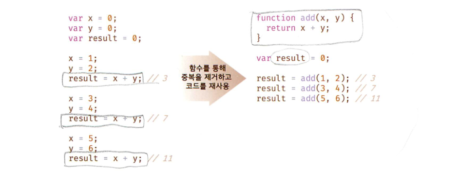
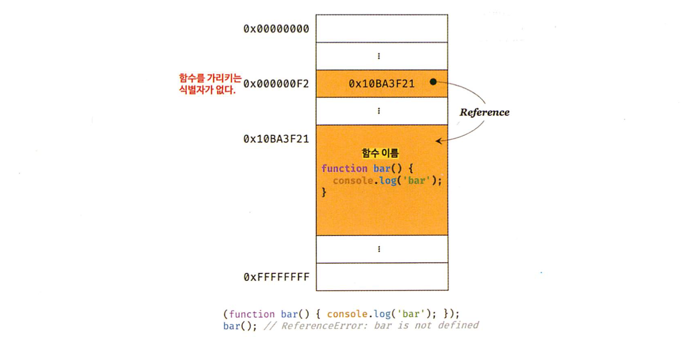
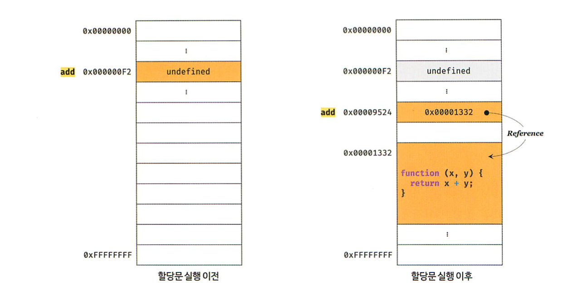
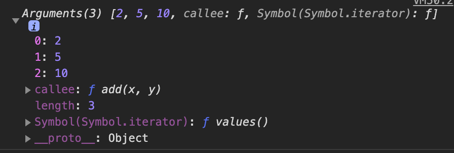
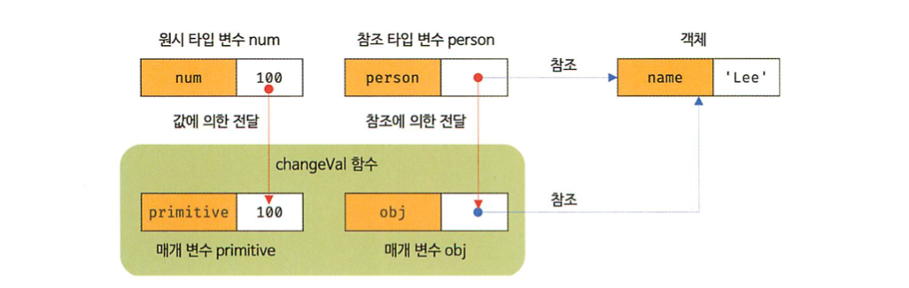

## 12장 함수

#### [1. 함수란?](#1-함수란?-1)
#### [2. 함수를 사용하는 이유](#2-함수를-사용하는-이유-1)
#### [3. 함수 리터럴](#3-함수-리터럴-1)
#### [4. 함수 정의](#4-함수-정의-1)
#### [5. 함수 호출](#5-함수-호출-1)
#### [6. 참조에 의한 전달과 외부 상태의 변경](#6-참조에-의한-전달과-외부-상태의-변경-1)
#### [7. 다양한 함수의 형태](#7-다양한-함수의-형태-1)

***

### 1. 함수란?

- 자바스크립트에서 가장 중요한 핵심 개념
- 함수와 관련 깊은 개념 : 스코프, 실행 컨텍스트, 클로저, 생성자 함수에 의한 객체 생성, 메서드, this, 프로토타입, 모듈화
- 수학의 함수와 프로그래밍 함수는 같은 개념 (인풋, 아웃풋)

```js
// 수학의 함수
f(x, y) = x + y

// 자바스크립트의 함수
function add(x, y) {
    return x + y;
}
add(2, 5); // 7
```

- 프로그래밍 언어의 함수는 일련의 과정을 `문` 으로 구현하고 코드 블록으로 감싸서 하나의 실행 단위로 정의한 것


- 자바스크립트의 함수 정의 방법

```js
// 함수 정의
function add(x, y) {
    return x + y;
}

// 함수 호출
var result = add(2, 5);

// 함수 add 에 인수 2, 5를 전달하면서 호출하면 반환값 7을 반환함
console.log(result); // 7
```

### 2. 함수를 사용하는 이유

- 함수는 필요할 때 여러번 호출할 수 있음
- 코드의 재사용 측면에서 유용함 (동일한 작업을 반복적으로 수행 -> 미리 정의된 함수를 재사용하는 것이 효율적)
- 함수는 유지보수의 편의성을 높이고 실수를 줄여 코드의 신뢰성을 높임
- 적절한 함수 이름은 코드의 가독성을 향상시킴




### 3. 함수 리터럴

- 자바스크립트의 함수는 객체 타입의 값임
- 함수 리터럴 구성  
function 키워드, 함수 이름, 매개 변수 목록, 함수 몸체
- 함수 이름 : 식별자, 생략 가능, 기명함수, 무명/익명 함수
- 매개변수 목록 : 소괄호로 감싸고, 쉼표로 구분, 지정한 인수가 순서대로 할당됨, 순서에 의미가 있음
- 함수 몸체 : 함수가 호출되었을 때 일괄적으로 실행될 문들을 하나의 실행 단위로 정의한 코드 블록임
- 리터럴 :  
값을 생성하는 표기 방식  
함수 리터럴도 평가되어 값을 생성하며, 이 값은 객체임  
즉 함수는 객체다!
- 일반 객체는 호출할 수 없지만, 함수 객체는 호출 할 수 있음
- 함수는 함수 객체만의 고유한 프로퍼티가 잆음
- 함수는 객체라는 사실은 자바스크립트의 중요한 특징임

### 4. 함수 정의

- 함수를 정의하는 방법은 4가지
```js
// (1) 함수 선언문
function add(x, y) {
    return x + y;
}
// (2) 함수 표현식
var add = function(x, y) {
    return x + y;
};
// (3) function 생성자 함수
var add = new Function('x', 'y', 'return x + y');
// (4) 화살표함수(ES6)
var add = (x, y) => x + y;

```
- ECMA Script에서 변수는 선언한다고 하고, 함수는 정의한다고 표현함

#### 4-1 함수 선언문

```js 
function add(x, y) {
    return x + y;
}
```

```js
// 함수 선언문은 표현식이 아닌 문이므로
// 변수에 할당할 수 없지만 변수에 할당되는 것 처럼 보임
var add = function(x, y) {
    return x + y;
};
```

- 자바스크립트 엔진이 코드의 문맥에 따라 동일한 함수 리터럴을 표현식이 아닌 문인 함수 선언문으로 해석하는 경우와 표현식인 문인 함수 리터럴 표현식으로 해석하는 경우가 있음

[1] {} 는 블록문일 수도 있고, 객체 리터럴일 수도 있음  
- 블록문 으로 인식 : 단독으로 존재하면
- 객체 리터럴로 인식 : 값으로 평가되어야 할 문맥에서 피연산자로 사용되면

[2] 기명 함수도 중의적인 코드임  
- 함수 선언문으로 해석 : 이름이 있는 함수 리터럴을 단독으로 사용
- 함수 리터럴 표현식으로 해석 : 함수 리터럴이 값으로 평가되어야 하는 문맥, 함수 리터럴을 변수에 할당하거나 피연산자로 사용하면

```js
foo();
(function bar() {console.log('bar'); });
bar(); // ReferenceError: bar is not defined
```
- 함수 리터럴에서 함수 이름은 몸체 내에서만 참조할수 있는 식별자
- 함수 몸체 외부에서 함수를 호출 할 수 없다는 의미, 식별자가 없다는 것과 마찬가지임



- 자바스크립트 엔진은 생성된 함수를 호출하기 위해 함수 이름과 동일한 이름의 식별자를 암묵적으로 생성하고 거기에 함수 객체를 항당함

```js
var add = function add(x, y) {
    return x + y;
};
console.log(add(2, 5)); // 7
```

- 함수 이름으로 호출하는 것이 아니라  
함수 객체를 가리키는 식별자로 호출함


#### 4.2 함수 표현식

- 자바스크립트 함수는 일급 객체 (값의 성질을 갖는 객체)
- 기명 함수 표현식

```js
var add = function foo (x, y) {
    return x + y;
};
console.log(add(2, 5)); // 7
console.log(foo(2, 5)); // ReferenceError
```

#### 4.3 함수 생성 시점과 함수 호이스팅

```js
// 함수 참조
console.dir(add); // f add(x,y)
console.dir(sub); // undefined
// 함수 호출
console.log(add(2, 5)); // 7
console.log(sub(2, 5)); // TypeError: sub is not a function
// 함수 선언문
function add(x, y) {
    return x + y;
}
// 함수 표현식
var sub = function (x, y) {
    return x - y;
};
```

- 함수 선언문으로 정의한 함수는 함수 선언문 이전에 호출할 수 있음
- 함수 표현식으로 정의한 함수는 함수 표현식 이전에 호출할 수 없음  
-> 함수 선언문으로 정의한 함수와 함수 표현식으로 정의한 함수 생성 시점이 다르기 때문
- 함수 선언문이 코드의 선두로 끌어 올려진 것처럼 동작하는 자바스크립트 고유의 특징을 함수 호이스팅이라함
- 함수 호이스팅과 변수 호이스팅은 미묘한 차이가 있음
- var 키워드로 선언된 변수는 undefined로 초기화되고, 함수 선언문을 통해 암묵적으로 생성된 식별자는 함수 객체로 초기화됨
- var 키워드를 사용한 변수 선언문 이전에 변수를 참조하면 변수 호이스팅에 의해 undefined로 평가되지만
- 함수 선언문으로 정의한 함수를 선언문 이전에 호출하면 함수 호이스팅에 의해 호출이 가능함

- 함수 표현식은 변수에 할당되는 값이 함수 리터럴인 문임
- 변수 선언은 런타임 이전에 실행되어 undefined로 초기화 되지만 변수 할당문의 값은 할당문이 실행되는 시점(런타임에 평가됨) 함수 표현식의 함수 리터럴도 할당문이 실행되는 시점에 평가되어 함수 객체가 됨
- ***함수 표현식으로 함수를 정의하면*** 함수 호이스팅이 발생하는 것이 아니라 ***변수 호이스팅이 발생함***

- 함수 표현식에 의한 함수 생성


- 함수 표현식으로 정의한 함수는 반드시 함수 표현식 이후에 참조 또는 호출해야함
(함수 표현식 이전에 함수를 참조하면 undefined로 평가되서  
함수를 호출하면 타입에러가 발생함)

#### 4.4 Function 생성자 함수

- 빌트인 함수 Function 생성자 함수에 매개변수 목록과 함수 몸체를 문자열로 전달하면서 new 연산자와 함께 호출하면 함수 객체를 생성해서 반환함
- new 연산자 없이 호출해도 결과는 동일함
- 생성자 함수 : 객체를 생성하는 함수를 말함

#### 4.5 화살표 함수

Function 생성자 함수로 함수를 생성하는 방식은 클로저를 생성하지 않고 함수 선언문이나 함수 표현식으로 생성한 함수와 다르게 동작함

```js
var add1 = (function() {
    var a = 10;
    return function (x, y) {
        return x + y + a;
    };
}());
console.log(add1(1, 2)); // 13

var add2 = (function() {
    var a = 10;
    return new Function('x', 'y', 'return x + y + a';);
}());
console.log(add2(1, 2)); // ReferenceError: a is not defined
```

#### 4.5 화살표 함수

- ES6에서 도입된 화살표 함수는 function 키워드 대신 화살표 => 를 사용
- 화살표 함수는 항상 익명 함수로 정의

`const add = (x, y) => x + y;`

- 화살표 함수는 기존 함수보다 표현만 간략한 것이 아니라 내부 동작 또한 간략화되어 있음
- 화살표 함수는 생성자 함수로 사용할 수 없으며 기존 함수와 this 바인딩 방식이 다르고, prototype 프로퍼티가 없으며 arguments 객체를 생성하지 않음


### 5. 함수 호출

#### 5.1 매개변수와 인수

- 인수는 값으로 평가될 수 있는 표현식
- 매개변수는 함수를 정의할 때 선언하며, 함수 몸체 내부에서 변수와 동일하게 취급됨
- 함수가 호출되면  
1. 함수 몸체 내에서 암묵적으로 매개변수가 생성되고  
2. undefined로 초기화된후  
3. 인수가 순서대로 할당됨


- 매개변수는 함수 몸체 내부에서만 참조할 수 있고 함수 몸체 외부에서는 참조할 수 없음
- 매개변수의 스코프는 함수 내부임
- 함수는 매개변수의 개수와 인수의 개수가 일치하는지 체크하지 않음
- 인수가 부족해서 인수가 할당되지 않은 매개변수의 값은 undefined

```js
function add(x, y) {
    console.log(x, y); // 2 5
    return x + y;
}
add(2, 5);           // add 함수의 매개변수 x, y 는 함수 몸체 내부에서만 참조가능
console.log(x, y);   // ReferenceError
console.log(add(2)); // NaN
                     // 매개변수 x에는 인수 2가 전달되지만, 매개변수 y에는 전달할 인수가 없어서 undefined로 초기화된 상태 그대로임
                     // 함수 몸체의 문 x + y는2 + undefined와 같으므로 NaN이 반환됨
console.log(add(2, 5, 10)); // 7 매개변수 보다 인수가 더 많은 경우 초과된 인수는 무시됨
                            // 초과된 인수는 그냥 버려지는 것이 아니고 암묵적으로 arguments 객체의 프로퍼티로 보관됨

function add(x, y) {
    console.log(arguments);
    // Arguments(3) [2, 5, 10]
    return x + y;
}
add(2, 5, 10);
```



- arguments 객체는 함수를 정의할 때 매개변수 개수를 확정할 수 없는 가변 인자 함수를 구현할 때 유용하게 사용됨

#### 5.2 인수 확인

```js
function add(x, y) {
    return x + y;
}
// 2개의 숫자 타입 인수를 전달받아 합계를 반환하는 것으로 추측되지만
// 어떤 타입의 인수를 전달해야하는지, 어떤 타입의 값을 반환하는지 명확하지 않음

console.log(add(2));        // NaN
console.log(add('a', 'b')); // 'ab'
```

- 자바스크립트 함수는 매개변수와 인수의 개수가 일치하는지 확인하지 않음
- 자바스크립트 함수는 동적 타입 언어라서 매개변수의 타입을 사전에 지정할 수 없음

- 자바스크립트는 함수를 정의할 때 적절한 인수가 전달되었는지 확인할 필요가 잆음

- ES6에서 도입된 매개변수 기본값을 사용하면 함수 내에서 수행하던 인수 체크 및 초기화를 간소화할수있다. (매개변수 기본값은 인수를 전달하지 않았을 경우와 undefined를 전달한 경우에만 유효함)

```js
function add(a = 0, b = 0, c = 0) {
    return a + b + c;
}
console.log(add(1, 2, 3)); // 6
console.log(add(1, 2));    // 3
console.log(add(1));       // 1
console.log(add());        // 0
```

#### 5.3 매개변수의 최대 개수

- ECMA Script 사양에서는 매개변수의 최대 개수에 대해 명시적으로 제한하고 있지 않음
- 매개변수는 순서에 의미가 있음(매개변수가 많아지면 함수를 호출할 떄 전달해야 할 인수의 순서를 고려해야함) -> 유지보수가 나빠짐
- 이상적인 함수는 한 가지 일만 해야 하며 가급적 작게 만들어야 함
- 매개변수는 최대 3개 이상을 넘지 않는 것을 권장함
- 객체를 인수로 사용하는 경우  
프로퍼티 키만 정확히 지정하면 매개변수의 순서를 신경쓰지 않아도 됨  
주의할 것은 함수 외부에서 함수 내부로 전달한 객체를  
함수 내부에서 변경하면 함수 외부의 객체가 변경되는 부수효과 가 방생함

#### 5.4 반환문

- 함수는 return 키워드와 표현식으로 이루어진 반환문을 사용해 실행 결과를 함수 외부로 반환할 수 있음

- 반환문은 두가지 역할을함  

```js
// 1. 함수의 실행을 중단하고 함수 몸체를 빠져나가서 반환문 이후에 다른 문이 존재하면 그 문은 실행되지 않고 무시됨  

function multiply(x, y) {
    return x * y; // 반환문
    console.log('실행안됨');
}
// 2. return 키워드 뒤에 오는 표현식을 평가해 반환해서 반환값으로 사용할 표현식을 명시적으로 지정하지 않으면 undefined가 반환됨
function foo() {
    return;
}
console.log(foo()); // undefined
```

- 반환문은 생략할 수 있음 `function() {}` 이 떄 함수는 몸체의 마지막 문까지 실행한 후 암묵적으로 undefined를 반환함  `console.log(foo()); // undefined `
- 반환문은 함수 몸체 내부에서만 사용 가능
- 전역에서 반환문을 사용하면 SyntaxError가 발생함
- Nodejs는 모듈 시스템에 의해 파일별로 독립적인 파일 스코프를 가짐 (파일의 가장 바깥 영역에 반환문을 사용해도 에러가 발생하지 않음)


### 6. 참조에 의한 전달과 외부 상태의 변경

- 원시 값은 값에의한 전달, 객체는 참조에 의한 전달 방식으로 동작함
- 매개변수도 함수 몸체 내부에서 변수와 동일하게 취급되므로 매개변수 또한 타입에 따라 값에 의한 전달, 참조에 의한 전달 방식을 그대로 따름
- 값에 의한 호출, 참조에 의한 호출

```js
// 매개변수 primitive는 원시 값을 전달받고, 매개변수 obj는 객체를 전달받음
function changeVal(primitive, obj) {
    primitive += 100;
    obj.name = 'Kim';
}

// 외부 상태
var num = 100;
var person = {name: 'Lee'};
console.log(num); // 100
console.log(person); // {name: "Lee"}
changeVal(num, person); // 원시값은 값 자체가 복사되어 전달되고, 객체는 참조 값이 복사되어 전달됨
console.log(num); // 100  원시 값은 원본이 훼손되지 않음
console.log(person); // {name: "Kim"}  원본이 훼손됨
```

- 값에 의한 호출과 참조에 의한 호출

- 함수가 외부 상태를 변경하면 상태 변화를 추적하기 어려워짐
- 코드의 복잡성을 증가시키고 가독성을 해치는 원인이 됨
- 논리가 간단해야 버그가 숨어들지 못함

### 7. 다양한 함수의 형태

#### 7.1 즉시 실행 함수

- 즉시 실행 함수는 익명 함수를 사용하는 것이 일반적임
- 기명함수는 사용할순 있지만 즉시실행함수를 다시 홀출할 수 없음
- 즉시 실행 함수는 반드시 그룹 연산자 (...) 로 감싸야함

```js
(function() {
    var a = 3;
    var b = 5;
    return a * b;
}());
```

- 그룹연산자의 피연산자는 값으로 평가되므로 기명 또는 무명 함수를 그룹 연산자로 감싸면 함수 리터럴로 평가되어 함수 객체가 됨
```js
console.log(typeof (function f(){})); // function
console.log(typeof (function (){}));  // function
```
- 그룹 연산자로 함수를 묶음 이유는  
함수 리터럴을 평가해서 함수 객체를 생성하기 위해서임

```js
(function(){()});
(function(){}());
!function(){}();
*function(){}();
```

- 즉시실행함수도 일반 함수처럼 값을 반환할 수 있고 인수를 전달할 수도 있음

```js
// 일반 함수처럼 값을 반환할 수 있음
var res = (function() {
    var a = 3;
    var b = 5;
    return a * b;
}());
console.log(res); // 15

// 일반 함수처럼 인수 전달할 수 있음
res = (function (a, b) {
    return a * b;
}(3, 5));
console.log(res); // 15
```

- 즉시실행함수에 코드를 모아두면 혹시 있을수도 있는 변수나 함수의 이름의 충돌을 방지할 수 있음

#### 7.2 재귀함수

- 함수가 자기 자신을 호출하는 것을 재귀 호출이라 함
- 재귀 함수는 자기 자신을 호출하는 행위
- 재귀 함수는 반복되는 처리를 위해 사용함

```js
// 10부터 0 까지 출력하는 함수 구현
function countdown(n) {
    for (var i = n; i >= 0; i--)
    console.log(i);
}
countdown(10);

// 반복문 없이 재귀함수를 사용
function countdown(n) {
    if (n < 0) return;
    console.log(n);
    countdown(n - 1); // 재귀 호출 (자기자신 호출)
}
countdown(10);
```

- [팩토리얼 참고 링크 (칸 아카데미)](https://ko.khanacademy.org/computing/computer-science/algorithms/recursive-algorithms/a/the-factorial-function)

#### 7.3 중첩 함수

- 함수 내부에 정의된 함수를 중첩함수 또는 내부 함수라 함
- 중첩함수를 포함하는 함수는 외부함수라 부름
- 중첩 함수는 외부 함수 내부에서만 호출할 수 있음
- 일반적으로 중첩함수는 자신을 포함하는 외부 함수를 돕는 헬퍼 함수의 역할을 함

```js
function outer() {
    var x = 1;

    function inner() {      // 중첩 함수
        var y = 2;
        console.log(x + y); // 3
    }
    inner();
}
outer();
```

- ES6 부터 if문이나 for문 등의 코드 블록 내에서도 함수를 정의할 수 있음

#### 7.4 콜백 함수

- 어떤 일을 반복 수행

```js
// [1] n 만큼 어떤 일을 반복함
// 매개변수를 통해 전달받은 숫자만큼 반복
function ice(n) {
    for (var i = 0; i < n; i++)
    console.log(i);
}
ice(5) // 0 1 2 3 4

// [2] n 만큼 어떤 일을 반복하는데 i 가 홀수일 때만 출력함
function ice(n) {
    for (var i = 0; i < n; i++) {
        if (i % 2)
        console.log(i);
    }
}
ice(5) // 1 3
```

```js
// 경우에 따라 변경되는 일을 함수 f로 추상화하고 외부에서 전달받음
// (자바스크립트 함수는 일급객체이므로 함수의 매개변수를 통해 함수를 전달할 수 있음)
// 외부에서 전달받은 f를 n 만큼 반복 호출함
function ice(n, f) { // 고차함수
    for (var i = 0; i < n; i++) {
        f(i) // i 를 전달하면서 f 를 호출
    }
}
var logAll = function(i) { // 콜백함수
    console.log(i);
}
ice(5, logAll);  // 반복 호출할 함수를 인수로 전달

var logOdds = function(i) { // 함수 객체를 갖고있는 변수
    if (i % 2)
        console.log(i);
}
ice(5, logOdds);  // 반복 호출할 함수를 인수로 전달
```

- 콜백 함수 : 함수의 매개변수를 통해 다른 함수의 내부로 전달되는 함수
- 고차 함수 : 매개변수를 통해 함수의 외부에서 콜백 함수를 전달받은 함수

- 매개변수를 통해 함수를 전달받거나 반환값으로 함수를 반환하는 함수를 함수형 프로그래밍에서 고차함수라 칭함
- 고차함수는 콜백 함수를 자신의 일부분으로 합성함
- 고차함수는 매개변수를 통해 전달받은 콜백 함수의 호출 시점을 결정해서 호출함
- 콜백 함수는 고차함수에 의해 호출되며, 고차함수는 필요에 따라 콜백 함수에 인수를 전달할 수 있음
- 고차함수에 콜백함수를 전달할때 콜백 함수를 호출하지 않고 함수 자체를 전달해야함

```js
대연님이 공유해주심

함수 선언문, 함수 리터럴 12.4

function repeat(n, f) { // 고차 함수 
    for (var i = 0; i < n; i++) {
        
        f(i); 
        // i를 전달하며 함수 f를 호출
        // 경우에 따라 변경되는 일을 함수 f로 추상화함
        // 이를 외부에서 전달받음
    }
}

-----------------------------------------
function logAll(i) { // 콜백 함수
    console.log(i); 
}

repeat(5, logAll); // 반복 호출할 A 함수를 인수로 함께 전달
// js의 함수는 일급 객체이므로 [ 함수의 매개변수를 통해 함수 자체를 전달 가능 ]
// 고차 함수(repeat)에게 콜백 함수(logAll)를 전달할 때에는 콜백 함수를 호출하지 않고 함수 자체를 전달해야 함 (함수 호출 연산자 ()가 없음에 유의)

-----------------------------------------
function logOdds(i) { // 콜백 함수
    if (i % 2) {
        console.log(i);
    }
}

repeat(5, logOdds); // 반복 호출할 B 함수를 인수로 함께 전달
```


```js
// 익명 함수 리터럴을 콜백 함수로 고차 함수에 전달함
// 익명 함수 리터럴은 ice 함수를 호출할 때마다 평가되어 함수 객체를 생성함
ice(5, function(i) {
    if (i % 2)
        console.log(i);
}); // 1 3

// logOdds 함수는 단 한 번만 생성됨
var logOdds = function(i) { // (1) 콜백 함수를 익명함수 리터럴로 정의하면서
    if(i % 2)
    console.log(i);
}

ice(5, logOdds); // 1 3 (고차함수에 함수 참조를 전달함)
                 // (2) 고차함수에 전달하면 고차 함수가 호출될 때마다 콜백 함수가 생성됨
```

- 콜백 함수는 함수형 프로그래밍 패러다임 뿐만 아니라 비동기 처리에 활용되는 중요한 패턴임
- 비동기 처리 (이벤트처리, Ajax 통신, 타이머 함수 등)

```js
// 콜백 함수를 사용한 이벤트 처리
// myBtn 버튼을 클릭하면 콜백 함수를 실행
document.getElementById('myBtn').addEventListener('click', function() {
    console.log('button clicked!');
});
setTimeout(function() {     // 콜백 함수를 사용한 비동기 처리
    console.log('1초 경과');
}, 1000);                   // 1초 경과
```

- 콜백 함수는 비동기 처리 뿐 아니라 배열 고차 함수에서도 사용됨
- 자바스크립트에서 배열은 사용 빈도가 매우 높은 자료구조이고 배열을 다룰 때 배열 고차 함수는 매우 중요함!

```js
// 콜백 함수를 사용하는 고차 함수 3개 (map, filter, reduce)

// [1] map
var res = [1, 2, 3].map(function(item) {
    return item * 2;
});
console.log(res); // [2, 4, 6]

// [2] filter
res = [1, 2, 3].filter(function(item) {
    return item % 2;
});
console.log(res); // [1, 3]

// [3] reduce
res = [1, 2, 3].reduce(function(acc, cur) {
    return acc + cur;
}, 0);
console.log(res); // 6
```

#### 7.5 순수 함수와 비순수 함수

- 순수함수 (부수효과가 없는 함수) :  
함수형 프로그래밍에서는 어떤 외부 상태에 의존하지도 않고 변경하지도 않음

- 비순수함수 (부수효과가 있는 함수) :  
외부 상태에 의존하거나 외부 상태를 변경함

- 순수함수는 동일한 인수가 전달되면 언제나 동일한 값을 반환하는 함수임
어떤 외부 상태에도 의존하지 않고 오직 매개변수를 통해 함수 내부로 전달된 인수에게만 의존해 반환값을 만듬

```js
// [1] 순수함수 (순수 함수가 반환한 결과값을 변수에 재할당해서 상태를 변경)

// count는 현재 카운트를 나타내는 상태
// 순수함수 increase는 동일한 인수가 전달되면 언제나 동일한 값을 반환함
var count = 0;
function increase(n) {
    return ++n;
}
count = increase(count);
console.log(count);         // 1
count = increase(count);
console.log(count);         // 2

// [2] 비순수 함수 (외부상태(count)를 변경하므로 상태변화를 추적하기 어려워짐)
// count는 현재 카운트를 나타내는 상태 (increase 함수에 의해 변화함)
// 외부 상태에 의존하며 외부 상태를 변경함
var count = 0;
function increase() {
    return ++count;
}
increase();
console.log(count);         // 1
increase();
console.log(count);         // 2
```

- 함수가 외부 상태를 변경하면 상태 변화를 추적하기 어려워지니 순수함수를 사용것이 좋음
- 함수형 프로그래밍은 순수함수를 통해 부수효과를 최대한 억제해 오류를 피하고 안정성을 높이려는 노력의 일환임
- 자바스크립트는 멀티 패러다임 언어이므로 객체지향 프로그래밍뿐만 아니라 함수형 프로그래밍을 적극적으로 활용하고 있음
