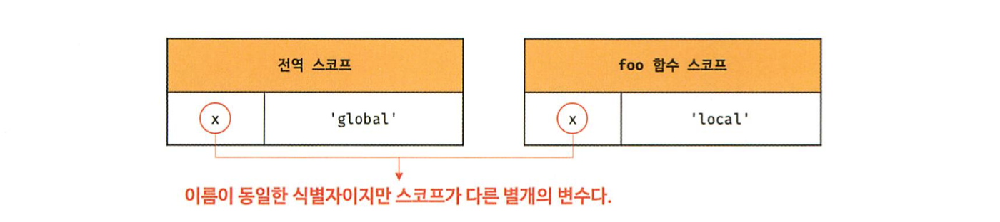
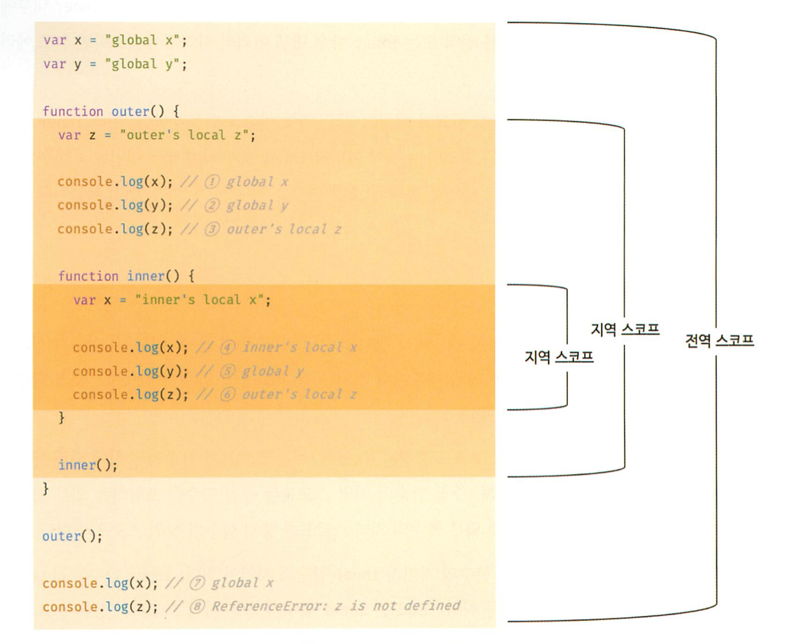

## 13장 스코프

#### [1. 스코프란?](#1-스코프란?-1)
#### [2. 스코프의 종류](#2-스코프의-종류-1)
#### [3. 스코프 체인](#3-스코프-체인-1)
#### [4. 함수 레벨 스코프](#4-함수-레벨-스코프-1)
#### [5. 렉시컬 스코프](#5-렉시컬-스코프-1)

***

### 1. 스코프란?

- 스코프는 자바스크립트를 포함한 모든 프로그래밍 언어의 기본적이며 중요한 개념임
- 스코프는 변수, 함수와 깊은 관련이 있음
```js
function add(x, y) {
    // 매개변수는 함수 몸체 내부에서만 참조 가능함
    console.log(x, y); // 2 5
    return x + y;
}
add(2, 5);
console.log(x, y); // ReferenceError
```

- 스코프는 식별자가 유효한 범위를 말함  
(모든 식별자는 자신이 선언된 위치에 의해 다른 코드가 식별자 자신을 참조할 수 있는 유효범위가 결정됨)
- 식별자는 어떤 값을 구별할 수 있어야하므로 유일해야함

```js
var x = 'global';
function foo() {
    var x = 'local';
    console.log(x); // local
}
foo();
console.log(x); // global
```



- 스코프라는 개념이 없다면 같은 이름을 갖는 변수는 충돌을 일으킴

- 프로그래밍 언어에서는 스코프를 통해 식별자인 변수 이름의 충돌을 방지하여 같은 이름의 변수를 사용할 수 있게함

```js
// var 키워드로 선언된 변수는 같은 스코프 내에서 중복 선언을 허용함
function foo() {
    var x = 1;
    var x = 2;
    console.log(x); // 2
}
foo();

// let 이나 const 키워드로 선언된 변수는 같은 스코프 내에서 중복 선언을 허용하지 않음
function bar() {
    let x = 1;
    let x = 2;
    console.log(x); // SyntaxError
}
bar();
```

### 2. 스코프의 종류

- 전역(global), 지역(local)로 구분 가능함



- 전역 변수는 어디서든지 참조 가능
- 지역은 함수 몸체 내부를 말함
- 지역은 스코프를 만듬
- 지역 변수는 자신의 지역 스코프와 하위 지역 스코프에서 유효함

### 3. 스코프 체인

- 함수는 전역에서 정의할 수도 있고 함수 몸체 내부에서 정의할 수도 있음
- 중첩 함수 : 함수 몸체 내부에서 함수가 정의된 것 (중첩에 의해 계층적 구조를 가짐)
- 외부 함수 : 중첩 함수를 포함하는 함수

3.1 스코프 체인에 의한 변수 검색

3.2 스코프 체인에 의한 함수 검색


### 4. 함수 레벨 스코프

- 코드 블록이 아닌 함수에 의해서만 스코프가 생성됨
- 함수 레벨 스코프 :  
var 키워드로 선언된 변수는 함수의 코드블록만을 지역 스코프로 인정함  
let, const 키워드는 블록 스코프를 지원함

### 5. 렉시컬 스코프

- 함수를 어디서 정의하는지 or 호출했는지에 따라 함수의 상위 스코프를 결정함

```js
var x = 1;
// 동적 스코프
function foo() {
    var x = 10;
    bar();
}
// 정적 스코프 (렉시컬 스코프)
function bar() {
    console.log(x);
}
foo();
bar();
```

- 자바스크립트는 렉시컬 스코프를 따르므로 함수를 어디서 호출했는지가 아니라  
함수를 어디서 정의했는지에 따라 상위 스코프를 결정함
- 함수가 호출된 위치는 상위 스코프 결정에 어떤 영향도 주지 않음
- 함수의 상위 스코프는 언제나 자신이 정의된 스코프임
- 함수의 상위 스코프는 함수 정의가 실행될 떄 정적으로 결정됨 (함수가 호출될 때마다 함수의 상위 스코프를 참조할 필요가 있기 때문임)
