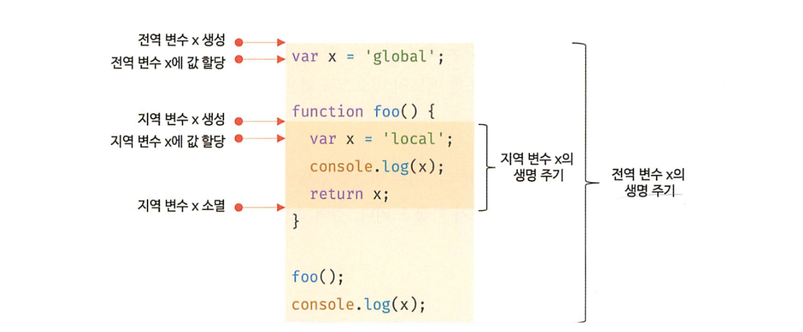

## 14장 전역 변수의 문제점

#### [1. 변수의 생명주기](#1-변수의-생명주기-1)
#### [2. 전역 변수의 문제점](#2-전역-변수의-문제점-1)
#### [3. 전역 변수의 사용을 억제하는 방법](#3-전역-변수의-사용을-억제하는-방법-1)

***

### 1. 변수의 생명주기

#### 1.1 지역 변수의 생명 주기

- 변수는 생성/소멸 되는 생명주기가 있음
- 지역변수의 생명주기는 함수의 생명주기와 일치함


```js
var x = 'global';
function foo() {
    console.log(x); // 함수 스코프 안에서 지역변수를 참조하는데
                    // 아직 할당문이 실행되기 이전이라서 undefined로 초기화 되어있음
    var x = 'local';
}
foo();
console.log(x); // global
```

#### 1.2 전역 변수의 생명주기

- 전역 코드는 명시적인 호출이 없이 실행됨
- var 키워드로 선언한 전역 변수는 전역 객체의 프로퍼티가 됨
- 전역 변수의 생명 주기가 전역 객체의 생명주기와 일치한다는 것을 말함



- 브라우저 환경에서 전역 객체는 window이므로 브라우저 환경에서 var 키워드로 선언한 전역변수는 전역객체 window의 프로퍼티임
- 전역 객체 window는 웹페이지를 닫기 전까지 유효함
- 브라우저 환경에서 var 키워드로 선언한 전역변수는 웹페이지를 닫을때까지 유효함
- var 키워드로 선언한 전역 변수의 생명주기는 전역 객체의 생명주기와 일치함

### 2. 전역 변수의 문제점

- [1] 암묵적 결함을 허용함 : 어디서든 참조하고 할당할 수 있는 변수를 사용하겠다는 것임  
변수의 유효 범위가 클수록 코드의 가독성은 나빠지고, 의도치 않게 상태가 변경될 수 있음

- [2] 긴 생명주기 : 전역변수는 생명주기가 길어서 메모리 리소스도 오랜기간 소비함  
var 키워드는 변수의 중복 선언을 허용하므로 생명 주기가 긴 전역변수는 변수이름이 중복될 가능성이 있음 (변수 이름이 중복되면 의도치 않은 재할당이 이뤄짐)

- [3] 스코프 체인 상에서 종점에 존재 : 전역 변수의 검색 속도가 가장 느림
- [4] 네임스페이스 오염 : 다른 파일 내에서 동일한 이름으로 명명된 전역 변수나 전역 함수가  
같은 스코프 내에 존재할 경우 예상치 못한 결과를 가져올 수 있음

### 3. 전역 변수의 사용을 억제하는 방법

- 전역 변수를 반드시 사용해야할 이유를 찾지 못한다면 지역변수를 사용해야함
- 변수의 스코프는 좁을수록 좋음

#### 3.1 즉시 실행 함수

- 모든 코드를 즉시 실행 함수로 감싸면 모든 변수는 즉시 실행 함수의 지역 변수가 됨
- **이 방법을 사용하면 전역 변수를 생성하지 않으므로 라이브러리 등에 자주 사용됨**

```js
(function() {
    var foo = 10; // 즉시실행함수의 지역변수
}());
console.log(foo); // ReferenceError
```

#### 3.2 네임스페이스 객체

- 전역에 네임스페이스 역할을 담당할 객체를 생성하고 전역 변수처럼 사용하고 싶은 변수를 프로퍼티로 추가하는 방법임

```js
var MYAPP = {};          // 전역 네임스페이스 객체
MYAPP.name = 'Lee';
console.log(MYAPP.name); // Lee
```

- 네임스페이스 객체에 또 다른 네임스페이스 객체를 프로퍼티로 추가해서  
네임스페이스를 계층적으로 구성할 수도 있음
- 네임스페이스를 분리해서 식별자 충돌을 방지하는 효과는 있지만  
네임스페이스 객체 자체가 전역 변수에 할당되므로 유용해보지이는 않음

```js
var MYAPP = {};          // 전역 네임스페이스 객체
MYAPP.person = {
    name: 'Lee',
    address: 'Seoul'
};
console.log(MYAPP.person.name); // Lee
```

#### 3.3 모듈 패턴

- 모듈 패턴은 클래스를 모방해서 관련이 있는 변수와 함수를 모아  
즉시실행함수로 감싸 하나의 모듈을 만듬

- 모듈 패턴은 자바스크립트의 강력한 기능인 클로저를 기반으로 동작함
- 모듈 패턴의 특징은 전역 변수의 억제는 물론 캡슐화까지 구현할 수 있음
- 모듈 패턴을 이해하려면 클로저를 먼저 이해해야함 (24장에서 자세히 다룸)

- 캡슐화 : 객체의 상태를 나타내는 프로퍼티와 프로퍼티를 참조하고 조작할 수 있는 동작인 메서드를 하나로 묶는 것을 말함

- 정보 은닉 : 캡슐화는 객체의 특정 프로퍼티나 메서드를 감출 목적으로 사용하기도 함

- 자바스크립트는 public, private, protected 등의 접근 제한자를 제공하지 않음
- 모듈 패턴은 전역 네임스페이스의 오염을 막는 기능은 물론 한정적이기는 하지만 정보 은닉을 구현하기 위해 사용함

```js
var Counter = (function() {
    var num = 0;             // private 변수
    return {                 // 외부로 공개할 데이터나 메서드를
                             // 프로퍼티로 추가한 객체를 반환함
        increase() {
            return ++num;
        },
        decrease() {
            return --num;
        }
    };
}());
console.log(Counter.num); // undefined  프라이빗 변수는 외부로 노출되지 않음
```

#### 3.4 ES6 모듈

- ES6 모듈은 파일 자체에 독자적인 모듈 스코프를 제공함
- 모던브라우저(크롬61, 파폭60, 사파리10.1, 엣지16 이상)에서는 ES6 모듈 사용가능
- script 태그에 type="module" 어트리뷰트를 추가하면 로드된 자바스크립트 파일은 모듈로서 동작함
- 모듈의 파일 확장자는 mjs를 권장함

```js
<script type="module" src="lib.mjs"></script>
<script type="module" src="app.mjs"></script>
```

- ES6 모듈은 IE를 포함한 구형 브라우저에서는 동작하지 않음
- 트랜스파일링이나 번들링이 필요하기 때문에 아직까지는 ES6모듈 기능보다는 webpack 모듈 번들러를 사용하는것이 일반적임
