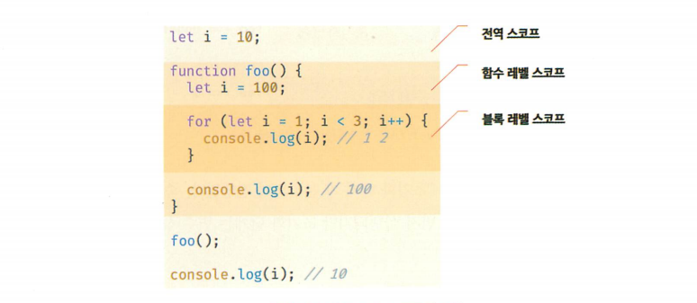

## 15장 let, const 키워드와 블록 레벨 스코프

#### [1. var 키워드로 선언한 변수의 문제점](#1-var-키워드로-선언한-변수의-문제점-1)
#### [2. let 키워드](#2-let-키워드-1)
#### [3. const 키워드](#3-const-키워드-1)
#### [4. var vs let vs const](#4-var-vs-let-vs-const-1)

***

### 1. var 키워드로 선언한 변수의 문제점

ES5까지는 변수를 선언할 방법은 var 키워드를 사용하는것

#### 1.1 변수 중복 선언 허용

var 키워드로 선언한 변수는 중복 선언이 가능함

```js
var x = 1;
var y = 1;
var x = 100;    // var 키워드로 선언된 변수는 같은 스코프 내에서 중복 선언을 허용
var y;          // 초기화문이 없는 변수 선언문은 무시됨
console.log(x); // 100
console.log(y); // 1
```

#### 1.2 함수 레벨 스코프

var 키워드로 선언한 변수는 오로지 함수의 코드 블록만을 지역 스코프로 인정함  
함수 외부에서 var 키워드로 선언한 변수는 코드 블록 내에서 선언해도 모두 전역 변수가 됨

```js
// for 문의 변수 선언문에서
// var 키워드로 선언한 변수도 전역 변수가 됨
var x = 1;    // 전역 변수
if (true) {
  var x = 10; // 변수값이 변경되는 부작용이 발생
}
console.log(x); // 10

var i = 10;
for (var i = 0; i < 5; i++) {
  console.log(i); // 0 1 2 3 4
}
console.log(i); // 5
```

#### 1.3 변수 호이스팅

var 키워드로 변수를 선언하면 `변수 호이스팅`에 의해 변수 선언문이 선두로 끌어 올려진 것처럼 동작함  
할당문 이전에 변수를 참조하면 언제나 undefined를 반환함

```js
console.log(foo); // 변수 foo는 호이스팅에 의해 이미 선언되있지만 값이 할당되기 전이므로 undefined로 초기화됨
foo = 123;        // 변수에 값 할당
console.log(foo); // 123
var foo;          // 변수 선언은 런타임 이전에 자바스크립트 엔진에 의해 암묵적으로 실행됨
```

### 2. let 키워드

- var 키워드의 단점을 보완하기 위해 ES6에서 let과 const를 도입

#### 2.1 변수 중복 선언 금지

```js
// var 키워드로 이름 동일한 변수를 중복 선언하면 에러가 발생하지 않음
// 중복 선언하면서 값까지 할당했다면 의도치않게 먼저 선언된 변수 값이 재할당되어 변경되는 부작용이 발생함
var foo = 123;
var foo = 456;

// let 키워드로 이름이 같은 변수를 중복 선언하면 문법 에러가 발생함
let bar = 123;
let bar = 456; // SyntaxError
```

#### 2.2 블록 레벨 스코프

- let 키워드로 선언한 변수는 모든 코드블록을 지역 스코프로 인정하는 블록 레벨 스코프를 따름
```js
let foo = 1;      // 전역 변수
{
  let foo = 2;    // 지역변수
  let bar = 3;
}
console.log(foo); // 1
console.log(bar); // ReferenceError
```



#### 2.3 변수 호이스팅

- let 키워드로 선언한 변수를 변수 선언문 이전에 참조하면 참조에러가 발생함
- var 키워드로 선언한 변수는 런타임 이전에 초기화 단계에서 undefined로 변수를 초기화함

- var 키워드로 선언한 변수의 생명주기


```js
console.log(foo); // ReferenceError (참조에러)
let foo;          // 변수 선언
console.log(foo); // undefined (초기화)
foo = 1;          // 변수에 값 할당
console.log(foo); // 1 (값)
```

- let 키워드로 선언한 변수의 생명주기


```js
// let 키워드로 선언한 변수도 변수 호이스팅이 발생함
let foo = 1;        // 전역 변수
{
  console.log(foo); // ReferenceError
  let foo = 2;      // 지역 변수
}
```

- 자바스크립트는 모든 선언을 호이스팅함 (var, let, const, function, function*, class 등)
- let, const, class 를 사용한 선언문은 호이스팅이 발생하지 않는 것처럼 동작함

#### 2.4 전역 객체와 let

- var 키워드로 선언한 전역변수와 전역함수, 선언하지 않은 변수에 값을 할당한 암묵적 전역은  
전역객체 window의 프로퍼티가 됨

```js
var x = 1;                // 전역 변수
y = 2;                    // 암묵적 전역
function foo() {}         // 전역 함수

console.log(window.x);    // 1            var 키워드로 선언한 전역 변수는 전역객체 window의 프로퍼티임
conosle.log(x);           // 1            전역객체 window의 프로퍼티는 전역변수처럼 사용할 수 있음
conosle.log(window.y);    // 2            암묵적 전역은 전역객체 window의 프로퍼티임
conosle.log(y);           // 2
conosle.log(window.foo);  // f foo() {}   함수 선언문으로 정의한 전역함수는 전역객체 window의 프로퍼티임
conosle.log(foo);         // f foo() {}   전역객체 window의 프로퍼티는 전역변수처럼 사용 할 수 있음
```

```js
let x = 1;              // let, const로 선언한 전역변수는 전역객체 window의 프로퍼티가 아님
console.log(window.x);  // undefined
console.log(x);         // 1
```

### 3. const 키워드

- const 키워드는 상수를 선언하기 위해 사용하지만 반드시 상수만을 위해 사용하지는 않음

#### 3.1 선언과 초기화

- const 키워드로 선언한 변수는 반드시 선언과 동시에 초기화해야함
- let, const 키워드로 선언한 변수는 블록 레벨 스코프를 가짐 (변수 호이스팅이 발생하지 않는 것처럼 동작함)

```js
const foo = 1;
const foo;      // SyntaxError
```

#### 3.2 재할당 금지

- const 키워드로 선언한 변수는 재할당이 금지됨

```js
const foo = 1;
foo = 2;        // TypeError
```

#### 3.3 상수

- 상수는 재할당이 금지된 변수를 말함
- 상수도 값을 저장하기 위한 메모리 공간이 필요하므로 변수임
- const 키워드로 선언된 변수에 원시 값을 할당한 경우 원시 값은 변경할 수 없는 값이고  
const 키워드에 의해 재할당이 금지되므로 할당된 값을 변경할수 있는 방법은 없음

- 상수의 이름은 대문자로 선언해 상수임을 명확히 나타냄
- 여러 단어로 이뤄진 경우는 언더스코어로 구분해서 스네이크 케이스로 표현하는 것이 일반적임

#### 3.4 const 키워드와 객체

- const 키워드로 선언된 변수에 `객체`를 `할당한 경우` `값을 변경할 수 있음`
- const 키워드는 재할당을 금지할뿐 불변을 의미하지는 않음

```js
const person = {     // const 키워드로 선언한 변수
  name: 'lee'        // 객체 할당
};
person.name = 'kim'; // 값을 변경할 수 있음
console.log(person); // {name: "kim"}
```

### 4. var vs let vs const

- 변수 선언에는 기본적으로 const를 사용하고


- const 키워드를 사용하면 의도치않은 재할당을 방지하기 때문에 좀더 안전함

- ES6를 사용한다면 var 키워드는 사용하지 않는것을 권장
- let은 재할당이 필요한 경우에 한정해 사용 (변수의 스코프는 최대한 좁게 만듬)
- 변경없고 읽기전용으로 사용하는 원시값과 객체에는 const 키워드를 사용


