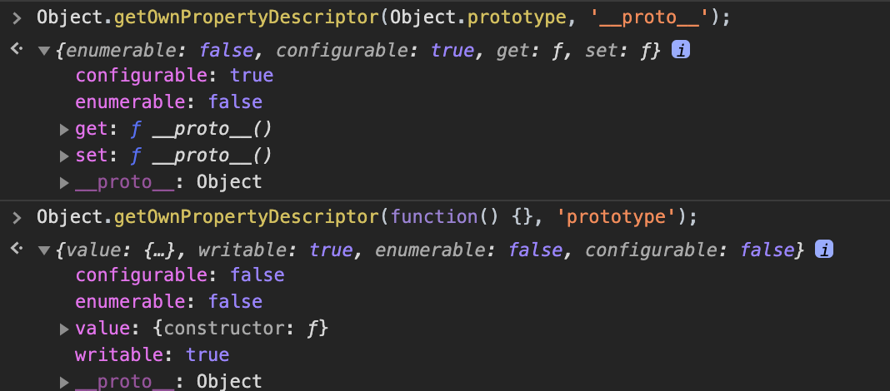

## 16장 프로퍼티 어트리뷰트

#### [1. 내부 슬롯과 내부 메서드](#1-내부-슬롯과-내부-메서드-1)
#### [2. 프로퍼티 어트리뷰트와 프로퍼티 디스크립터 객체](#2-프로퍼티-어트리뷰트와-프로퍼티-디스크립터-객체-1)
#### [3. 데이터 프로퍼티와 접근자 프로퍼티](#3-데이터-프로퍼티와-접근자-프로퍼티-1)
#### [4. 프로퍼티 정의](#4-프로퍼티-정의-1)
#### [5. 객체 변경 방지](#5-객체-변경-방지-1)

***

### 1. 내부 슬롯과 내부 메서드

- 프로퍼티 어트리뷰트를 이해하기 위해 먼저 내부 슬롯과 내부 메서드의 개념에 대해 알아봄
- `내부 슬롯`, `내부 메서드`는 자바스크립트 엔진의 구현 알고리즘을 설명하기 위해 ECMA Script 사양에 등장하는 이중 대괄호로 감싼 이름들이 내부 슬롯과 내부 메서드임 `[[...]]`

- 자바스크립트 엔진이 실제로 동작하지만 개발자가 직접 접근할 수 있도록 외부로 공개된 객체의 프로퍼티는 아님
- 모든 객체는 [[Prototype]] 라는 내부 슬롯을 가짐
- 내부 슬롯은 자바스크립트 엔진의 내부 로직이므로 원칙적으로 직접 접근할 수 없지만  
[[Prototype]] 내부 슬롯의 경우, __proto__를 통해 간접적으로 접근할 수 있음

```js
const a = {};
a.[[Prototype]]  // SyntaxError
a.__proto__      // Object.prototype
// 일부 내부 슬롯과 내부 메서드에 한하여 간접적으로 접근할 수 있는 수단을 제공함
```

### 2. 프로퍼티 어트리뷰트와 프로퍼티 디스크립터 객체

- 자바스크립트 엔진은 프로퍼티를 생성할 떄 프로터피의 상태를 나타내는 프로퍼티 어트리뷰트를 기본값으로 자동 정의함
- 프로퍼티의 상태 : 프로퍼티 값, 값의 갱신 가능 여부, 열거 가능 여부, 재정의 가능 여부

- 프로퍼티 어트리뷰트는 자바스크립트 엔진이 관리하는 내부 상태 값인 내부 슬롯 [[Value]], [[Writable]], [[Enumerable]], [[Configurable]] 이라서 프로퍼티 어트리뷰트에 직접 접근할 수 없지만 `Object.getOwnPropertyDescriptor` 메서드를 사용하여 간접적으로 확인할 수 있음

```js
// 프로퍼티 어트리뷰트 정보를 제공하는 프로퍼티 디스크립터 객체를 반환함
// {value: "Lee", writable: true, enumerable: true, configurable: true}
const person = {
    name: 'Lee'
};
console.log(Object.getOwnPropertyDescriptor(person, 'name'));
```

- 첫번째 매개변수에는 객체의 참조를 전달하고, 두번째 매개변수에는 프로퍼티 키를 문자열로 전달함
- 존재하지 않는 프로퍼티나 상속받은 프로퍼티에 대한 프로퍼티 디스크립터를 요구하면 undefined가 반환됨
- `Object.getOwnPropertyDescriptor`는 하나의 프로퍼티에 대해 프로퍼티 디스크립터 객체를 반환하지만 ES6에서 도입된 `Object.getOwnPropertyDescriptors` 메서드는 모든 프로퍼티의 프로퍼티 어트리뷰트 정보를 제공하는 프로퍼티 디스크립터 객체들을 반환함

```js
const person = {
    name: 'Lee'
};
person.age = 20;
console.log(Object.getOwnPropertyDescriptors(person));
/*
{
    name: {value: "Lee", writable: true, enumerable: true, configurable: true},
    age: {value: 20, writable: true, enumerable: true, configurable: true}
}
*/
```

### 3. 데이터 프로퍼티와 접근자 프로퍼티

- 프로퍼티는 `데이터 프로퍼티(키와 값으로 구성)`와 `접근자 프로퍼티(다른 데이터 프로퍼티의 값을 읽거나 저장할떄 호출되는 접근자 함수로 구성된 프로퍼티)`로 구분함

#### 3.1 데이터 프로퍼티

- 이 프로퍼티 어트리뷰트는 자바스크립트 엔진이 프로퍼티를 생성할 떄 기본값으로 자동 정의됨


- [[Value]]
> 1. 프로퍼티 키를 통해 프로퍼티 값에 `접근`하면 반환되는 값임  
2. 프로퍼티 키를 통해 프로퍼티 값을 `변경`하면 [[Value]]에 값을 재할당함  
이 떄 프로퍼티가 없으면 프로퍼티를 동적 생성하고 생성된 프로퍼티의 [[Value]]에 값을 저장함

- [[Writable]]
> 1. 프로퍼티 값의 변경 가능 여부를 나타내며 불리언 값을 가짐
2. [[Writable]] 의 값이 `false`인 경우 해당 프로퍼티의 [[Value]]의 값을 변경할 수 없는 읽기 전용 프로퍼티가 됨

- [[Enumerable]]
> 1. 프로퍼티의 열거 가능 여부를 나타내며 불리언 값을 가짐  
2. [[Enumerable]]의 값인 `false`인 경우 해당 프로퍼티는 `for...in` 문이나 Object.keys 메서드 등으로 열어할 수 없음

- [[Configurable]]
> 1. 프로퍼티의 재정의 가능 여부를 나타내며 불리언 값을 가짐  
2. [[Configurable]]의 값이 `false`인 경우 해당 프로퍼티의 삭제, 프로퍼티 어트리뷰트 값의 변경이 금지됨 (단 [[Writable]]이 true인 경우 [[Value]]의 변경과 [[Writable]]을 `false`로 변경하는 것은 허용됨)

#### 3.2 접근자 프로퍼티

- 접근자 프로퍼티는 자체적으로 값을 갖지 않고 다른 데이터 프로퍼티의 값을 읽거나 저장할떄 사용하는 접근자 함수로 구성된 프로퍼티임

- [[Get]]
> 1. 접근자 프로퍼티를 통해 데이터 프로퍼티의 값을 읽을 때 호출되는 접근자 함수임  
2. 접근자 프로퍼티 키로 프로퍼티 값에 접근하면 프로퍼티 어트리뷰트 [[Get]]의 값 getter 함수가 호출되고 그 결과가 프로퍼티 값을 반환됨

- [[Set]]
> 1. 접근자 프로퍼티를 통해 데이터프로퍼티의 값을 저장할 떄 호출되는 접근자 함수임  
2. 접근자 프로퍼티 키로 프로퍼티 값을 저장하면 프로퍼티 어트리뷰트 [[Set]]의 값 setter 함수가 호출되고 그 결과가 프로퍼티 값으로 저장됨

- [[Enumerable]]
> 1. 데이터 프로퍼티와 같음

- [[Configurable]]
> 1. 데이터 프로퍼티와 같음

- 접근자 함수는 getter / setter 함수라고도 부름
- 접근자 프로퍼티는 getter와 setter 함수를 모두 정의할 수 있고 하나만 정의할 수도 있음

```js
const person = {
    firstName: 'Ice', // 데이터 프로퍼티
    lastName: 'cream',

    // 접근자 함수로 구성된 접근자 프로퍼티
    // 메서드 앞에 get, set이 붙는 메서드가 있는데 이게 getter, setter 함수의 이름 fullName이 접근자 프로퍼티임
    // 접근자 프로퍼티는 자체적으로 값을 가지지 않으며 데이터 프로퍼티의 값을 읽거나 저장할떄 관여할뿐임
    get fullName() {
        return `${this.firstName} ${this.lastName}`;
    },
    set fullName(name) {
        [this.firstName, this.lastName] = name.split('');
    }
};
console.log(person.firstName + ' ' + person.lastName); // 데이터 프로퍼티를 통한 프로퍼티 값의 참조
person.fullName = 'Orange Icecream'; // 접근자 프로퍼티를 통한 프로퍼티 값의 저장
console.log(person);          // {firstName: "Orange", lastName: "Icecream"}
console.log(person.fullName); // Orange Icecream

// firstName, lastName은 데이터 프로퍼티임 (Value, Writable, Enumerable, Configurable)
// fullName은 접근자 프로퍼티임 (Get, Set, Enumerable, Configurable)
let descriptor = Object.getOwnPeopertyDescriptor(person, 'firstName');
console.log(descriptor);

descriptor = Object.getOwnPropertyDescriptor(person, 'fullName');
console.log(descriptor);
// 접근자 프로퍼티 fullName으로 프로퍼티 값에 접근하면
// 내부적으로 [[Get]] 내부 메서드가 호출되어 다음과 같이 동작함
// 1. 프로퍼티 키가 유효한지 확인함 (문자열, 심벌)
// 2. 프로토타입 체인에서 프로퍼티를 검색함
// 3. 검색된 fullName 프로퍼티가 데이터 프로퍼티인지 접근자 프로퍼티인지 확인함
// 4. 접근자 프로퍼티 fullName의 프로퍼티 어트리뷰트 [[Get]]의 값, getter 함수를 호출하여 그 결과를 반환함
//    프로퍼티 fullName의 프로퍼티 어트리뷰트 [[Get]]의 값은 Object.getOwnPropertyDescriptor 메서드가 반환하는 프로퍼티 디스크립터 객체의 get 프로퍼티 값과 같음
```

- 프로로타입 :
> 어떤 객체의 상위(부모) 객체의 역할을 하는 객체임  
하위(자식) 객체에게 자신의 프로퍼티와 메서드를 상속함  
프로토타입 객체의 프로퍼티나 메서드를 상속받은 하위 객체는 자신의 프로퍼티 또는 메서드인 것처럼 자유롭게 사용할수 있음

- 프로토타입 체인 :  
> 프로토타입이 단방향 링크드 리스트 형태로 연결되어 있는 상속 구조를 말함  
객체의 프로퍼티나 메서드에 접근하려고 할 때 해당 객체에 접근하려는 프로퍼티 또는 메서드가 없다면 프로토타입 체인을 따라 프로토타입의 프로퍼티나 메서드를 차례대로 검색함

- `접근자 프로퍼티`와 `데이터 프로퍼티`를 `구별하는 방법`은 다음과 같음

- 일반 객체의 `__proto__`는 `접근자` 프로퍼티 (get, set, enumerable, configurable)
- 함수 객체의 `prototype`는 `데이터` 프로퍼티 (value, writable, enumerable, configurable)

```js
Object.getOwnPropertyDescriptor(Object.prototype, '__proto__');
Object.getOwnPropertyDescriptor(function() {}, 'prototype');
```




### 4. 프로퍼티 정의

- 프로퍼티 정의란 :
> 새로운 프로퍼티를 추가하면서 프로퍼티 어트리뷰트를 명시적으로 정의하거나  
기존의 프로퍼티의 프로퍼티 어트리뷰트를 재정의하는 것을 말함

- Object.definedProperty 메서드를 사용하면 프로퍼티의 어트리뷰트를 정의할 수 있음
- 인수로는 객체의 참조와 데이터 프로퍼티의 키인 문자열, 프로퍼티 디스크립터 객체를 전달함

```js
const person = {};
Object.definedProperty(person, 'firstName', {
    value: 'Ice',
    writable: true,
    enumerable: true,
    configurable: true
});

Object.defineProperty(person, 'lastName', {
    value: 'cream'
});

let descriptor = Object.getOwnPropertyDescript(person, 'firstName');
console.log('firstName', descriptor);

descriptor = Object.getOwnPropertyDescript(person, 'lastName');
console.log(Object.keys(person));
person.lastName = 'lee';
delete person.lastName;

descriptor = Object.getOwnPropertyDescript(person, 'lastName');
cosnole.log('lastName', descriptor);

Object.definedProperty(person, 'fullName' {
    get() {
        return `${this.firstName} ${this.lastName}`;
    },
    set(name) {
        [this.firstName, this.lastName] = name.split(' ');
    },
    enumerable: true,
    configrable: true
});

descriptor = Object.getOwnPropertyDescript(person, 'fullName');
console.og('fullName', descriptor);
person.fullName = 'Ice cream';
console.log(person);
```

- Object.definedProperty 메서드 프로퍼티를 정의할 떄 프로퍼티 디스크립터 객체의 프로퍼티를 일부 생략할 수 있음

- 프로퍼티 디스크립터 객체에서 생략된 어트리뷰트는 다음과 같이 기본값이 적용됨
> 프로퍼티 디스크립터 객체의 프로퍼티 / 생략했을 때의 기본값
> value / undefined
> get / undefined
> set / undefined
> writable / false
> enumerable / false
> configurable / false

- Object.definedProperty 메서드는 한번에 하나의 프로퍼티만 정의할 수 있음
- Object.definedProperties 메서드를 사용하면 여러 개의 프로퍼티를 한번에 정의 가능

```js
const person = {};
Object.definedProperties(person, {
    firstName: {
        value: 'Ice',
        writable: true,
        enumerable: true,
        configrable: true
    },
    lastName: {
        value: 'cream',
        writable: true,
        enumerable: true,
        configrable: true        
    },
    fullName: {
        get() {
            return `${this.firstName} ${this.lastName}`;
        },
        set(name) {
            [this.firstName, this.lastName] = name.split(' ');
        },
        enumerable: true,
        configrable: true
    }
});
person.fullName = 'Ice cream';
console.log(person);
```

### 5. 객체 변경 방지


