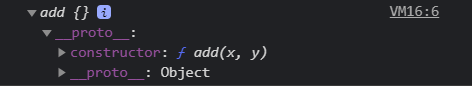
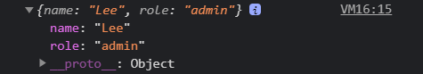

## 17장 생성자 함수에 의한 객체 생성

#### [1. Object 생성자 함수](#1-Object-생성자-함수-1)
#### [2. 생성자 함수](#2-생성자-함수-1)

***

### 17.1 Object 생성자 함수

- new 연산자와 함께 Object 생성자 함수를 호출하면 빈 객체를 생성하여 반환함
- 빈 객체를 생성한 이후 프로퍼티 또는 메서드를 추가하여 객체를 완성할 수 있다

```js
const person = new Object();

person.name = 'lee'; // 프로퍼티
person.sayHello = function() { // 메서드
  console.log('hi my name is ' + this.name);
};
console.log(person);
person.sayHello();
```

- 생성자 함수란 new 연산자와 함께 호출하여 객체를 생성하는 함수를 말함
- 생성자 함수에 의해 생성된 객체를 인스턴스라 함
- 자바스크립트는 Object 생성자 함수 이외에도 String, Number, Boolean, Function, Array, Date, RegExp(레겍스), Promise 등의 빌트인 생성자 함수를 제공함

```js
                                     //   타입, 객체 생성
const strObj = new String('lee');    // object, String {"Lee"}
const numObj = new Number(123);      // object, Number {123}
const boolObje = new Boolean(true);  // object, Boolean {true}
const func = new Function('x', 'return x * x');  // function, f anonymous(x)
const arr = new Array(1, 2, 3);      // object, {1, 2, 3}
const regExp = new RegExp(/ab+c/i);  // objcet, /ab+c/i
const date = new Date();             // object, 현재날짜
```

- 반드시 Object 생성자 함수를 사용해 빈 객체를 생성해야 하는 것은 아님
- 객체를 생성하는 방법은 객체 리터럴을 사용하는 것이 더 간편함
- Object 생성자 함수를 사용해 객체를 생성하는 방식은 특별한 


### 17.2 생성자 함수

- 객체 리터럴에 의한 객체 생성 방식은 직관적이고 간편함
- 객체는 프로퍼티를 통해 객체 고유의 상태를 표현함
- 메서드를 통해 상태 데이터인 프로퍼티를 참조하고 조작하는 동작을 표현함
- 프로퍼티는 객체마다 프로퍼티 값이 다를 수 있지만 메서드는 내용이 동일한 경우가 일반적임

#### 17.2.2 생성자 함수에 의한 객체 생성 방식의 장점

- 객체를 생성하기 위한 템플릿처럼  
생성자 함수를 사용하여  
프로퍼티 구조가 동일한 객체 여러개를 간편하게 생성할 수 있다

```js
// 객체지향 설명 (붕어빵)

// 생성자 함수
function Circle(radius) {
  this.radius = radius;
  this.getDiameter = function() {
    return 2 * this.radius;
  };
}
// 인스턴스의 생성
const circle1 = new Circle(5); // 반지름이 5인 Circle 객체를 생성
const circle2 = new Circle(10);
console.log(circle1.getDiameter()); // 10
console.log(circle2.getDiameter()); // 20
```

- this는 객체 자신의 프로퍼티나 메서드를 참조하기 위한 자기 참조 변수다.
this가 가리키는값, 즉 this 바인딩은 함수 호출 방식에 따라 동적으로 결정된다.

- 함수 호출 방식 / this 바인딩  
  일반 함수 호출   > 전역 객체 
  메서드 호출      > 메서드를 호출한 객체 (마침표 앞의 객체)
  생성자 함수 호출  > 생성자 함수가 생성할 인스턴스

```js
// 함수는 다양한 방식으로 호출될수 있다
function foo() {
  console.log(this);
}
foo();                  // 일반적인 함수 호출 (window)

const obj = {foo};      // 프로퍼티로 등록된 메서드
obj.foo();              // 메서드로 호출 (obj)

const inst = new foo(); // 생성자 함수로 호출  (inst)
```

- 생성자 함수는 이름 그대로 객체를 생성하는 함수임 (new 연산자와 함께 호출)
- new 연산자와 함께 생성자함수를 호출하지 않으면 생성자 함수가 아니라 일반 함수로 동작함

#### 17.2.3 생성자 함수의 인스턴스 생성 과정

- 생성자 함수의 역할은 프로퍼티 구조가 동일한 인스턴스를 생성하기 위한 템플릿으로서 동작하여
인스턴스를 생성하는 것과 생성된 인스턴스를 초기화 하는 것입니다.
- 생성자 함수가 인스턴스를 생성하는 것은 필수이고, 생성된 인스턴스를 초기화 하는 것은 옵션입니다.

```js
function Circle(radius) {  // 생성자 함수
    this.radius = radius;  // 인스턴스 초기화
    this.getDiameter = function() {
        return 2 * this.radius;
    };
}

const circle1 = new Circle(5); // 인스턴스 생성
```

[1] 인스턴스 생성과 this 바인딩
- 암묵적으로 빈 객체가 생성됩니다.
- 빈 객체가 바로 생성자 함수가 생성한 인스턴스 입니다.
- 암묵적으로 생성된 빈 객체, 즉 인스턴스는 this에 바인딩 됩니다.
- 생성자 함수 내부의 this가 생성자 함수가 생성할 인스턴스를 가리키는 이유가 바로 이것입니다.
- 이 처리는 함수 몸체의 코드가 한 줄씩 실행되는 런타임 이전에 실행됩니다.
- `바인딩` :
`식별자와 값을` `연결하는 과정`을 `의미`합니다.
> 변수선언은 변수이름과 확보된 메모리 공간의 주소를 바인딩하는 것입니다.
> this 바인딩은 this와 this가 가리킬 객체를 바인딩하는 것입니다.

```js
function Circle(radius) {
    // 1. 암묵적으로 인스턴스가 생성되고 this에 바인딩됩니다.
    console.log(this); // Circle {}

    this.radius = radius;
    this.getDiameter = function() {
        return 2 * this.radius;
    };
}
```

[2] 인스턴스 초기화
- 생성자 함수에 기술되어있는 코드가 한 줄씩 실행되어 this에 바인딩되어 있는 인스턴스를 초기화 합니다.
- this에 바인딩되어 있는 인스턴스에 프로퍼티나 메서드를 추가하고
- 생성자 함수가 인수로 전달받은 초기값을 인스턴스 프로퍼티에 할당하여 초기회하거나 고정값을 할당합니다.

```js
function Circle(radius) {
    // 1. 암묵적으로 인스턴스가 생성되고 this에 바인딩됩니다.

    // 2. this에 바인딩되어 있는 인스턴스를 초기화합니다.
    this.radius = radius;
    this.getDiameter = function() {
        return 2 * this.radius;
    };
}
```

[3] 인스턴스 반환
- 생성자 함수 내부의 모든 처리가 끝나면
완성된 인스턴스가 바인딩된 this가 암묵적으로 반환됩니다.

```js
function Circle(radius) {
    // 1. 암묵적으로 인스턴스가 생성되고 this에 바인딩됩니다.

    // 2. this에 바인딩되어 있는 인스턴스를 초기화합니다.
    this.radius = radius;
    this.getDiameter = function() {
        return 2 * this.radius;
    };

    // 3. 완성된 인스턴스가 바인딩된 "this가 암묵적으로 반환"됩니다.

    // return {} ; // 만약 이처럼 명시적으로 객체 반환 시 암묵적인 this 반환이 무시되고 `return 문에 명시한 객체가 반환됩니다.`
    // return 100 ; // 만약 이처럼 명시적으로 원시값 반환 시 원시값 반환은 무시되고 `암묵적으로 this가 반환됩니다.`
    // 위와 같은 문제가 있으므로 생성자 함수 내부에서는 `return 문을 반드시 생략`
}

// 인스턴스 생성 
// Circle 함수는 암묵적으로 this를 반환함 -> 반환된 this가 circle 변수에 저장됩니다.
const circle = new Circle(1);
console.log(circle); // Circle {radius: 1, getDiameter: f}
```

#### 17.2.4 내부 메서드 [[Call]]과 [[Construct]]

- 함수 선언문 또는 함수 표현식으로 정의한 함수는 일반적인 함수로서
  호출할 수 있는 것은 물론 생성자 함수로서 호출할 수 있습니다.
- 생성자 함수로서 호출한다는 것은 new 연산자와 함께 호출하여 객체를 생성하는 것을 의미 합니다.

- 함수는 객체이므로 일반 객체와 동일하게 동작할 수 있습니다.
함수 객체는 일반 객체가 가지고 있는 내부 슬롯과 내부 메서드를 모두 가지고 있기 때문입니다.

```js
function foo() {}            // 함수는 객체 입니다.
foo.prop = 10;               // 함수는 객체이므로 `프로퍼티` 소유 가능 합니다.
foo.method = function () {   // 함수는 객체이므로 `메서드` 소유 가능 합니다.
    console.log(this.prop);
};
foo.method();                // 10
```

- 함수는 객체이지만 일반 객체와는 다릅니다.
- 일반 객체는 호출할 수 없지만 함수는 호출할 수 있습니다.
  따라서 함수 객체는 일반 객체가 가지고 있는 내부 슬롯과 내부 메서드는 물론,
  함수로서 동작하기 위해 함수 객체만을 위한 [[Environment]], [[FormalParameters]] 등의 내부 슬롯과
  [[Call]], [[Construct]] 같은 내부 메서드를 추가로 가지고 있습니다.


```js
function foo() {}
// 일반 함수로 호출 시 : 함수 객체의 내부 메서드 [[Call]] 이 호출됨
// (모든 함수 객체에 구현되어 있음)
foo();

// new 연산자와 함께 생성자 함수로 호출 시 : 내부 메서드 [[Construct]] 가 호출됨 
// (모든 함수 객체가 갖고 있는 것은 아님)
new foo();
```

- 내부 메서드 [[Call]]을 갖는 함수 객체 == **callable**
  -> 호출할 수 있는 객체, 즉 함수

- 내부 메서드 [[Construct]]를 갖는 함수 객체 == **constructor**
  -> 생성자로서 호출할 수 있는 함수

- 내부 메서드 [[Construct]]를 갖지 않는 함수 객체 == **non-constructor**
  -> 생성자 함수로서 호출할 수 없는 함수

- 이 때, 모든 함수 객체가 [[Construct]]를 갖는 것은 아님
  -> 모든 함수 객체가 constructor인 것은 아님
  -> 함수 객체는 constructor 일수도 있고 non-constructor 일수도 있습니다.


#### 17.2.5 constructor & non-constructor 의 구분

- 자바스크립트 엔진은 함수 정의를 평가하여 함수 객체 생성 시,
- `함수 정의 방식`에 따라 함수를 constructor와 non-constructor로 구분합니다.

* constructor : 함수 선언문 / 함수 표현식 / 클래스
* non-constructor : 메서드(ES6 메서드 축약 표현) / 화살표 함수

```js
// 일반 함수 정의 : 함수 선언문 & 함수 표현식
function foo() {}
const bar = function () {};

// 프로퍼티 x의 값으로 할당된 것은 일반 함수로 정의된 함수이나,
// ECMAScript 사양에서는 `메서드로 인정하지 않습니다.`
const baz = {
    x : function () {} // 메서드 아님
};

// 일반 함수로 정의될 시 constructor 입니다.
new foo();    // foo {}
new bar();    // bar {}
new baz.x();  // x {}


// 화살표 함수 정의
const arrow = () => {};

// 메서드 정의: ES6의 메서드 축약 표현만 메서드로 인정함
const obj = {
    x() {}
};

// [ non-constructor ]
new arrow(); // TypeError: arrow is not a constructor
new obj.x(); // TypeError: obj.x is not a constructor
```

- 함수를 프로퍼티 값으로 사용 시 일반적으로 메서드로 통칭하나,
- ECMAScript 사양에서 메서드란 ES6의 메서드 축약 표현 만을 의미합니다.
- 즉 함수가 할당된 위치에 따라 메서드(non-constructor)인지 판단하는 것이 아니라
함수 정의 방식에 따라 constructor와 non-constructor를 구분합니다.
- 따라서 위 예제와 같이 일반 함수, 즉 함수 선언문과 함수 표현식으로 정의된 함수만이 constructor이고
ES6의 화살표 함수와 메서드 축약 표현으로 정의된 함수는 non-constructor 입니다.

- 함수를 일반 함수로서 호출하면 함수 객체의 내부 메서드 [[Call]]이 호출되고
new 연산자와 함께 생성자 함수로서 호출하면 내부 메서드가[[Construct]] 호출됩니다.
non-constructor인 함수 객체는 내부 메서드를[[Construct]] 갖지 않습니다.
따라서 non-constructor인 함수 객체를 생성자 함수로서 호출하면 에러가 발생합니다.

#### 17.2.6 new 연산자

- new 연산자와 함께 호출하는 함수는 constructor 이어야 합니다.

```js
// 생성자 함수로 정의하지 않은 일반함수 (객체 반환 X)
function add(x, y){
    return x + y;
}
let inst = new add(3, 5); // // 생성자 함수로 정의하지 않은 함수를 new 연산자와 함께 호출
// 함수가 객체를 반환하지 않았으므로 반환문이 무시됩니다. (빈 객체가 생성되어 반환)
console.log(inst); // {}
```


```js
// 생성자 함수 X, 객체 반환 O
function createUser(name, role){
    return {name , role};
}
inst = new createUser('Lee', 'admin'); // 일반 함수를 new 연산자와 함께 호출

// 함수가 생성한 객체를 반환합니다.
console.log(inst); // {name: "Lee", role: "admin"}
```



```js
function Circle(radius){
  this.radius = radius;
  this.getDiameter = function() {
      return 2 * this.radius;
  };
}

const circle = Circle(5);   // new 연산자가 없더라도 생성자 함수로서 내부적으로 호출됨
console.log(circle);        // undefined 일반 함수 내부의 this는 전역 객체 window를 가리킴
console.log(radius);        // 5
console.log(getDiameter()); // 10
circle.getDiameter();       // TypeError
```

#### 17.2.7 new.target

- 생성자 함수가 new 연산자 없이 호출되는 것을 방지하기 위해 ES6 에서는 new.target을 지원함 (IE는 지원 X)
- new.target은 this와 유사하게 constructor 내부에서 `암묵적인 지역 변수`와 같이 사용되며 `메타 프로퍼티`라고 부릅니다. 
- 함수 내부에서 new.target 사용 시 new 연산자와 함께 생성자 함수로서 호출되었는지 확인 가능
- new 연산자와 함께 생성자 함수로서 호출 시 함수 내부의 new.target은 함수 자신을 가리킴
- new 연산자 없이 일반 함수로서 호출 시 함수 내부의 new.target은 undefined 입니다.

```js
function Circle(radius){
    // 본 함수가 new 연산자 없이 호출되었다면 new.target은 undefined 입니다.
    if (!new.target) {
        // new 연산자와 함께 생성자 함수를 재귀 호출하여 생성된 인스턴스를 반환
        return new Circle(radius);
    }

    this.radius = radius;
    this.getDiameter = function() {
        return 2 * this.radius;
    };
}

// new 연산자 없이 생성자 함수를 호출하여도 new.target을 통해 생성자 함수로서 내부적으로 호출됨
const circle = Circle(5);
console.log(circle.getDiameter()); // 10
```

- 스코프 세이프 생성자 패턴 scope-safe constructor :
```js
// IE에서는 new.target 사용이 불가하므로 스코프 세이프 생성자 패턴을 사용할수 있습니다.
// 위 코드에서 if 부분을 스코프 세이프 생성자 패턴으로 적용
  if ( !(this instanceof Circle) ) {
      return new Circle(radius);
  }
```

- 대부분의 빌트인 생성자 함수는 new 연산자 함께 호출 여부를 확인 후 적절한 값을 반환합니다.
  (Object / String / Number / Boolean / Function / Array / Date / RegExp / Promise 등)
- Object와 Function 생성자 함수는 new 연산자 없이 호출해도
  new 연산자와 함께 호출했을 때와 동일하게 작동합니다.


```js
let obj = new Object();
console.log(obj);  // {}

obj = Object();
console.log(obj);  // {}

let f = new Function('x', 'return x ** x');
console.log(f);    // f anonymous(x) {return x ** x}

f = Function('x', 'return x ** x');
console.log(f);    // f anonymous(x) {return x ** x}
```

- String / Number / Boolean 생성자 함수는
  new 연산자와 함께 호출했을 때 String / Number / Boolean 객체를 생성하여 반환하지만
  new 연산자없이 호출하면 문자열, 숫자, 불리언 값을 반환 합니다.
  이를 통해 타입 변환을 하기도 합니다.

```js
const str = String(123);
console.log(str, typeof str);   // 123 string

const num = Number('123');
console.log(num, typeof num);   // 123 number

const bool = Boolean('true');
console.log(bool, typeof bool); // true boolean
```
