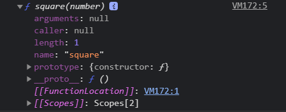

## 18장 함수와 일급 객체

#### [1. 일급 객체](#1-일급-객체-1)
#### [2. 함수 객체의 프로퍼티](#2-함수-객체의-프로퍼티-1)

***

### 18.1 일급 객체

- 일급 객체의 조건
> 1. 무명의 `리터럴로 생성` 가능 (런타임에 생성이 가능)
> 2. `변수 or 자료구조(객체, 배열 등)에 저장` 가능
> 3. 함수의 `매개변수`에 전달 가능
> 4. 함수의 `반환값`으로 사용 가능
- 자바스크립트의 함수는 위 조건을 모두 만족하므로 `일급 객체` 입니다.

```js
// 1. 함수는 무명의 리터럴로 생성 가능
// 2. 함수는 변수에 저장 가능

// 런타임(할당 단계)에 함수 리터럴이 평가되어 함수 객체가 생성되고 변수에 할당됨
const increase = function(num) {
    return ++num;
};

const decrease = function(num) {
    return --num;
};

// 2. 함수는 객체에 저장 가능
const predicates = { increase, decrease };

// 3. 함수는 매개 변수에 전달 가능
// 4. 함수의 반환값으로 사용 가능
function makeCounter(plusminus) {
    let num = 0;

    return function(){
        num = plusminus(num);
        return num; 
    };
}

// 3. 함수는 매개 변수에 함수를 전달 가능
const increaser = makeCounter(predicates.increase);
console.log(increaser()); // 1
console.log(increaser()); // 2

// 3. 함수는 매개 변수에 함수를 전달 가능
const decreaser = makeCounter(predicates.decrease);
console.log(decreaser()); // -1
console.log(decreaser()); // -2
```

- 함수는 일급 객체이므로 함수를 객체와 동일하게 사용할 수 있다는 의미 입니다.
- `객체는 값`이므로 함수는 값을 사용할 수 있는 곳 이라면 어디든지 `리터럴로 정의 가능`하며 `런타임에 함수 객체로 평가됩니다.`
(값을 사용할 수 있는 곳 : 변수 할당문, 객체의 프로퍼티 값, 배열의 요소, 함수 호출의 인수, 함수 반환문)

- 일급 객체로서 함수가 가지는 가장 큰 특징은 일반 객체와 같이 함수의 매개변수에 전달할 수 있으며, 함수의 반환값으로 사용할 수도 있다는 것입니다.
- 이는 함수형 프로그래밍을 가능하게 하는 자바스크립트의 장점 중 하나입니다.
함수는 객체이지만 일반 객체와는 차이가 있습니다. 일반 객체는 호출할수 없지만 함수 객체는 호출할 수 있습니다.
- 함수 객체는 일반 객체에는 없는 함수 고유의 프로퍼티를 소유합니다.


### 18.2 함수 객체의 프로퍼티

- 함수도 객체이므로 프로퍼티를 가질 수 있음
- 브라우저 콘솔에서 `console.dir` 메서드를 통해 함수 객체의 내부를 살필 수 있습니다.

```js
function square(number) {
    return number * number;
}

console.dir(square);
```



```js
// Object.getOwnPropertyDescriptors 메서드로 
// square 함수의 모든 프로퍼티의 프로퍼티 어트리뷰트를 확인 가능
function square(number) {
    return number * number;
}

console.log(Object.getOwnPropertyDescriptors(square));
/*
- length: {value: 1, writable: false, enumerable: false, configurable: true}
- name: {value: "square", writable: false, enumerable: false, configurable: true}
- arguments: {value: null, writable: false, enumerable: false, configurable: false}
- caller: {value: null, writable: false, enumerable: false, configurable: false}
- prototype: {value: {…}, writable: true, enumerable: false, configurable: false}
*/

// __proto__는 square 함수의 프로퍼티가 아님
console.log(Object.getOwnPropertyDescriptor(square, '__proto__')); // undefined

// __proto__는 Object.prototype 객체의 접근자 프로퍼티
// square 함수는 Object.prototype 객체로부터 __proto__ 접근자 프로퍼티를 상속받음
console.log(Object.getOwnPropertyDescriptor(Object.prototype, '__proto__')); 
// {enumerable: false, configurable: true, get: ƒ, set: ƒ}
```

- arguments / caller / length / name / prototype 프로퍼티는 모두 `함수 객체의 데이터 프로퍼티` 입니다.
- 위 프로퍼티들은 일반 객체에는 없는 함수 객체 고유의 프로퍼티 입니다.

#### 18.2.1 arguments 프로퍼티

- 함수 객체의 arguments 프로퍼티 값은 arguments 객체 입니다.
- arguments 객체 : 
  `함수 호출 시 전달된 인수들의 정보를 담고 있는 순회 가능한 유사 배열 객체`
  함수 내부에서 지역 변수처럼 사용됩니다.
  함수 외부에서는 참조 불가능 합니다.

- Function.arguments와 같은 사용법은 권장되지 않습니다.
  -> 함수 내부에서 지역 변수처럼 사용 가능한 arguments 객체를 참조하도록 합니다.

- 자바스크립트는 함수의 매개변수와 인수의 개수 일치를 확인하지 않습니다.
  -> 함수 호출 시 매개변수 개수만큼 인수를 전달하지 않아도 에러가 발생하지 않습니다.
  

```js
function multiply(x, y) {
    console.log(arguments); 
    return x * y;
}

console.log(multiply());           // NaN
console.log(multiply(1));          // NaN
console.log(multiply(1, 2));       // 2
console.log(multiply(1, 2, 3));    // 2
```

- 선언된 매개변수보다 인수를 적게 전달했을 경우, 
  인수가 전달되지 않은 매개변수는 `undefined`로 초기화된 상태를 유지합니다.

- 선언된 매개변수보다 인수를 많이 전달했을 경우, 
  초과된 인수는 무시되나 모든 인수는 암묵적으로 `arguments 객체의 프로퍼티`로 보관됩니다.

- arguments 객체는 인수를 프로퍼티 값으로 소유하며 
  프로퍼티 key는 인수의 순서를 나타냅니다.

- arguments 객체의 `callee 프로퍼티`가 호출되어 arguments 객체를 생성한 함수를(함수 자신) 가리킵니다.

- arguments 객체의 `length 프로퍼티`는 `인수의 개수`를 나타냅니다.(arguments 객체 "내부"의 length 프로퍼티임에 유의)

```js
// - arguments 객체의 `Symbol(Symbol.iterator) 프로퍼티` :
//   arguments 객체를 `순회 가능한 자료구조인 이터러블로 만들기 위한` 프로퍼티 입니다.
//   Symbol.iterator를 프로퍼티 key로 사용한 메서드를 구현하는 것에 의해 이터러블이 됩니다.

function multiply(x, y) {
  // Symbol.iterator를 프로퍼티 key로 사용한 메서드를 구현하는 것
  const interator = arguments[Symbol.iterator]();

  // 이터레이터의 next 메서드를 호출해 이터러블 객체 arguments를 순회
  console.log(iterator.next()); // {value: 1, done: false}
  console.log(iterator.next()); // {value: 2, done: false}
  console.log(iterator.next()); // {value: 3, done: false}
  console.log(iterator.next()); // {value: undefined, done: true}
  
  return x * y;
}

multiply(1, 2, 3);
```

- 함수가 호출되면 인수 개수를 확인하고 이에 따라 함수의 동작을 달리 정의할 필요가 있을 때, 
arguments객체를 유용하게 활용 할 수 있습니다.
- arguments 객체는 매개변수 개수를 확정할 수 없는 `가변 인자 함수`를 구현할 때 유용합니다.

```js
function sum() {
    let res = 0;
    // arguments 객체는 length 프로퍼티가 있는 유사 배열 객체이므로,
    // for 문으로 순회가 가능함
    // (유사 배열 객체 : 실제 배열은 아니지만 length 프로퍼티가 있어 for 문으로 순회 가능한 객체)
    for (let i = 0; i < arguments.length; i++) {
        res += arguments[i];
    }

    return res;
}

console.log(sum());            // 0
console.log(sum(1, 2));        // 3
console.log(sum(1, 2, 3));     // 6
```

- arguments 객체는 배열 형태로 인자 정보를 담고 있지만 실제 배열이 아닌 `유사 배열 객체` 입니다.
- `유사 배열 객체`란 length 프로퍼티를 가진 객체로 for 문으로 순회할 수 있는 객체를 말합니다.

- 유사 배열 객체와 이터러블(순회)
> ES6 에서 도입된 이터레이션 프로토콜을 준수 시, 순회 가능한 자료구조인 이터러블이 됨
> ES5 에서는 arguments 객체가 유사 배열 객체로 구분되었으나,
> ES6 부터는 이터러블이 도입되어 arguments 객체가 유사 배열 객체이면서 동시에 이터러블 입니다.

- 유사 배열 객체는 배열이 아니므로 배열 메서드 사용 시 에러 발생합니다.
- 배열 메서드를 사용하려면 Function.prototype.call, Function.prototype.apply로 간접 호출해야 하는 번거로움이 있습니다.

```js
function sum() {
    // arguments 객체를 배열로 변환
    const array = Array.prototype.slice.call(arguments);
    
    return array.reduce(function (pre, cur) {
        return pre + cur;
    }, 0);
}

console.log(sum(1, 2));             // 3
console.log(sum(1, 2, 3, 4, 5));    // 15
```

```js
// 위 예제에서의 번거로움을 해결하기 위해 ES6 에서는 Rest 파라미터를 도입함
function sum(...args) {
    return args.reduce((pre, cur) => pre + cur, 0);
}

console.log(sum(1, 2));             // 3
console.log(sum(1, 2, 3, 4, 5));    // 15
```

#### 18.2.2 caller 프로퍼티

- caller 프로퍼티는 ECMAScript 사양에 포함되지 않은 비표준 프로퍼티 입니다.
- 함수 객체의 caller 프로퍼티는 `함수 자신을 호출한 함수`를 가리킵니다.

```js
function foo(func) {
    return func();
}

function bar() {
    return 'caller : ' + bar.caller;
}

// 브라우저에서 실행한 결과
// Node.js 에서 실행 시 다른 결과가 나오며, 모듈과 관계가 있음 (48장 모듈)
console.log(foo(bar)); // caller : function foo(func) {...}
console.log(bar());    // caller : null
```

#### 18.2.3 length 프로퍼티

- 함수 객체의 length 프로퍼티는 `함수를 정의할 때 선언한 매개변수의 개수`를 가리킵니다.
- arguments 객체 내부의 length 프로퍼티와 함수객체의 length 의 값은 다를 수 있으므로 주의해야 합니다.
> arguments 객체의 length 프로퍼티는 인자의 개수를 가리킵니다.
> 함수 객체의 length 프로퍼티는 매개변수의 개수를 가리킵니다.

```js
function foo() {}
console.log(foo.length); // 0

function bar(x) {
    return x;
}
console.log(bar.length); // 1

function baz(x, y) {
    return x * y;
}
console.log(baz.length); // 2
```

#### 18.2.4 name 프로퍼티

- name 프로퍼티는 함수 이름을 가리킴 (ES6 에서 정식 표준이 됩니다.)
- `함수를 호출`할 때에는 함수 이름이 아닌 `함수 객체`를 `가리키는 식별자`로 호출합니다.

- ES5 & ES6 에서 다르게 동작함에 유의 
- 익명 함수 표현식의 경우,
  ES5 - name 프로퍼티는 `빈 문자열`을 `값`으로 가집니다.
  ES6 - name 프로퍼티는 `함수 객체를 가리키는 식별자`(변수 이름)를 값으로 가집니다.

```js
// 기명 함수 표현식 
var namedFunc = function foo() {};
console.log(namedFunc.name); // foo

// 익명 함수 표현식
var anonymousFunc = function() {};
console.log(anonymousFunc.name); // (ES5) '' <- 빈 문자열
console.log(anonymousFunc.name); // (ES6) anonymousFunc <- 함수 객체를 가리키는 변수 이름

// 함수 선언문 
function bar() {}
console.log(bar.name); // bar
```

#### 18.2.5 __proto__ 접근자 프로퍼티

- 모든 객체는 [[Prototype]] 이라는 내부 슬롯을 갖고 있습니다.
- [[Prototype]] 내부 슬롯은 `객체 지향 프로그래밍의 [상속]을 구현하는 프로토타입 객체`를 가리킵니다.

- __proto__ 프로퍼티는 [[Prototype]] 내부 슬롯이 가리키는 `프로토타입 객체`에 접근하기 위한 접근자 프로퍼티
- __proto__ 접근자 프로퍼티를 통해 간접적으로 프로토타입 객체에 접근 할 수 있습니다. (내부 슬롯에 직접 접근은 불가능)

```js
const obj = { a: 1 };

// 객체 리터럴 방식으로 생성한 객체의 프로토타입 객체는 Object.prototype 입니다.
console.log(obj.__proto__ === Object.prototype); // true

// 객체 리터럴 방식으로 생성한 객체는 프로토타입 객체인 Object.prototype의 프로퍼티를 상속받습니다.
console.log(obj.hasOwnProperty('a'));            // true
console.log(obj.hasOwnProperty('__proto__'));    // false

// hasOwnProperty() 메서드는
// - Object.prototype의 메서드 입니다.
// - 인수로 전달받은 프로퍼티 키가 `객체 고유의 프로퍼티 키`일 때만 true를 반환합니다.
// - 상속받은 프로토타입의 프로퍼티 키인 경우에는 false를 반환합니다.
```

#### 18.2.6 prototype 프로퍼티

- 생성자 함수로 호출할 수 있는 함수 객체(constructor)만이 소유하는 프로퍼티 입니다.
- 일반 객체와 생성자 함수로 호출할 수 없는(non-constructor)는 prototype 프로퍼티가 없습니다.

```js
// 함수 객체는 prototype 프로퍼티를 소유 합니다.
(fucntion() {}).hasOwnProperty('prototype');          // true

// 일반 객체는 prototype 프로퍼티를 소유 하지 않습니다.
({}).hasOwnProperty('prototype');                     // false
```


