## 19장 프로토타입

#### [1. 객체지향 프로그래밍](#1-객체지향-프로그래밍-1)
#### [2. 상속과 프로토타입](#2-상속과-프로토타입-1)
#### [3. 프로로타입 객체](#3-프로로타입-객체-1)
#### [4. 리터럴 표기법에 의해 생성된 객체의 생성자 함수와 프로토타입](#4-리터럴-표기법에-의해-생성된-객체의-생성자-함수와-프로토타입-1)
#### [5. 프로토타입의 생성 시점](#5-프로토타입의-생성-시점-1)
#### [6. 객체 생성 방식과 프로토타입의 결정](#6-객체-생성-방식과-프로토타입의-결정-1)
#### [7. 프로토타입 체인](#7-프로토타입-체인-1)
#### [8. 오버라이딩과 프로퍼티 섀도잉](#8-오버라이딩과-프로퍼티-섀도잉-1)
#### [9. 프로토타입 교체](#9-프로토타입-교체-1)
#### [10. instanceof 연산자](#10-instanceof-연산자-1)
#### [11. 직접 상속](#11-직접-상속-1)
#### [12. 정적 프로퍼티/메서드](#12-정적-프로퍼티/메서드-1)
#### [13. 프로퍼티 존재 확인](#13-프로퍼티-존재-확인-1)
#### [14. 프로퍼티 열거](#14-프로퍼티-열거-1)

***

- 자바스크립트는 `명령형`, `함수형`, `프로토타입 기반`, `객체지향 프로그래밍`을 <u>지원</u>하는 멀티 패러다임 프로그래밍 언어 입니다.

- ES6에서 클래스가 도입됨
- 클래스도 함수임
- 자바스크립트는 객체 기반의 프로그래밍 언어이며 `자바스크립트를 이루고있는 거의 모든 것`이 객체임
- 원시타입의 값을 제외한 나머지 값들은 모두 객체임 (함수, 배열, 정규표현식(레겍스))

### 1. 객체지향 프로그래밍

- 객체지향 프로그래밍 : 특징이나 성질을 나타내는 속성을 갖고있는 실체를 인식하거나 구별할수 있음

- `객체` : 속성을 통해 여러개의 값을 하나의 단위로 구성한 복합적인 자료구조
- `객체지향 프로그래밍` : 독립적인 객체의 집합으로 프로그램을 표현하려는 프로그래밍 패러다임

- `원` 이라는 개념을 객체로 만들어봅시다.  
원은 <u>반지름</u>이라는 `속성`이 있음  
반지름은 원의 `상태`를 나타내는 데이터임    
지름, 둘레, 넓이를 구한것은 `동작` 입니다.

```js
const circle = {
    radius: 5,
    getDiameter() {
        return 2 * this.radius;
    },
    getPerimeter() {
        return 2 * Math.PI * this.radius;
    },
    getArea() {
        return Math.PI * this.radius ** 2;
    }
};
console.log(circle);                // {radius: 5, getDiameter: f, getPerimeter: f, getArae: f}
console.log(circle.getDiameter());  // 10 지름
console.log(circle.getPerimeter()); // 31.415 둘레
console.log(circle.getArea());      // 78.539 넓이
```

- 객체지향 프로그래밍은  
객체의 `상태`를 나타내는 데이터와  
상태 데이터를 조작할 수 있는 `동작`을 하나의 논리적인 단위로 묶어 생각함

### 2. 상속과 프로토타입

- 상속 : 어떤 객체의 프로퍼티 또는 메서드를 다른 객체가 상속받아 그대로 사용할 수 있는 것 (객체지향 프로그래밍의 핵심 개념)
- 자바스크립트는 프로토타입을 기반으로 상속을 구현하여 불필요한 중복을 제거함
- 중복을 제거하는 방법은 기존의 코드를 적극적으로 재사용하는 것임


```js
function Circle(radius) { // 생성자 함수
    this.radius = radius;
    this.getArea = function() {
        return Math.PI * this.radius ** 2; // Math.PI는 원주율을 나타내는 상수임
    };
}
const circle1 = new Circle(1); // 반지름 1인 인스턴스 생성
const circle2 = new Circle(2); // 반지름 2인 인스턴스 생성

// Circle 생성자 함수는 인스턴스를 생성할 때마다 동일한 동작을 하는
// getArea 메서드를 중복 생성하고 모든 인스턴스가 중복 소유함
// getArea 메서드는 하나만 생성하여 모든 인스턴스가 공유해서 사용하는 것이 바람직함
console.log(circle1.getArea === circle2.getArea); // false - 메모리 할당이 각각 다르게 할당되서 메모리주소가 다름
console.log(circle1.getArea()); // 3.14
console.log(circle2.getArea()); // 12.5

이 예제의 생성자 함수는 문제가 있음
Circle 생성자 함수가 생성하는 모든 객체는(인스턴스)
```

#### 설명
-> Circle 생성자 함수를 생성하고
밖에서 받아온 (radius) 파라미터를 변수인 this.radius에 저장하고
this.getArea 메서드에 기능을 추가해줌

-> circle1, circle2에 아규먼트(1),(2)를 추가해서 인스턴스 생성

-> circle1.getArea === circle2.getArea
Circle 생성자 함수로 인스턴스를 생성할 때마다 모든 인스턴스가 getArea메서드를 중복 소유함

-> 
생성자 함수는 동일한 프로퍼티 구조를 갖는 객체를 여러개 생성할때 유용함

-> 하지만 여기서 문제는
Circle 생성자 함수가 생성하는 모든 인스턴스는(붕어빵)
radius 프로퍼티와 gatArea 메서드를 가짐

radius 프로퍼티 값은 일반적으로 인스턴스마다 다를 수 있음
getArea 메서드는 모든 인스턴스가 동일한 내용의 메서드를 사용하므로 단 하나만 생성하여 모든 인스턴스가 공유해서 사용하는것이 바람직한데
Circle 생성자함수는 인스턴스를 생성할때마다 getArea메서드를 중복 생성하고 모든 인스턴스가 중복 소유됨

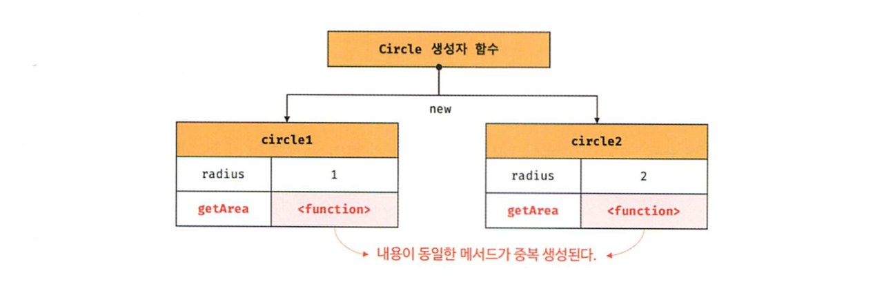


```js 
// 헷갈려서 적어둠

인스턴스 - 메모리에 할당된 객체(붕어빵)
아규먼트 - 밖에서 밀어넣는 실제 값
파라미터 - 밖에서 들어오는 값을 받아내는 임시 변수

this.radius == 변수, 속성, 프로퍼티(객체의 변수)
this.getArea == 기능, 함수, 메서드 

Circle == 생성자 함수 (설계도)
circle1 = new Circle(1) -> circle1 == 인스턴스(객체 변수)
```

### 3. 프로토타입 객체

- 프로토타입 객체란 프로그래밍의 근간을 이루는 객체간 상속을 구현하기 위해 사용됨
- 모든 객체는 [[Prototype]]이라는 내부 슬롯을 가짐
- 내부슬롯의 값은 프로토타입의 참조다.
- [[Prototype]]에 저장되는 프로토타입은 객체 생성 방식에 의해 결정됨
- 객체가 생성될때 객체 생성방식에 따라 프로토타입이 결정되고 [[Prototype]]에 저장됨

- `객체 리터럴`에 의해 생성된 객체의 프로토타입은 `Object.prototype`이고
- `생성자 함수`에 의해 생성된 객체의 프로토타입은 생성자 함수의 prototype `프로퍼티에 바인딩되어 있는` 객체임

- 모든 객체는 하나의 프로토타입을 가짐
- 모든 프로토타입은 생성자 함수와 연결되어 있음

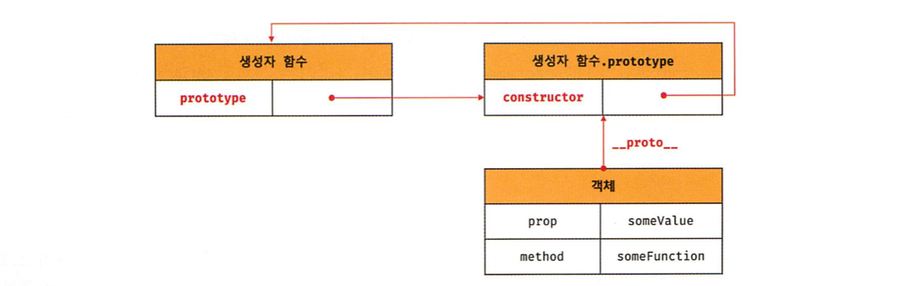

- [[Prototype]] 내부 슬롯에는 직접 접근할수 없지만
- 위 그림처럼 __proto__ 접근자 프로퍼티를 통해 자신의 프로토타입인  
자신의 [[Prototype]] 내부 슬롯이 가리키는 프로토타입에 간접적으로 접근할 수 있음

#### 3.1 __proto__ 접근자 프로퍼티

- 모든 객체는 __ptoto__ 접근자 프로퍼티를 통해 자신의 [[Prototype]]이라는 내부 슬롯에 간접적으로 접근할 수 있음

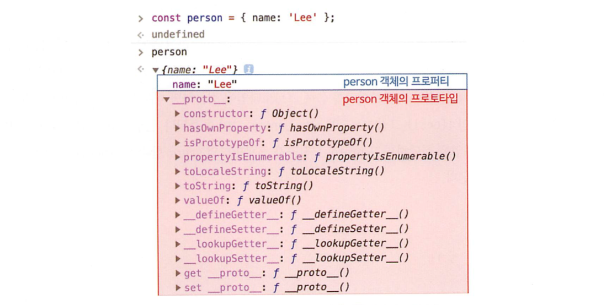

```js
// 브라우저 콘솔에서 출력한 객체의 프로퍼티
const person = {name: 'Lee'};

// 이미지에서 빨간 박스로 표시한것이
// person 객체의 프로토타입인 Object.prototype 입니다.
```

- __proto__는 접근자 프로퍼티다.
- 내부 슬롯은([[Prototype]]) 프로퍼티가 아닙니다.
- 자바스크립트는 원칙적으로 내부슬롯과 내부 메서드에 직접적으로 접근하거나 호출할수있는 방법을 제공하지 않습니다. -> (접근자 프로퍼티로 `접근`함)


- 접근자 프로퍼티는 자체적으로는 값을 가지지 않고 다른 데이터 프로퍼티의 값을 읽거나 저장할 때 사용하는 접근자 함수([[Get]], [[Set]]) 프로퍼티 어트리뷰트로 구성된 프로퍼티 입니다.

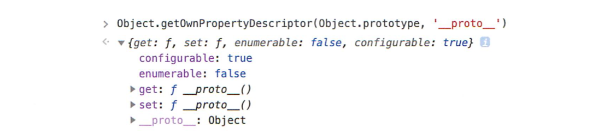

- Object.prototype의 접근자 프로퍼티인 __proto__는 getter/setter 함수라고 부르는 접근자 함수([[Get]], [[Set]])를 통해 내부슬롯([[Prototype]])의 값(프로토타입)을 취득하거나 할당합니다.


```js
const obj = {};
const parent = {x: 1};
obj.__proto__;              // get __proto__가 호출되어 obj 객체의 프로토타입을 취득
obj.__proto__ = parent;     // set __proto__가 호출되어 obj 객체의 프로토타입을 교체 
console.log(obj.x);         // 1
```


```js
# __proto__ 접근자 프로퍼티는 상속을 통해 사용됩니다.

- __proto__ 객체가 직접 소유하는 프로퍼티가 아니라 Object.prototype의 프로퍼티입니다.
- 모든 객체는 상속을 통해 Object.prototype.__proto__ 접근자 프로퍼티를 사용할 수 있습니다.


const person = {name: 'lee'};
// person 객체는 __proto__ 프로퍼티를 소유하지 않음
console.log(person.hasOwnProperty('__proto__')); // false
// __proto__ 프로퍼티는 모든 객체의 프로토타입 객체인 Object.prototype의 접근자 프로퍼티임
consosle.log(Object.getOwnPropertyDescriptor(Object.prototype, '__proto__')); // {get: f, set: f, enumerable: false, configurable: true}
// 모든 객체는 Object.prototype의 접근자 프로퍼티 __proto__를 상속받아 사용할 수 있음
cosnole.log({}.__proto__ === Object.prototype); // true
```


- 모든 객체는 프로토타입의 계층 구조인 프로토타입 체인에 묶여있습니다.
- 자바스크립트 엔진은  
객체의 프로퍼티에(메서드포함) 접근하려고 할 때  
해당 객체에 접근하려는 프로퍼티가 없다면  
__proto__ 접근자 프로퍼티가 가리키는 참조를 따라  
자신의 부모 역할을 하는 프로토타입의 프로퍼티를 순차적으로 검색합니다.

- 프로토타입 체인의 `최상위 객체`는 Object.prototype이며  
이 객체의 프로퍼티와 메서드는 모든 객체에 상속됩니다.


```js
# __proto__ 접근자 프로퍼티를 통해 프로토타입에 접근하는 이유

- 프로토타입에 접근하기 위해 접근자 프로퍼티를 사용하는 이유는
상호 참조에 의해 프로토타입 체인이 생성되는 것을 방지하기 위해서입니다.

const parent = {};
const child = {};

child.__proto__ = parent;
parent.__proto__ = child;

1.
parent 객체를 child 객체의 프로토타입으로 설정한 후
child 객체를 parent 객체의 프로토타입으로 설정했습니다.

2.
이러한 코드가 에러없이 정상적으로 처리되면
서로가 자신의 프로토타입이 되는 비정상적인 프로토타입 체인이 만들어지기 때문에
__proto__ 접근자 프로퍼티는 에러를 발생시킵니다.

3.
프로토타입 체인은 단방향 링크드 리스트로 구현되어야 합니다.
검색 방향이 한쪽 방향으로만 흘러가야합니다.
위와 같이 서로가 자신의 프로토타입이 되는 비정상적인 프로토타입 체인(순환참조)이 만들어지면 프로토타입 체인 종점이 존재하지 않기 때문에 무한루프에 빠지게됩니다.
```


- __proto__ 접근자 프로퍼티는 ES5까지 ECMAScript 사양에 포함되지 않은 비표준이었습니다.
- 현재는 `대부분의 브라우저` (IE11이상)가 `__proto__`를 `지원`합니다.
- 하지만 __proto__ 접근자 프로퍼티를 코드 내에서 직접 사용하는 것은 권장하지 않습니다. 모든 객체가 __proto__ 접근자 프로퍼티를 사용할 수 있는 것은 아니기 때문입니다.
268p

- 직접 상속을 통해 Object.prototpye을 상속받지 않는 객체를 생성할수도 있기 때문에 __proto__ 접근자 프로퍼티를 사용할수 없는 경우가 있습니다.

```js
const obj = Object.create(null); // obj는 프로토타입 체인의 종점임 (Object.__proto__를 상속받을 수 없음)
console.log(obj.__proto__); // obj는 Object.__proto__를 상속받을 수 없음
console.log(Object.getPrototypeOf(obj)); // null
// __proto__ 보다 프로토타입의 참조를
// 취득하고 싶은 경우에는 Object.getPrototypeOf 메서드를 사용하고
// 교체하고 싶은 경우에는 Object.setPrototypeOf 메서드를 사용을 권장

const obj = {}; // obj 객체의
const parent = {x: 1};
Object.getPrototypeOf(obj); // 프로토타입을 취득
Object.setPrototypeOf(obj, parent); // 프로토타입을 교체
console.log(obj.x); // 1
```

#### 3.2 함수 객체의 prototype 프로퍼티
함수 객체만이 소유하는 prototype 프로퍼티 생성자 함수가 생성할 인스턴스의 프로토타입을 가리킵니다.

- 함수 객체는 prototype 프로퍼티를 소유합니다.
`(function(){}).hasOwnProperty('prototpye'); // true`

- 일반 객체는 prototype 프로퍼티를 소유하지 않습니다.
`({}).hasOwnProperty('prototpye'); // false`

- prototype 프로퍼티는 생성자 함수가 생성할 객체의 프로토타입을 가리킵니다.
- 생성자 함수로서 호출할수 없는 함수(non-constructor)인 화살표함수와 ES6 메서드 축약 표현으로 정의한 메서드는 prototype 프로퍼티를 소유하지 않으며 프로토타입도 생성하지 않습니다.

```js
// 화살표 함수는 non-constructor임
const Person = name => {
    this.name = name;
};
console.log(Person.hasOwnProperty('prototype')); // false - non-constructor는 prototype 프로퍼티를 소유하지 않음
console.log(Person.prototype); // undefined non-constructor는 prototype을 생성하지 않음

const obj = { // ES6의 메서드 축약표현으로 정의한 메서드는 non-constructor임
    foo() {}
};
console.log(obj.foo.hasOwnProperty('prototpye')); // false non-constructor는 prototype 프로퍼티를 소유하지 않음
console.log(obj.prototype);                       // undefined  constructor는 프로토타입을 생성하지 않음
```

- 생성자 함수로 호출하기 위해 정의하지 않은 일반 함수도 prototype 프로퍼티를 소유하지만 객체를 생성하지 않는 일반 함수의 prototype 프로퍼티는 아무런 의미가 없음

- `모든 객체`가 가지고 있는 `__proto__ 접근자 프로퍼티`와
`함수 객체`만이 가지고 있는 `prototype 프로퍼티`는
`동일한 프로토타입을 가리킴`
하지만 이들이 프로퍼티를 `사용하는 주체가 다름`

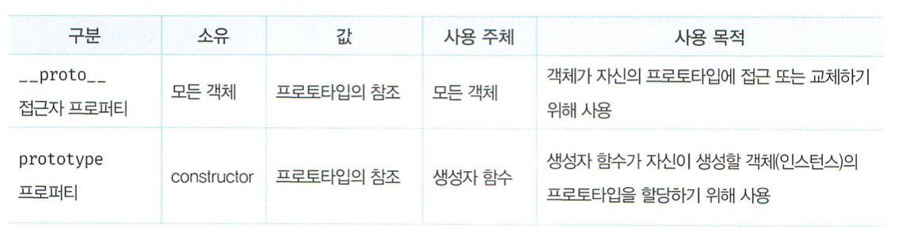

```js
// 생성자함수로 객체를 생성한 후 __proto__ 접근자 프로퍼티와 prototype 프로퍼티로 프로토타입 객체에 접근해보자
function Person(name) { // 생성자함수
    this.name = name;
}
const me = new Person('lee');
console.log(Person.prototype === me.__proto__); // true 동일한 프로토타입을 가리킴
```

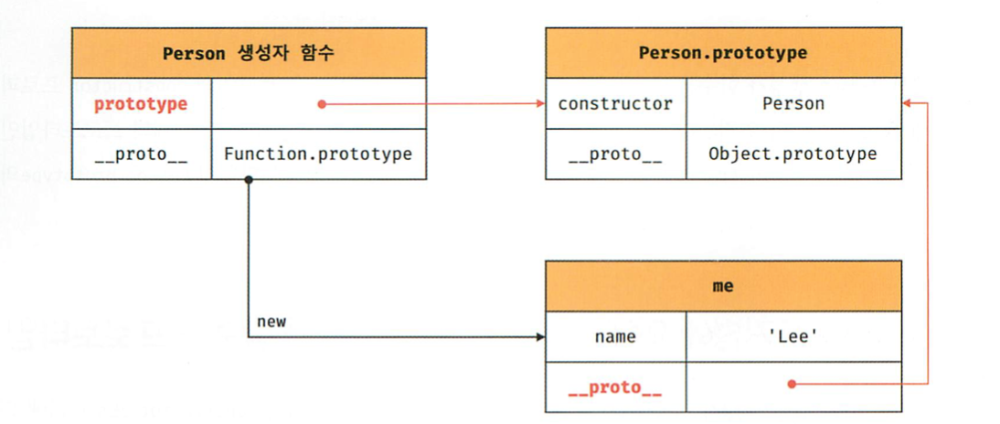

#### 3.3 프로토타입의 constructor 프로퍼티와 생성자 함수
- 모든 프로토타입은 constructor 프로퍼티를 가집니다.
- 이 constructor 프로퍼티는 prototype 프로퍼티로 자신을 참조하고있는 생성자 함수를 가리킵니다.
- 이 연결은 생성자함수가 생성될 때(함수 객체가 생성될때) 이루어집니다.

```js
function Person(name) { // 생성자함수
    this.name = name;
}
const me = new Person('lee');
// me 객체에는 constructor 프로퍼티가 없지만
// me 객체의 프로토타입인 Person.prototype에는 constructor프로퍼티가 있음
// -> 따라서 me 객체는 프로토타입인 Person.prototype의
// constructor 프로퍼티를 상속받아 사용할수 있음

console.log(me.prototype === Person); // true
// me 객체의 생성자함수는 Person입니다.
```

### 4. `리터럴 표기법`에 의해 생성된 객체의 `생성자 함수`와 프로토타입

- `생성자 함수`에 의해 생성된 `인스턴스`는
`프로토타입의 constructor 프로퍼티에 의해` 생성자 함수와 `연결`됩니다.
- `constructor 프로퍼티`가 가리키는 `생성자 함수`는
`인스턴스`를 `생성한` `생성자 함수`입니다.

- 객체 리터럴 표기법에 의한 객체 생성방식과 같이
명시적으로 new 연산자와 함께 생성자 함수를 호출하여 인스턴스를 생성하지 않는 객체 생성 방식도 있습니다.

```js
// 리터럴 표기법에 의해 생성된 객체로 프로토타입이 존재합니다.
// 리터럴 표기법에 의해 생성된 객체의 경우
// 프로토타입의 constructor 프로퍼티가 가리키는 생성자 함수가
// 반드시 객체를 생성한 생성자 함수라고 단정할 수는 없습니다.

1. 객체 리터럴  : const obj = {};
2. 함수 리터럴  : const add = function (a, b) {return a + b};
3. 배열 리터럴  : const arr = [1, 2, 3];
4. 정규식 리터럴 : const regexp = /is/ig;

// obj 객체의 생성자 함수는 Object 생성자 함수입니다.
console.log(obj.constructor === Object); // true

// obj 객체는 Object 생성자 함수로 생성한 객체가 아니라
// 객체 리터럴에 의해 생성된 객체입니다.
// 하지만 obj 객체는
// Object 생성자 함수와 constructor 프로퍼티로 연결되어 있습니다.

// 그렇다면 객체 리터럴에 의해 생성된 객체는 Object 생성자 함수로 생성되는 것은 아닐까.
```

- ECMAScript 사양에서 Object생성자 함수는 다음과 같이 구현하도록 정의되어 있습니다.

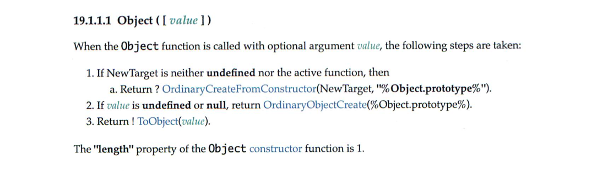

- 객체 리터럴이 평가될때는 다음과같이 추상연산 OrdinaryObjectCreate를 호출하여 {}(빈 객체)를 생성하고 프로퍼티를 추가하도록 정의되어 있습니다.

- 객체 리터럴의 평가
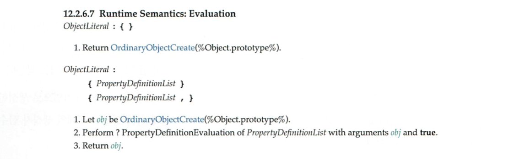

- `Object 생성자 함수 호출`과 `객체 리터럴의 평가`는
`추상연산 OrdinaryObjectCreate`를 `호출`하여 `빈객체를 생성`하는 점에서 동일하나
`new.target`의 `확인`이나 `프로퍼티를 추가하는 처리` 등 `세부 내용은 다릅`니다.

- 따라서 `객체 리터럴`에 의해 `생성된 객체`는
`Object 생성자 함수`가 `생성한 객체가 아닙니다.`


- `함수 객체`의 경우 차이가 더 명확합니다.
Function 생성자 함수에서 살펴보았듯이
`Function 생성자 함수를 호출`하여 `생성한 함수`는
렉시컬 스코프를 만들지않고, `전역 함수인 것처럼` `스코프를 생성`하며,
클로저도 만들지 않습니다.

- 따라서 `함수 선언문`과 `함수 표현식`을 `평가`하여 `함수 객체를 생성한것은`
`Function 생성자 함수가 아닙니다.`

- 하지만 `constructor 프로퍼티를 통해 확인해보면`
`foo 함수`의 `생성자 함수`는 `Function 생성자 함수`입니다.

```js
// foo 함수는 Function 생성자 함수로 생성한 함수 객체가 아니라
// 함수 선언문으로 생성함
function foo() {}
// 하지만 constructor 프로퍼티를 통해 확인해보면
// 함수 foo의 생성자 함수는 Function 생성자 함수입니다.
console.log(foo.constructor === Function); // true
```

- `리터럴 표기법에 의해 생성된 객체`도  
상속을 위해 프로토타입이 필요하기에 `가상적인 생성자 함수를 가집니다.`  
프로토타입은 생성자함수와 더불어생성되며  
prototype, constructor 프로퍼티에 의해 연결되어있기 때문입니다.

- `프로토타입`과 `생성자함수`는  
단독으로 존재할 수 없고 `언제나 쌍으로 존재`합니다.

- 리터럴 표기법에 의해 생성된 객체의 생성자 함수와 프로토타입
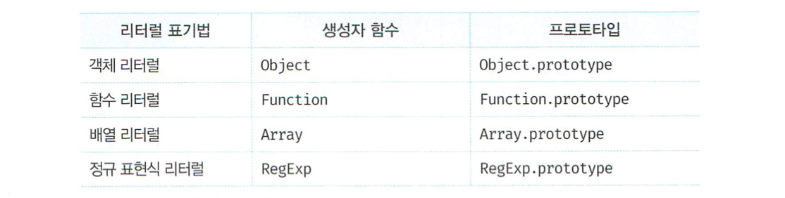


### 5. 프로토타입의 생성 시점

- 모든 객체는 생성자함수와 연결되어 있습니다.
- 프로토타입은 생성자 함수가 생성되는 시점에 더불어 생성됩니다.

#### 5.1 사용자 정의 생성자 함수와 프로토타입 생성 시점

화살표함수나 ES6 메서드 축약 표현으로 정의하지 않고  
일반 함수(함수선언문, 함수표현식)로 정의한 함수 객체는 new 연산자와 함께  
생성자 함수로서 호출할 수 있습니다.

```js
// 함수 정의가 평가되어 함수객체를 생성하는 시점에 프로토타입도 같이 생성됨
console.log(Person.prototype); // {constructor: f};
// 생성자 함수
function Person(name) {
    this.name = name;
}
// 화살표함수는 non-constructor 입니다.
const Person = name => {
    this.name = name;
};
// non-constructor는 프로토타입이 생성되지 않습니다.
console.log(Person.prototype); // undefined
```

- 앞에 12장 함수에서 살펴봤듯이  
`함수 선언문`은 `런타임 이전`에 자바스크립트 엔진에 의해 `먼저 실행`됩니다.

- 따라서 `함수 선언문으로 정의`된 `Person 생성자 함수`는  
어떤 코드보다 `먼저 평가`되어 `함수 객체`가 됩니다.  
이때 `프로토타입도 더불어 생성`됩니다.

- 생성된 프로토타입은
Person 생성자 함수의
prototype 프로퍼티에
바인딩 됩니다.

- Person `생성자 함수`와 `더불어 생성`된 `프로토타입의 내부`를 살펴봅시다.


- 생성된 프로토타입은 오직 constructor 프로퍼티만을 갖는 객체입니다.

- `프로토타입`도 `객체`이고
`모든 객체`는 `프로토타입을 가지므로` 프로토타입도 자신의 프로토타입을 가집니다.
`생성된 프로토타입`의 `프로토타입은 Object.prototype`입니다.

- Person.prototype의 프로토타입
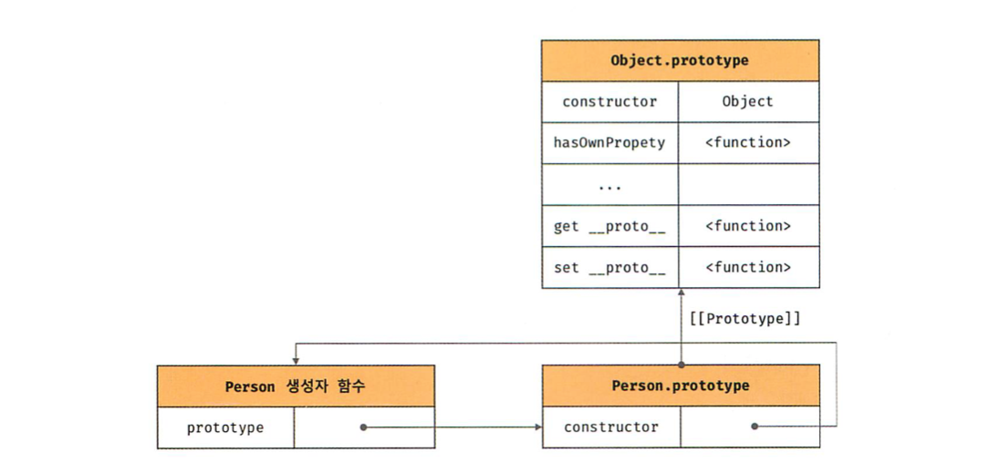

- 빌트인 생성자 함수가 아닌
`사용자 정의 생성자 함수`는
자신이 평가되어 `함수 객체로 생성되는 시점`에 `프로토타입도 더불어 생성`되며
`생성된 프로토타입`의 `프로토타입은 언제나 Object.prototype` 입니다.


#### 5.2 빌트인 생성자 함수와 프로토타입 생성 시점

- 빌트인 생성자 함수 (new로 만들어진 기존 생성자 함수)
Object, String, Number, Function, Array, RegExp, Date, Promise

- `빌트인 생성자 함수`도 `일반 함수`와 마찬가지로
빌트인 생성자 함수가 `생성되는 시점`에
`프로토타입이 생성`됩니다.

- 모든 빌트인 생성자 함수는
`전역 객체`가 `생성되는 시점`에 `생성`됩니다.
생성된 프로토타입은 `빌트인 생성자 함수`의
`prototype 프로퍼티`에 `바인딩` 됩니다.

- Object 생성자 함수와 프로토타입
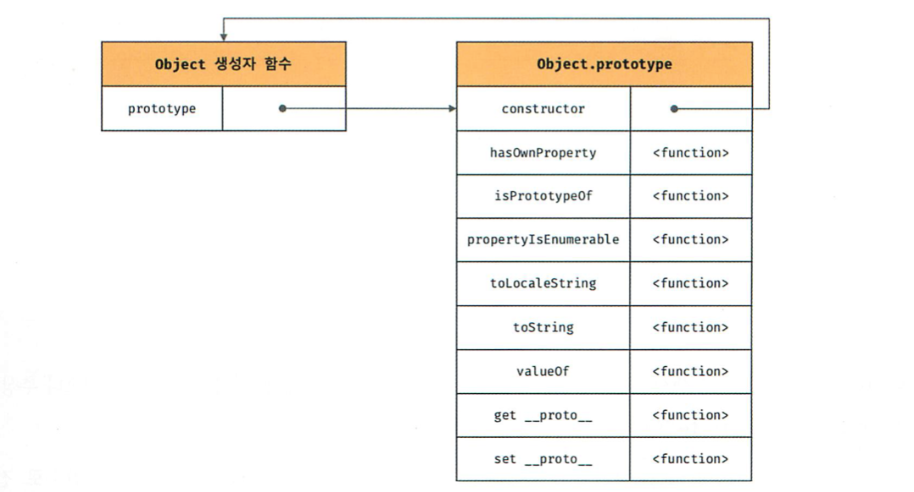

- `객체가 생성되기 이전`에
`생성자 함수와 프로토타입은` `이미 객체화`되어 존재합니다.
이후 `생성자 함수` 또는 `리터럴 표기법`으로 `객체를 생성`하면
`프로토타입`은 `생성된 객체의` [[Prototype]] `내부 슬롯에 할당`됩니다.
`이렇게 생성된 객체`는 `프로토타입을 상속`받습니다.

```
- 전역 객체

전역객체는 코드가 실행되기 이전 단계에
자바스크립트 엔진에 의해 생성되는 특수한 객체입니다.

클라이언트 사이드 환경(브라우저)에서는 window,
서버사이드 환경(Nodejs)에서는 global 객체를 의미합니다.

전역 객체는 표준 빌트인 객체들과 환경에 따른 포스트 객체
그리고 var 키워드로 선언한 전역 변수와 전역 함수를 프로퍼티로 가집니다.

Math, Reflect, JSON을 제외한
표준 빌트인 객체는 모두 생성자 함수입니다.

window.Object === Object // true

표준 빌트인 객체인 Object도 전역 객체의 프로퍼티이며
전역 객체가 생성되는 시점에 생성됩니다.
```

### 6. 객체 생성 방식과 프로토타입의 결정

- `객체`는 `다양한 생성 방법`이 있습니다.
객체 리터럴  
Object 생성자 함수  
생성자 함수  
Object.create 메서드  
클래스(ES6)  

다양한 방식으로 생성된 `모든 객체`는
각 방식마다 세부적인 객체생성방식의 차이는 있으나
`추상연산 OrdinaryObjectCreate`에 의해 `생성`된다는 공통점이 있습니다.

#### 6.1 객체 리터럴에 의해 생성된 객체의 프로토타입

- `추상 연산`에 `전달되는` `프로토타입`은 `Object.prototype` 입니다.
- 즉 `객체 리터럴`에 의해 `생성되는` `객체의 프로토타입`은
`Object.prototype` 입니다.

`const obj = { x: 1 };`  
위 예제에서 `객체 리터럴`이 `평가`되면  
`추상연산` OrdinaryObjectCreate에 의해 다음과 같이
`Object 생성자 함수`와 `Object.prototype`과
생성된 객체 사이에 `연결이 만들어`집니다.

```js
const obj = {x: 1};
console.log(obj.constructor === Object); // true
console.log(obj.hasOwnProperty('x'));    // true - 프로퍼티를 갖고있는지 확인

// 이처럼 `객체 리터럴`에 의해 `생성된 obj 객체`는
// Object.prototype을 프로토타입으로 갖게되며
// `Object.ptororype`을 `상속` 받습니다.

// `obj 객체`는 `constructor 프로퍼티`와 `hasOwnProperty 메서드를`
// `자신의 자산`인 것처럼 `자유롭게 사용`할 수 있습니다.
```

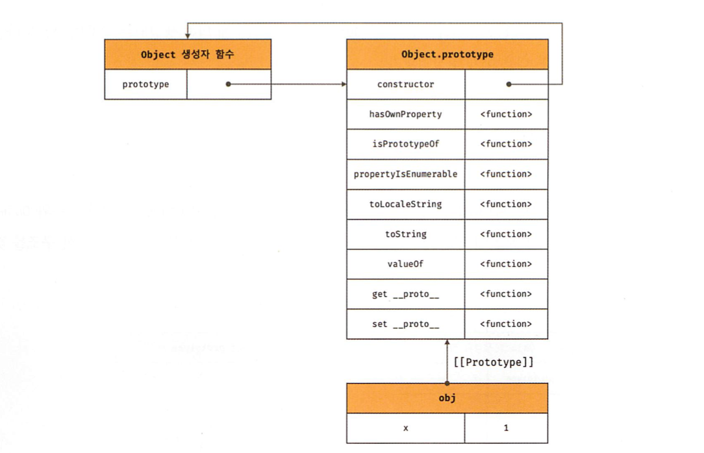

#### 6.2 Object 생성자 함수에 의해 생성된 객체의 프로토타입

- `Object 생성자 함수`를 `인수 없이 호출`하면 `빈 객체가 생성`됩니다.
- `Object 생성자 함수를 호출`하면 객체 리터럴과 마찬가지로 `추상연산`이 `호출`됩니다.
- `추상 연산`에 `전달`되는 `프로토타입`은 `Object.prototype` 입니다.
- 즉 `Object 생성자 함수`에 의해 `생성`되는 `객체`의 `프로토타입`은 `Object.prototype` 입니다.

```js
const obj = new Object();
obj.x = 1;
```

- Object 생성자 함수에 의해 생성된 객체의 프로토타입
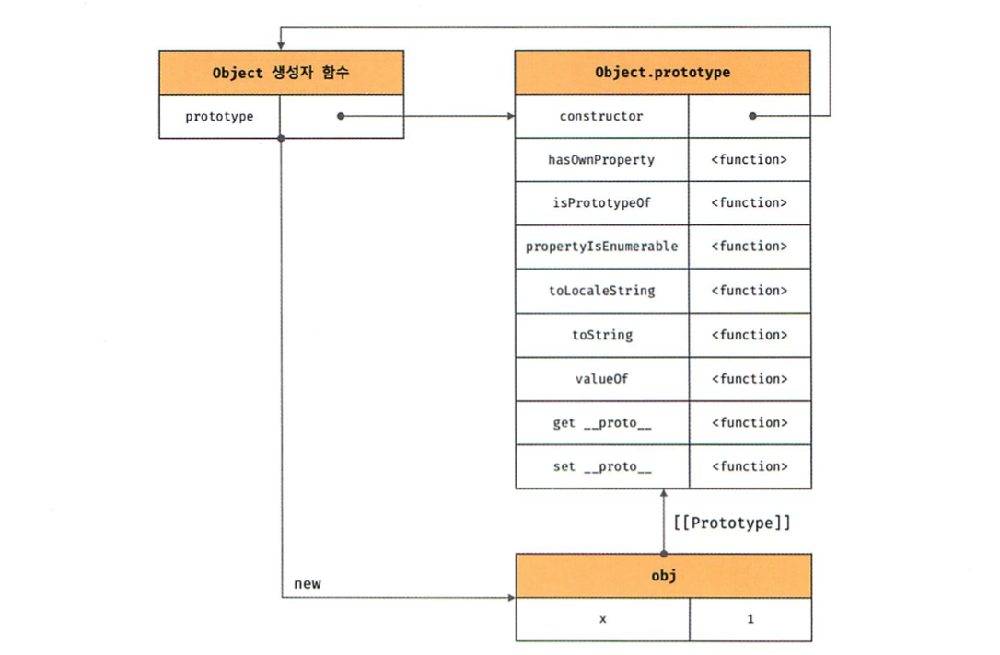

`Object 생성자 함수`에 의해 `생성`된 obj `객체`는  
`Object.prototype`을 `프로토타입`으로 갖게되며  
Object.protytpe을 `상속`받습니다.

```js
const obj = new Object();
obj.x = 1;
console.log(obj.constructor === Object); // true
console.log(obj.hasOwnProperty('x'));    // true
```

### 6.3 생성자 함수에 의해 생성된 객체의 프로토타입

```js
function Person(name) {
    this.name = name;
}
const me = new Person('lee');
```

- 코드가 실행되면 `추상연산`에 의해  
다음과 같이 `생성자 함수`와 생성자 함수의 `prototype 프로퍼티`에 `바인딩`   
되어있는 `객체`와 `생성된 객체` `사이`에 `연결`이 `만들어`집니다.


- `프로토타입 Person.prototype`에 `프로퍼티를 추가`하여  
`하위 객체`가 `상속`받을 수 있도록 `구현`해봅시다.

```js
function Person(name) {
    this.name = name;
}
Person.ptototype.sayHello = function() { // 프로토타입 메서드
    console.log(`Hi! My name is ${this.name}`);
};
const me = new Person('lee');
const you = new Person('kim');
me.sayHello();
you.sayHello();
```

설명
me 라는 인스턴스에 

person이라는 생성자함수에
me 라는 아규먼트를 넘ㄴ겨서
매개변수에

1) 'lee' argument 를 전달하며 Person 생성자 함수를 실행함
2) Person 생성자 함수의 "name" parameter가 'lee' argument 를 밖에서 전달받음
3) 전달받은 'Lee'를 Person 생성자 함수 내부의 "name" property의 값으로 저장함 


***

- Person `생성자 함수`를 통해 생성된 `모든 객체`는
`프로토타입`에 추가된 sayHello `메서드를 상속받아`
`자신의 메서드`처럼 `사용`할 수 있습니다.

- 프로토타입의 확장과 상속
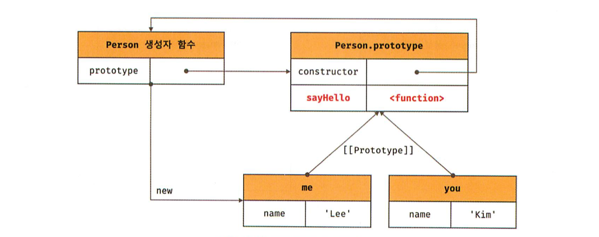

### 7. 프로토타입 체인

Object.getPrototypeOf(Person.prototype) === Object.prototype;

- 위 예제를 그림프로 표현하면 아래와 같음
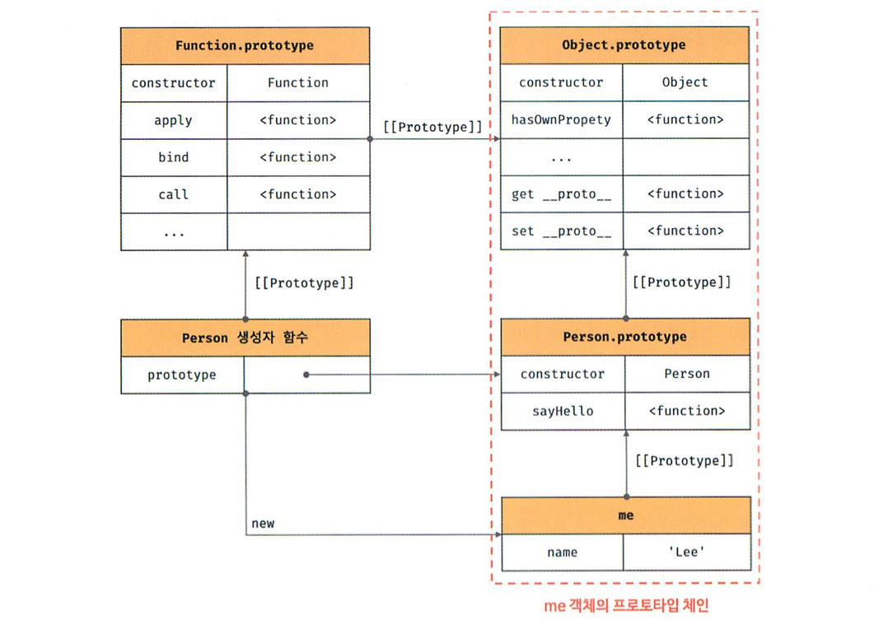

- `자바스크립트`는
`객체의 프로퍼티(메서드 포함)`에 `접근`하려고 할 때
해당 객체에 접근하려는 `프로퍼티가 없다면` [[Prototype]]`내부 슬롯`의 `참조를 따라`
자신의 `부모 역할을` 하는 프로토타입의 `프로퍼티를 순차적으로 검색`합니다.
이를 `프로토타입 체인`이라 부릅니다.

- `프로토타입 체인`은 `자바스크립트`가 `객체지향 프로그래밍`의 `상속을 구현`하는 `매커니즘(작동방식)`입니다.


`me.hasOwnProperty('name'); // true`
> `hasOwnProperty`는 `Object.prototype`의 `메서드` 입니다.
> `me 객체`는 `프로토타입 체인`을 따라 `hasOwnProperty 메서드를 검색`하여 `사용`합니다.

- hasOwnProperty('name')과 같이 `메서드를 호출`하면
`아래`와 같은 `과정`을 거쳐서 `메서드를 검색`합니다. (프로퍼티를 참조하는 경우도 마찬가집니다.)

> 1.
> 먼저 hasOwnProperty 메서드를 호출한 me 객체에서
> `hasOwnProperty 메서드를 검색합니다.`

> `me 객체에는 hasOwnProperty메서드가 없으므로`
> 프로토타입 체인을 따라([[Prototype]] 내부슬롯에 바인딩 되어있는 프로토타입으로)
> 이동하여 hasOwnProperty 메서드를 검색합니다.

> 2.
> `Person.prototype 에도 hasOwnProperty 메서드가 없으므로`
> 프로토타입 체인을 따라([[Prototype]] 내부슬롯에 바인딩 되어있는 프로토타입으로)
> 이동하여 hasOwnProperty 메서드를 검색합니다.

> 3.
> 위에 내부슬롯에 바인딩 되어있는 프로토타입인 `Object.prototype`에
> `hasOwnProperty 메서드가 존재`합니다.

> `자바스크립트 엔진`은 `Object.prototype.hasOwnProperty 메서드를 호출`합니다.
> 이때 Object.prototype.hasOwnProperty 메서드의 `this`에는
> `me 객체가 바인딩`됩니다.

> `Object.prototype.hasOwnProperty.call(me, 'name');`


- call 메서드
> call 메서드는 this로 사용할 객체를 전달하면서 함수를 호출합니다.

- 프로토타입 체인 최상위에 위치하는 객체는 언제나 Object.prototype 입니다.
> 모든 객체는 Object.prototype을 상속 받습니다.
> Object.prototype은 프로토타입 체인의 종점 입니다.
> Object.prototype == [[Prototype]] 내부슬롯의 값은 null 입니다.
> Object.prototype에서도 프로퍼티를 검색할 수없는 경우 undefined를 반환합니다. (이때 에러가 발생하지 않는것에 주의해야합니다.)

- 자바스크립트 엔진은 프로토타입 체인을 따라 프로퍼티/메서드를 검색합니다.
> 상속관계로 이루어진 프로토타입의 계층적인 구조에서 객체의 프로퍼티를 검색합니다.
> 프로토타입 체인은 상속과 프로퍼티 검색을 위한 메커니즘 입니다.

- 식별자는 스코프 체인에서 검색합니다.
> 자바스크립트 엔진은 함수의 중첩 관계로 이루어진 스코프의 계층적 구조에서 식별자를 검색합니다.
> 스코프 체인은 색별자 검색을 위한 메커니즘 입니다.

```js
me.hasOwnProperty('name');
// 먼저 스코프 체인에서 me 식별자를 검색합니다.
// me 식별자는 전역에서 선언되었으므로 전역 스코프에서 검색됩니다.
// me 식별자를 검색한 다음
// me 객체의 프로토타입 체인에서 hasOwnProperty 메서드를 검색합니다.
```

- `스코프 체인`과 `프로토타입 체인`은 서로 연관없이 별도로 동작하는 것이 아니라
- `서로 협력`하여 `식별자와 프로퍼티를 검색`하는데 `사용`됩니다.

### 8. 오버라이딩과 프로퍼티 섀도잉

```js
const Person = (function () {
    // 생성자 함수
    function Person(name) {
        this.name = name;
    }
    // 프로토타입 메서드 (프로토타입이 소유한 프로퍼티 == 프로토타입 프로퍼티)
    Person.prototype.sayHello = function () {
        console.log(`Hi! My name is ${this.name}`);  
    };
    // 생성자 함수를 반환
    return Person;
}());

const me = new Person('Lee');

// 인스턴스 메서드 (인스턴스가 소유한 프로퍼티 == 인스턴스 프로퍼티)
me.sayHello = function () {
    console.log(`Hey! My name is ${this.name}`);  // Hi -> Hey
};

// 인스턴스 메서드가 호출됩니다.
// 프로토타입 메서드는 인스턴트 메서드에 의해 가려집니다.
me.sayHello(); // Hey! ~~~
```


> 기존의 프로토타입 메서드는 `덮어쓰여지는` 것이 `아니라` 
> 인스턴스 자체에 `새로 추가된` 인스턴스 메서드에 의해 `가려짐`

- 프로토타입이 소유한 프로퍼티(메서드 포함)를 프로토타입 프로퍼티
- 인스턴스가 소유한 프로퍼티를 인스턴스 프로퍼티라고 부릅니다.

- 인스턴스 메서드 sayHello는 프로토타입 메서드 sayHello 오버라이딩했고 프로토타입 메서드 sayHello는 가려집니다.
상속관계에 의해 프로퍼티가 가려지는 현상을 프로퍼티 섀도잉 이라 합니다.

- 오버라이딩 : 상위 클래스가 가지고있는 메서드를 하위 클래스가 재정의하여 사용하는 방식입니다.
- 오버로딩   : 함수의 이름은 동일하지만 매개변수의 타입 또는 개수가 다른 메서드를 구현하고
              매개변수에 의해 메서드를 구별하여 호출하는 방식입니다.
              자바스크립트는 오버로딩을 지원하지 않지만 arguments 객체를 사용하여 구현할수는 있습니다.

- 프로퍼티를 삭제하는 경우도 마찬가지 입니다.

```js
// [1] 먼저 인스턴스 메서드를 삭제해봅시다.
delete me.sayHello;
// 인스턴스에는 sayHello 메서드가 없으므로 프로토타입 메서드가 호출됩니다.
me.sayHello(); // Hi! My name is Lee
```

```js
// [2]. 다시 한번 sayHello 메서드를 삭제해서 프로토타입 메서드를 삭제해봅시다.
// 프로토타입 체인을 통해 프로토타입 메서드가 삭제되지 않고
delete me.sayHello;
// 프로토타입 메서드가 호출됩니다.
me.sayHello(); // Hi! My name is Lee
```

- 위에 예제처럼 하위객체를 통해 프로토타입의 프로퍼티를 변경/삭제 하는것은 불가능 합니다.
> 하위 객체를 통해 프로토타입에 get 액세스는 허용되나 set 액세스는 허용되지 않습니다.

- 프로토타입의 프로퍼티를 변경/삭제 하려면 프로토타입에 직접 접근해야 합니다.
```js
// 프로토타입 프로퍼티 변경/삭제는 `프로토타입에 직접 접근`해야 함
Person.prototype.sayHello = function () {
    console.log(`Whooa! My name is ${this.name}`);  
};
me.sayHello(); // Whooa! ~~~

// (직접) 프로토타입 메서드의 삭제 시도
delete Person.prototype.sayHello;
me.sayHello(); // TypeError: me.sayHello is not a function
```

### 9. 프로토타입 교체

- 프로토타입은 임의의 다른 객체로 변경할수 있습니다.
> 부모 객체인 프로토타입을 동적으로 변경 가능
> 객체 간의 상속 관계를 동적으로 변경 가능
- 프로토타입은 `생성자 함수` 또는 `인스턴스`에 의해 교체 가능

#### 19.9.1 생성자 함수에 의한 프로토타입 교체

```js
const Person = (function () {
    function Person(name) {
        this.name = name;
    }
    // 생성자 함수의 prototype 프로퍼티를 통해 프로토타입 교체
    Person.prototype = {
        // Person 생성자 함수가 생성할 객체의 프로토타입을 [객체 리터럴]로 교체
        sayHello() {
            console.log(`Hi! My name is ${this.name}`);  
        }
    };
    return Person;
}());

const me = new Person('Lee');
```

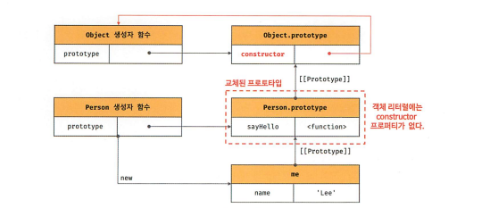
> 생성자 함수에 의한 프로토타입 교체

- 프로토타입을 `객체 리터럴`로 교체 시,
> 객체 리터럴에는 constructor 프로퍼티가 없으므로 (원래 js엔진이 프로토타입 생성 시 암묵적으로 추가)
> me 객체의 생성자 함수를 검색하면 Person이 아닌 Object가 나오게 됩니다.

```js
// 프로토타입을 교체하면 constructor 프로퍼티와 생성자 함수 간 연결이 파괴됩니다.
console.log(me.constructor === Person); // false
// 프로토타입 체인을 따라 Object.prototype의 constructor 프로퍼티가 검색됩니다.
console.log(me.constructor === Object); // true
```

```js
// 아래와 같이 교체될 객체 리터럴에 constructor 프로퍼티를 추가하여
// 프로토타입의 constructor 프로퍼티를 되살릴 수 있습니다.
const Person = (function () {
    function Person(name) {
        this.name = name;
    }
    Person.prototype = {
        constructor: Person, // 추가된 라인, 교체될 프로토타입의 constructor 프로퍼티와 생성자 함수 간 연결을 설정  
        sayHello() {
            console.log(`Hi! My name is ${this.name}`);  
        }
    };
    return Person;
}());

const me = new Person('Lee');

// constructor 프로퍼티가 생성자 함수를 가리킵니다.
console.log(me.constructor === Person); // true
console.log(me.constructor === Object); // false
```

#### 19.9.2 인스턴스에 의한 프로토타입 교체

- 프로토타입은 `생성자 함수의 prototype 프로퍼티` 뿐만 아니라,
- `인스턴스의 __proto__ 접근자 프로퍼티 (Object.getPrototypeOf 메서드)` 로 접근할 수도 있습니다.

- `생성자 함수의 prototype 프로퍼티` 에 다른 객체를 바인딩 하는 것은
  `미래에 생성할 인스턴스`의 프로토타입을 교체하는 것 입니다.

- `인스턴스의 __proto__ 접근자 프로퍼티 (Object.getPrototypeOf 메서드)`
  `이미 생성된 객체`의 프로토타입을 교체하는 것 입니다.

```js
function Person(name) {
    this.name = name;
}
const me = new Person('Lee');
// 프로토타입으로 교체될 객체
const parent = {
    sayHello() {
        console.log(`Hi! My name is ${this.name}`);  
    }
};
// me 객체의 프로토타입을 parent 객체로 교체
Object.setPrototypeOf(me, parent); // me.__proto__ = parent; 와 동일하게 동작합니다.
me.sayHello(); // Hi My name is Lee
```
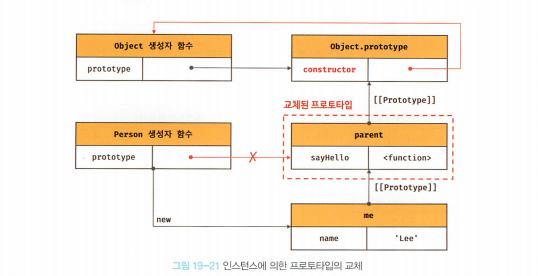

- 위 이미지 설명 :
> `생성자 함수에 의한 프로토타입 교체`와 마찬가지로
> 프로토타입으로 교체한 객체에는 constructor 프로퍼티가 없으므로
> constructor 프로퍼티와 생성자 함수 간의 연결이 파괴됩니다.
> 프로토타입의 constructor 프로퍼티로 me 객체의 생성자 함수를 검색하면
> person이 아닌 Object가 나옵니다.

```js
console.log(me.constructor === Person); // false - 프로토타입을 교체하면 constructor 프로퍼티와 생성자 함수 간의 연결이 파괴됩니다.
console.log(me.constructor === Object); // true - 프로토타입 체인을 따라 Object.prototype의 constructor 프로퍼티가 검색됩니다.
```

- `생성자 함수에 의한 프로토타입 교체`와
- `인스턴스에 의한 프로토타입 교체`는
- 별다른 차이가 없어 보입니다.
- `미묘한 차이`를 이미지로 확인해봅시다.

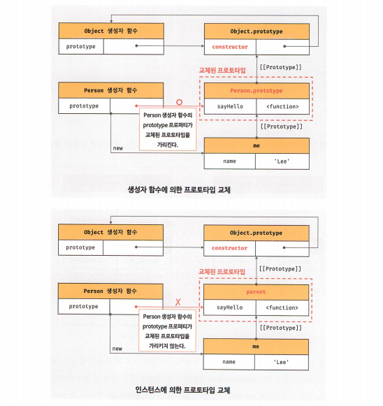

```js
// 프로토타입을 교체하면 객체 리터럴에 constructor 프로퍼티를 추가하고,
// 생성자 함수의 prototype 프로퍼티를 재설정하여 파괴된 생성자 함수와 프로토타입 간의 연결을 되살려봅시다.

function Person(name) {
    this.name = name;
}
const me = new Person('Lee');
// 프로토타입으로 교체될 객체
const parent = {
    // (유의) constructor 프로퍼티와 생성자 함수 간의 연결을 설정 
    constructor: Person,

    sayHello() {
        console.log(`Hi! My name is ${this.name}`);  
    }
};

// (유의) 생성자 함수의 prototype 프로퍼티와 프로토타입 간 연결을 설정
Person.prototype = parent;

// me 객체의 프로토타입을 parent 객체로 교체
Object.setPrototypeOf(me, parent); // me.__proto__ = parent;  와 동일
me.sayHello(); // Hi My name is Lee

console.log(me.constructor === Person); // true - constructor 프로퍼티와 생성자 함수를 가리킵니다.
console.log(me.constructor === Object); // false

// (유의 2건 덕분에) 생성자 함수의 prototype 프로퍼티가 교체된 프로토타입을 가리키게 됩니다.
console.log(Person.prototype === Object.getPrototypeOf(me)); // true
```

> 위처럼 프로토타입 교체를 통해 `객체간의 상속 관계`를 `동적으로 변경`하는 것은 `번거롭습니다.`
> 따라서 프로토타입은 직접 교체하지 않는 것이 좋습니다.
- 아래에 `직접 상속`에서 살펴볼 직접 상속이 `더 편리하고 안전`합니다.

### 10. instanceof 연산자

- instanceof 연산자는 이항 연산자로서
> 좌변에 객체를 가리키는 식별자,
> 우변에 생성자 함수를 가리키는 식별자를 피연산자로 받습니다.
> 만약, 우변의 피연산자가 함수가 아닌 경우 TypeError가 발생합니다.

` 객체 instanceof 생성자 함수 `

- 우변에 생성자 함수의 prototype에 바인딩된 객체가
- 좌변의 객체의 프로토타입 체인 상에 존재하면
- true로 평가되고, 그렇지 않은 경우는 false로 평가됩니다.

```js
// 생성자 함수
function Person(name) {
    this.name = name;
}
const me = new Person('lee');

// Person.prototype과 Object.prototype은
// me 객체의 프로토타입 상에 존재하므로 true로 평가됩니다.
console.log(me instanceof Person); // true
console.log(me instanceof Object); // true
```

```js
// instanceof 연산자가 어떻게 동작하는지 이해하기 위해 프로토타입을 교체해봅시다.
function Person(name) {
    this.name = name;
}
const me = new Person('lee');

const parent = {};
Object.setPrototypeOf(me, parent);

// Person 생성자함수와 parent 객체는 연결되어 있지 않습니다.
console.log(Person.prototype === parent);   // false
console.log(parent.constructor === Person); // false

// Person.prototype은
// me 객체의 프로토타입 상에 존재하지 않으므로 false로 평가됩니다. (Object.prototype은 존재해서 true로 평가됨ㅁ)
console.log(me instanceof Person); // false
console.log(me instanceof Object); // true
```

> me 객체는 비록 프로토타입이 교체되어 프로토타입과 생성자 함수 간의 연결이 파괴되었지만 Person
> 생성자 함수에 의해 생성된 인스던스임에는 틀림이 없습니다.
> 그러나 me instanceof Person은 false로 평가됩니다.

> 이는 Personprototype이 me객체의 프로토타입 체인 상에 존재하지 않기 때문입니다.
> 따라서 프로토타입으로 교체한 parent 객체를
> Person 생성자 함수의 prototype 프로퍼티에 바인딩하면
> me instanceof Person은 true로 평가될 것입니다.

```js
function Person(name) {
    this.name = name;
}
const me = new Person('lee');
const parent = {};
Object.setPrototypeOf(me, parent);
console.log(Person.prototype === parent);   // false
console.log(parent.constructor === Person); // false

// parent 객체를 Person 생성자 함수의 prototype 프로퍼티에 바인딩합니다.
Person.prototype = parent;

// Person.prototype과 Object.prototype는
// me 객체의 프로토타입 상에 존재하므로 true로 평가됩니다.
console.log(me instanceof Person); // true
console.log(me instanceof Object); // true
```

- 이처럼 instanceof 연산자는 프로토타입의 constructor 프로퍼티가 가리키는 생성자 함수를 찾는 것이 아니라
- 생성자 함수의 prototype에 바인딩된 객체가 프로토타입 체인 상에 존재하는지 확인합니다.

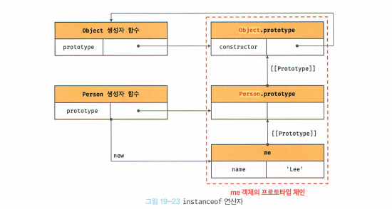

- me instanceof Person의 경우
> me 객체의 프로토타입 체인 상에 Person.prototype에 바인딩된 객체가 존재하는지 확인합니다.

- me instanceof Object의 경우도 마찬가지입니다.
> me 객체의 프로토타입 체인 상에 Object.prototype에 바인딩된 객체가 존재하는지 확인합니다.

- instanceof 연산자를 함수로 표현하면 다음과 같습니다.
```js
function isInstanceof(instance, constructor) {
    const prototype = Object.getPrototypeOf(instance); // 프로토타입 취득
    // 재귀 탈출 조건 (prototype이 null이면 프로토타입체인의 종점에 다다른것입니다.)
    if (prototype === null) return false;
    // 프로토타입이 생성자함수의 prototype 프로퍼티에 바인딩된 객체라면 true를 반환합니다.
    // 그렇지 않다면 재귀 호출로 프로토타입 체인 상의 상위 프로토타입으로 이동하여 확인합니다.
    return prototype === constructor.prototype || isInstanceof(prototype, constructor); 
}
console.log(isInstanceof(me, Person)); // true
console.log(isInstanceof(me, Object)); // true
console.log(isInstanceof(me, Array)); // false
```

- 따라서 생성자 함수에 의해 프로토타입이 교체되어
  constructor 프로퍼티와 생성자 함수 간의 연결이 파괴 되어도
> 생성자 함수의 prototype 프로퍼티와 프로토타입 간의 연결은 파괴되지 않으므로
> instanceof는 아무런 영힝을 받지 않습니다.

```js
const Person = (function() {
    function Person(name) {
        this.name = name;
    }
    Person.prototype = {
        sayHello() {
            console.log(`Hi! My name is ${this.name}`);
        }
    };
    return Person;
}());
const me = new Person('lee');

// constructor 프로퍼티와 생성자함수 간의 연결이 파괴되어도
// instanceof는 아무런 영향을 받지 않습니다.
console.log(me.constructor === Person);  // false

// Person.prototype과 Object.prototype는
// me 객체의 프로토타입 상에 존재하므로 true로 평가됩니다.
console.log(me instanceof Person);       // true
console.log(me instanceof Object);       // true
```

### 19.11 직접 상속

#### 19.11.1 Object.create에 의한 직접 상속

- Objectcreate 메서드는 명시적으로 프로토타입을 지정하여 새로운 객체를 생성한다.
> Object.create 메서드도 다른 객체 생성 방식과 마찬가지로
> 추상 연산 OrdinaryObjectCreate를 호출합니다.

- Object.create 메서드의
> 첫 번째 매개변수에는 생성할 객체의 프로토타입으로 지정할 객체를 전달합니다.
> 두번째 매개변수에는 생성할 객체의 프로퍼티 키와 프로퍼티 디스크립터 객체로 이뤄진 객체를 전달합니다.
> 객체의 형식은 Object.deFineProperties 메서드의 두 번째 인수와 동일합니다. (두번째 인수는 옵션이므로 생략 가능)


★★★ 중간에 예제 19-51 코드가 말하고자 하는게 이해가 안됨


- Object.create 메서드는
첫 번째 매개변수에 전달한 객체의 프로토타입 체인에 속하는 객체를 생성합니다.

- 객체를 생성하면서 직접적으로 싱속을 구현하는 메서드의 장점
> new연산자가 없이도 객체를 생성 가능
> 프로토타입을 지정하면서 객체를 생성 가능
> 객체 리터럴에 의해 생성된 객체도 상속받을 수 있습니다.

- Object.prototype의 빌트인 메서드인
> Object.prototype.hasOwnProperty,
> Object.prototype.isPrototypeOf,
> Object.prototype.propertyIsEnumerable 등은
> Object.prototype의 메서드이므로 모든 객체가 상속 받아 호출할 수 있습니다.
(모든 객체의 프로토타입 체인의 종점)

```js
const obj = {a: 1};
obj.hasOwnProperty('a');       // true
obj.propertyIsEnumerable('a'); // ture
```

- ESLint에서는 Object.prototype의 빌트인 메서드를
객체가 직접 호출하는 것을 권장하지 않습니다.
> 그 이유는 Object.create 메서드를 통해
> 프로토타입 체인의 종점에 위치하는 객체를 생성할 수 있기 때문입니다.
> 프로토타입 체인의 종점에 위치히는 객체는
> Object.prototype의 빌트인 메서드를 사용할 수 없습니다.

```js
// 프로토타입이 null인 객체 (프로토타입 체인의 종점에 위치하는 객체를 생성합니다.)
const obj = Object.create(null);
obj.a = 1;
console.log(Object.getPrototypeOf(obj) === null); // true

// console.log(obj.hasOwnProperty('a')); // TypeError: obj.hasOwnProperty is not a function
// 위와 같은 에러를 발생시킬 위험을 없애기위해
// Object.prototype의 빌트인 메서드는 다음과 같이 간접적으로 호출하는 것이 좋습니다.
console.log(Object.prototype.hasOwnProperty.call(obj, 'a')); // true
```

#### 19.11.2 객체 리터럴 내부에서 __proto__ 에 의한 직접 상속

- Object.create 메서드에 의한 직접 상속은 여러 장점이 있습니다.
> 두번째 인자로 프로퍼티를 정의하는 것은 번거롭습니다.
> 일단 객체를 생성한 이후 프로퍼티를 추가하는 방법도 있으나, 이 또한 깔끔한 방법은 아닙니다.
- ES6에서는 객체 리터럴 내부에서 __proto__ 접근자 프로퍼티를 사용하여
- 직접 상속을 구현할 수 있습니다.

```js
const myProto = {x: 10};
// 객체 리터럴에 의해 객체를 생성하면서
// 프로토타입을 지정하여 직접 상속 받을 수 있습니다.
const obj = {
    y: 20,
    __proto__: myProto                               // 객체를 직접 상속받습니다.
                                                     // obj -> myProto ->
                                                     // Object.prototype -> null
};
console.log(obj.x, obj.y);                           // 10 20
console.log(Object.getPrototypeOf(obj) === myProto); // true
```

### 19.12 정적 프로퍼티/메서드

- 정적 프로퍼티/메서드는 생성자 함수로 인스턴스를 생성하지 않아도
참조/호출 할 수 있는 프로퍼티/메서드 를 말합니다.

```js
function Person(name) {                             //생성자 함수
    this.name = name;
}
Person.prototype.sayHello = function() {            // 프로토타이 메서드
    console.log(`Hi! My name is ${this.name}`);
};
Person.staticProp = 'static prop';                  // 정적 프로퍼티
Person.staticMethod = function() {                  // 정적 메서드
    console.log('staticMethod');
};
const me = new Person('lee');                       // 인스턴스
// 생성자함수로 추가한 정적 프로퍼티/메서드는 생성자 함수로 참조/호출 합니다.
// 정적 프로퍼티/메서드는 생성자함수가 생성한 인스턴스로 참조/호출 할 수 있습니다.
// 인스턴스로 참조/호출할 수 있는 프로퍼티/메서드는 프로토타입 체인 상에 존재해야 합니다.
Person.staticMethod();          // staticMethod
me.staticMethod();              // TypeError: me.staticMethod is not a function
```

- Person 생성자함수는 객체이므로
> 자신의 프로퍼티/메서드를 소유할 수 있습니다.
- Person 생성자함수 객체가 소유한 프로퍼티/메서드를
> 정적 프로퍼티/메서드 라고 합니다.
> 정적 프로퍼티/메서드는
> 생성자 함수가 생성한 인스턴스로 참조/호출 할 수 없습니다.

- 정적 프로퍼티 메서드
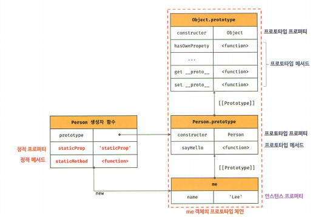

- 생성자 함수가 생성한 인스턴스는
자신의 프로토타입 체인에 속한 객체의 프로퍼티/메서드에 접근할 수 있습니다.
> 정적 프로퍼티/메서드는
> 인스턴스의 프로토타입 체인에 속한 객체의 프로퍼티/메서드가 아니므로
> 인스턴스로 접근할 수 없습니다.

- Object.create 메서드는
> Object 생성자 함수의 정적 메서드입니다.
> 인스턴스(Object 생성자 함수가 생성한 객체)로 호출할 수 없습니다.

- Object.prototype.hasOwnProperty 메서드는
> Object.prototype의 메서드 입니다.
> 프로토타입 체인의 종점 이므로(Object.prototype) 모든 객체가 호출할 수 있습니다.

```js
const obj = Object.create({name: 'lee'});   // 정적 메서드
obj.hasOwnProperty('name');                 // false - 프로토타입 메서드
```

- 인스턴스/프로토타입 메서드 내에서 this를 사용하지 않는다면
> 그 메서드는 정적 메서드로 변경할 수 있습니다.
- 인스턴스가 호출한 인스턴스/프로토타입 메서드 내에서 this는 인스턴스를 가리킵니다.
> 메서드 내에서 인스턴스를 참조할 필요가 없다면 정적 메서드로 변경하여도 동작합니다.
- 프로토타입 메서드를 호출하려면 인스턴스를 생성해야 하지만
> 정적 메서드는 인스턴스를 생성하지 않아도 호출할 수 있습니다.

```js
function Foo() {}
Foo.prototype.x = function() {  // 프로토타입 메서드
    console.log('x');
};
const foo = new Foo();
foo.x();                        // x - 프로토타입 메서드를 호출하려면 인스턴스를 생성해야 합니다.
Foo.x = function() {            // 정적 메서드
    console.log('x');
};
Foo.x();                        // x - 정적메서드는 인스턴스를 생성하지 않아도 호출할 수 있습니다.
```

- MDN과 같은 문서를 보면
> `정적 프로퍼티/메서드와`
> `프로토타입 프로퍼티/메서드를`
> 구분하여 소개하고 있습니다.

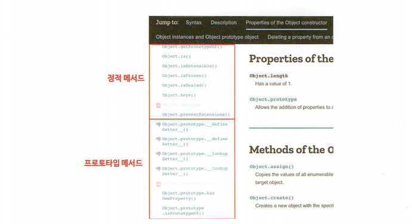

### 13. 프로퍼티 존재 확인

#### 19.13.1 in 연산자

- in 연산자는 객체 내에 특정 프로퍼티가 존재하는지 여부를 확인합니다.
- in 연산자의 사용법은 다음과 같습니다.
- `key in object`
> key는 프로퍼티 키를 나타내는 문자열
> object는 객체로 평가되는 표현식

```js
const person = {
    name: 'Lee',
    address: 'Seoul'
};

// person 객체에 name과 address 프로퍼티가 존재합니다.
console.log('name' in person);    // true
console.log('address' in person); // true

// person 객체에는 toString이라는 프로퍼티가 없지만 true를 반환하는 이유는
// in 연산자가 person 객체가 속한 프로토타입 체인 상에 존재하는
// 모든 프로토타입에서 toString 프로퍼티를 검색했기 때문입니다.
// toString은 Object.prototype의 메서드입니다.
console.log('toString' in person); // true
```

```js
// in 연산자 대신 ES6에서 도입된 Reflect.has 메서드를 사용할 수도 있습니다.
// Reflect.has 메서드는 in 연산자와 동일하게 동작합니다.
const person = {name: 'lee'};
console.log(Reflect.has(person, 'name'));     // true
console.log(Reflect.has(person, 'toString')); // true
```

#### 19.13.2 Object.prototype.hasOwnProperty 메서드

- Object.prototype.hasOwnProperty 메서드를 사용해도
> 객체에 특정 프로퍼티가 존재하는지 확인할 수 있습니다.

- 인수에서 전달 받은 프로퍼티 키가
> 객체 고유의 프로퍼티 키인 경우에만 true를 반환하고
> 상속받은 프로토타입의 프로퍼티 키인 경우 false를 반환합니다.


```js
console.log(person.hasOwnProperty('name')); // true
console.log(person.hasOwnProperty('age'));  // false

```

### 19.14 프로퍼티 열거

#### 19.14.1 for...in 문

- 객체의 모든 프로퍼티를 순회하며 열거하려면 for...in 문을 사용합니다.
` for (변수선언문 in 객체) {...} `

```js
const person = {
    name: 'lee',
    address: 'seoul'
};
for (const key in person) {
    console.log(key + ': ' + person[key]);
}
// name: lee
// address: seoul
```

- for...in 문은
> 객체의 프로퍼티 개수만큼 순회하며
> for...in 문의 변수 선언문에서 선언한 변수에
> 프로퍼티 키를 할당합니다.

- 예제의 경우 person 객체에는
> 2개의 프로퍼티가 있으므로 객체를 2번 순회하면서
> 프로퍼티 키를 key 변수에 할당한 후 코드 블록을 실행합니다.

> 첫 번째 순회에서는 프로퍼티 키 'name'을 key 변수에 할당한 후 코드 블록을 실행하고
> 두 번째 순회에서는 프로퍼티 키 'address' 를 key 변수에 할당한 후 코드 블록을 실행합니다.

- for .. in 문은 in 연산자처럼
> 순회 대상 객체의 프로퍼티뿐만 아니라 상속받은 프로토타입의 프로퍼티까지 열거합니다.
> 하지만 위 예제의 경우 toString과 같은 Object.prototype의 프로퍼티가 열거되지 않습니다.

```js
const person = {
    name: 'lee',
    address: 'seoul'
};
// in 연산자는 객체가 상속받은 모든 프로토타입의 프로퍼티를 확인합니다.
console.log('toString' in person); // true

// for...in 문도 객체가 상속받은 모든 프로토타입의 프로퍼티를 열거합니다.
// 하지만 toString과 같은 Object.prototype의 프로퍼티가 열거되지 않습니다.
// toString 메서드가 열거할 수 없도록 정의되어 있는 프로퍼티이기 때문입니다.
for (const key in person) {
    console.log(key + ': ' + person[key]);
}
// name: lee
// address: seoul
```

- Object.prototype.string 프로퍼티의
> 프로퍼티 어트리뷰트 [[Enumerable]]의 값이 False이기 때문입니다.

- 프로퍼티 어트리뷰트 [[Enumerable]]은
> 프로퍼티의 열거 기능 여부를 나타내며 불리언 값을 가집니다.

```js
// Object.getOwnPropertyDescriptor 메서드는 프로퍼티 디스크립터 객체를 반환합니다.
// 프로퍼티 디스크립터 객체는 프로퍼티 어트리뷰트 정보를 담고 있는 객체입니다.
console.log(object.getOwnPropertyDescriptor(Object.protytpe, 'toString'));
```

- for...in 문에 대해 명확하게 표현하면 아래와 같습니다.
> for...in 문은 객체의 프로토타입 체인 상에 존재하는
> 모든 프로토타입의 프로퍼티 중에서
> 프로퍼티 어트리뷰트 [[Enumerable]]의 값이 true인 프로퍼티를 순회하며 열거합니다.

```js
const person = {
    name: 'lee',
    address: 'seoul',
    __proto__: {age: 20}
};

for (const key in person) {
    console.log(key + ': ' + person[key]);
}
// name: lee
// address: seoul
// age: 20
```

- for...in 문은 프로퍼티 키가 심벌인 프로퍼티는 열거하지 않습니다.

```js
const sym = Symbol();
const obj = {
    a: 1,
    [sym]: 10
};
for (const key in person) {
    console.log(key + ': ' + person[key]);
}
// a: 1
```

- 상속받은 프로퍼티는 제외하고
> 객체 자신의 프로퍼티만 열거하려면
> Object.prototype.hasOwnProperty 메서드를 사용하여
> 객체 자신의 프로퍼티인지 확인해야 합니다.

```js
const person = {
    name: 'lee',
    address: 'seoul',
    __proto__: {age: 20}
};
for (const key in person) {
    // 객체 자신의 프로퍼티인지 확인합니다.
    if (!person.hasOwnProperty(key)) continue;
    console.log(key + ': ' + person[key]);
}
// name: lee
// address: seoul
```

- 위 예제의 결과는 person 객체의 프로퍼티가 정의된 순서대로 열거되었습니다.
> 하지만 for...in 문은 프로퍼티를 열거할 때 순서를 보장하지 않으므로 주의하셔야 합니다.

```js
const obj = {
    2: 2,
    3: 3,
    1: 1,
    b: 'b',
    a: 'a'
};
for (const key in obj) {
    if (!obj.hasOwnProperty(key)) continue;
    console.log(key + ': ' + obj[key]);
}

/*
1: 1
2: 2
3: 3
b: b
a: a
*/
```

- 배열에는 for...in 문을 사용하지 말고
> 일반적인 for 문이나 for...of 문
> 또는 Array.prototype.forEach 메서드를 사용하기를 권장합니다.
> 배열도 객체이므로 프로퍼티와 상속받은 프로퍼티가 포함될 수 있습니다.

#### 19.14.2 Object.keys / values / entries 메서드

- for...in 문은 객체 자신의 고유 프로퍼티뿐 아니라 상속받은 프로퍼티도 열거합니다.
- 따라서 Object.prototype.hasOwnProperty 메서드를 사용하여
  객체 자신의 프로퍼티인지 확인하는 추가 처리가 필요합니다.

- 객체 자신의 고유 프로퍼티만 일거하기 위해서는 for...in 문을 사용하는 것보다
Object.keys/values/entries 메서드를 사용히는 것을 권장합니다.
Object.keys 메서드는 객체 자신의 열거 가능한 프로퍼티 키를 배열로 반환합니다.

```js
const person = {
    name: 'lee',
    address: 'seoul',
    __proto__: {age: 20}
};
console.log(Object.keys(person));    // ["name", "address"] 
console.log(Object.values(person));  // ["lee", "seoul"] 
console.log(Object.entries(person)); // ["name", "lee"], ["address", "seoul"]
Object.entries(person).forEach(([key, value]) => console.log(key, value));
```

- Object.values 메서드는 (ES8에서 도입)
> 객체 자신의 열거가능한 프로퍼티 값을 배열로 반환합니다.

- Object.entries 메서드는 (ES8에서 도입)
> 객체 자신의 열거 가능한 프로퍼티 키와 값의 쌍의 배열을 배열에 담아 반환합니다.

