#### 12. 함수 (Done)

#### [12.1 함수란?](#121-함수란-1)

#### [12.2 함수를 사용하는 이유](#122-함수를-사용하는-이유-1)

#### [12.3 함수 리터럴](#123-함수-리터럴-1)

#### [12.4 함수 정의](#124-함수-정의-1)

#### [12.4.1 함수 선언문 (statement)](#1241-함수-선언문-statement-1)

#### [12.4.2 함수 표현식](#1242-함수-표현식-1)

#### [12.4.3 함수 생성 시점과 함수 호이스팅](#1243-함수-생성-시점과-함수-호이스팅-1)

#### [12.4.4 Function 생성자 함수](#1244-function-생성자-함수-1)

#### [12.4.5 화살표 함수](#1245-화살표-함수-1)

#### [12.5 함수 호출](#125-함수-호출-1)

#### [12.5.1 매개변수와 인수](#1251-매개변수와-인수-1)

#### [12.5.2 인수 확인](#1252-인수-확인-1)

#### [12.5.3 매개변수의 최대 개수](#1253-매개변수의-최대-개수-1)

#### [12.5.4 반환문](#1254-반환문-1)

#### [12.6 참조에 의한 전달과 외부 상태의 변경](#126-참조에-의한-전달과-외부-상태의-변경-1)

#### [12.7 다양한 함수의 형태](#127-다양한-함수의-형태-1)

#### [12.7.1 즉시 실행함수](#1271-즉시-실행함수-1)

#### [12.7.2 재귀함수](#1272-재귀함수-1)

#### [12.7.3 중첩함수](#1273-중첩함수-1)

#### [12.7.4 콜백함수](#1274-콜백함수-1)

#### [12.7.5 순수함수와 비순수](#1275-순수함수와-비순수-1)

<hr>

## 12.1 함수란?

- 함수: 함수는 일련의 과정을 문 (statement)으로 구현히고 코드 블록으로 감싸서 하나의 실행 단위로 정의한것
  - 매개변수: 함수 내부로 입력을 전달 받는 변수
  - 인수: 입력
  - 출력: 반환값(return value)  
    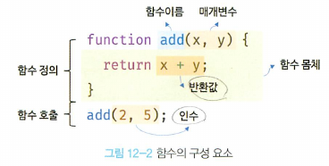
- 함수의 정의(funciton definition)
- 함수의 호출(function call/invoke)

## 12.2 함수를 사용하는 이유

- 코드의 재사용(유지보수 편의성 높이고, 코드의 신뢰성 높임)
- 함수는 객체타입의 값 > 이름(식별자)을 붙일 수 있다.

## 12.3 함수 리터럴

- 함수도 함수 리터럴로 생성할 수 있다.
  ```js
  // 변수에 함수 리터럴을 할당
  var f = function add() {
    return x + y;
  };
  ```
  
- 리터럴: 5.2d에서 살펴보았듯이 리터럴은 사람이 이해할 수 있는 문자 또는 약속된 기호를 사용해 말한다. 즉, 리터럴은 값을 생성하기위한 표기법 > 함수 리터럴도 평가되어 값을 생성하며, 이값은 객체다. 즉, **함수의 값은 객체**
- 함수는 객체지만 일반 객체와 다르다.
  - 일반객체는 호출 할 수 없음 vs 함수는 호출 가능
  - 일반객체에는 없는 함수만의 고유 프로퍼티를 갖는다.
  - 함수가 객체라는 사실은 다른 프로그래밍 언어와는 다른 중요한 특징

## 12.4 함수 정의

- 함수 정의: 함수를 호출하기 이전에 인수를 전달받을 매개변수와 실행할 문들, 그리고 반환할 값을 지정하는 것. 정의된 함수는 js engine에 의해서 평가되어 함수 객체가 됨.
- 함수를 정의하는 법 4가지  
  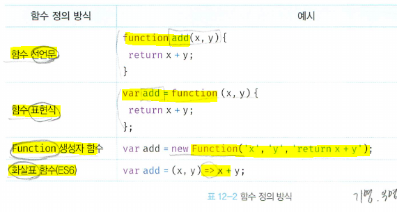
  - 함수는 정의 vs 변수는 선언 (용어차이)

## 12.4.1 함수 선언문 (statement)

- 함수 선언문은 함수 리터럴과 동일하지만, 함수명을 생략할 수는 없다.

```js

// 함수 선언문
function add(x, y) {
  return x + y;
}

// 함수명을 생략한 이렇게는 불가하다는 말 (함수 리터럴은 생략가능)
function (x, y) {
  return x + y;
}
// SyntaxError: Functlon statelnents requlre a functlon name

```

- 함수 선언문은 변수에 할당할 수 없다. 표현식(expression)이 아닌 문. so, 함수 statement를 실행시키고 console.log()찍어보면 undefined가 나온다. expression이면 평가되어 값으로 return되고, 변수에 할당할 수 있다.(statement는 변수로 할당될 수 없다.)
  - 하지만!!! 작동된다.  
    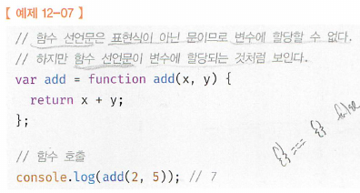
  - 이유는 자바스크립트 엔진이 코드의 문맥에 따라 동일한 함수 리터럴을 표현식이 아닌 문인
    함수 선언문으로 해석하는 경우와 표현식인 문인 함수 리터럴 표현식으로 해석하는 경우가 있기 때문이다. 즉, 기명함수리터럴은 `함수 선언문` 또는 `기명함수 리터럴` 두개로 중의적 해석 가능.
    즉, 단독으로 쓰이면 `함수 선언문`으로 사용되고, 위의 코드에서처럼 함수 리터럴이 값으로 평가되어야 하는 문맥(변수에 할당하는 코드면)이면 `기명함수 리터럴`로 해석되어 변수에 할당이 가능한거임
  - 이와 동일하게 { }: 객체 리터럴이 될수도 있고, 블록문일수도 있고. > 문맥에 따라서 해석이 달라진다.

```js
// 기명함수 리터럴을 단독으로 사용하면 '함수 선언문'으로 해석된다.
// 함수 선언문에서는 함수 이름을 생략할 수 없다.
function foo() { console 1og( 'foo' ); }
foo() ; // foo

//함수 리터렬을 피연산자로 사용하면 함수 선언문이 아니라 '함수 리터럴 표현식'으로 해석
// 함수 리터럴에서는 함수 이름을 생략할 수 있다.
(function bar(){console.log('bar');});
bar(); // ReFerenceError: bar is not deFined

```

## 12.4.2 함수 표현식

- 객체의 특징(so, 자바스크립트 함수는 일급 객체 = 함수를 값처럼 자유롭게 사용할 수 있다는 말)
  - 자바스크립트의 힘수는 객체 타입의 값
  - 자바스크립트의 힘수는 값처럼 변수에 할당할 수도 있고 : 함수 표현식(function expression)
  - 프로퍼티 값이 될 수도 있으며
  - 배열의 요소가 될 수도 있다
- 함수 리터럴: 기명함수, 익명함수 둘다 가능
- 함수 선언문: 오직 기명함수만 가능
- 함수 표현식: 기명함수, 익명함수 둘다 가능  
  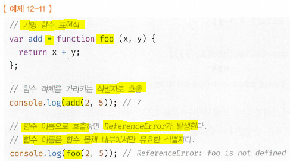
- js engine은 함수 선언문의 함수 이름으로 식별자를 암묵적 생성하고 생성된 함수 객체를 할당하므로 힘수 표현식과 유사하게 동작히는 것처럼 보인다. BUT 정확히 선언문과 표현식이 정확하게 일치하지는 않는다.
  - 함수 선언문: 표현식이 아닌 문
  - 함수 표현식: 표현식인 문: 값으로 평가가 가능

## 12.4.3 함수 생성 시점과 함수 호이스팅

- 함수 선언문으로 정의한 함수는 함수 선언문 이전에 호출할 수 있다. 그러나 함수 표현식으로 정의한 함수는 함수 표현식 이전에 호출할 수 없다. 이는 함수 선언문으로 정의한 함수와 함수표현식으로 정
  의한 함수의 생성 시점이 다르기 때문.
- 함수 선언문: `runtime`(코드가 한 줄씩 순차적으로 실행되는 시점) **'이전에'** js engine에 의해서 함수 객체가 먼저 생성된다. 그리고 엔진은 함수 이름과 동일한 이름의 식별자를 암묵적으로 생성하고 생성된 함수 객체를 할당.
  - 즉, `runtime`시점에는 이미 함수객체 생성완료, 함수이름과 동일한 변수 생성 완료, 그 변수에 할당까지 완료된 상태. > 따라서 함수 선언문 이전에 함수를 참조 할 수도 있고, 호출할수도 있는것임. (hoisting)
- 함수 hoisitng vs 변수 hoisting
  - 공통점: 똑같이 `runtime`이전에 js engine이 식별자(함수 식별자는 생성 후) 코드 선두로 끌어올림
  - 차이점
    - 변수 hoisting은 undefined로 초기화 vs 함수 hoisting은 함수객체로 초기화
    - so, 변수 초기화 이전에 변수 참조시 `undefined`, 함수는 선언문 이전에라도 호출시 사용가능
- 함수 표현식
  - 변수에 할당되는 함수 리터럴문
  - 함수 hoisting이 되는게 아니라 `변수 호이스팅`이 실행된다.
  - so, 할당 이전에 함수 표현식에 접근하면 `undefined`가 `평가`되는것임.
  - so, 이때 함수 호출하면 `undefined`를 호출하는것이므로, 타입에러(TypeError) 발생
  - so, 함수 표현식으로 정의함 함수 이후에 참조 또는 호출해야
- 더글라스 클락포드는 `함수 선언문` 대신 `함수 표현식`을 사용할것을 권장(`함수 선언문`은 함수 정의 이전에도 사용이 가능한 상황이 연출되므로)

## 12.4.4 Function 생성자 함수

- 빌트인 함수인 Function 생성자 함수에 매개변수 목록과 함수 몸체를 문자열로 전달하면서 new 연산자와 함께 호출하면 함수 객체를 생성해서 반환 (new연산자 없이 호출해도 결과는 동일)
- Function 생성자 함수로 함수를 생성하는 방식은 일반적이지 않으며 바람직하지도 않다.
- Function 생성자 함수로 생성한 함수는 클로저 closure를 생성하지 않는다
- 생성자 함수
  - 객체를 생성하는 함수. 객체를 생성하는 방식은 객체 리터럴 이외에 다양한 방법이 있다. 17장  
    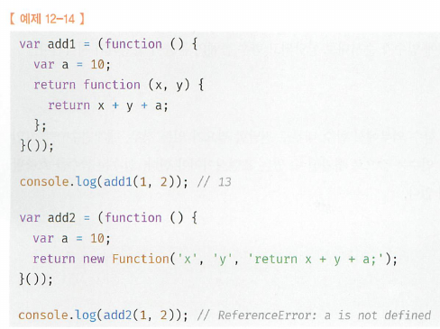

## 12.4.5 화살표 함수

- 화살표 함수는항상 익명 함수로 정의함
- 생성자 함수로 사용할 수 없다
- this binding이 다르다
- prototype property가 없다.
- arguments 객체를 생성하지 않는다

```js
// 화살표 함수
const add = (x, y) => x + y;
console.1og(add(2, 5)); // 7

```

## 12.5 함수 호출

- 함수는 함수를 가리키는 식별자와 한 쌍의 소괄호인(`( )`) `함수 호출 연산자`로 호출

## 12.5.1 매개변수와 인수

- 매개변수(parameler)를 통해 인수(argument)를 전달한다
- 인수
  - 값으로 평가될 수 있는 표현식
  - 호출할때 지정, 갯수와 타입에 제한이 없다
- 매개변수
  - 함수를 정의할때 선언
  - 함수 몸체 내부에서 변수와 동일하게 취급
  - 함수 호출되면 함수 몸체 내에서 암묵적으로 매개변수 생성, 일반적인 변수와 마찬가지로 `undefined`로 초기화된 이후 인수가 순서대로 할당. 함수가 호출될 때마다 매개변수는 이와 같은 단계를 거친다.
  - 함수 몸체 내부에서만 참조할 수 있고 함수 몸체 외부에서는 참조할 수 없다(매개변수 scope는 함수 내부)
- 함수는 매개변수의 개수와 인수의 개수
  - 함수 호출시 일치하는지 체크하지 않는다. 즉, 함수를 호출할 때 매개변수의 개수 != 인수 경우에도 에러가 발생하지는 않는다. 인수가 부족해서 인수가 할당되지 않는 매개변수의 값은 `undefined`
  - 매개변수보다 인수가 더 많은 경우 초과된 인수는 무시 (버려지는것은 아니고, 모든 인수는 암묵적으로 arguments 객체의 프로퍼티로 보관)
  - arguments객체는 함수를 정의할 때 매개변수 개수를 확정할 수 없는 가변 인자 함수를 구현할 때 유용 (18.2.1)

## 12.5.2 인수 확인

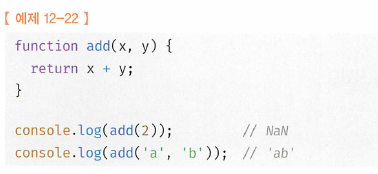

- 문법상 아무 이상 없고, 잘 작동.
  1. 자바스크립트 함수는 **매개 변수와 인수의 개수가 일치하는지 확인하지 않는다.**
  2. 자바스크립트는 **동적 타입 언어**다. 따라서 자바스크립트 함수는 **매개변수의 타입을 사전에 지정할 수 없다**.
- So, js에서 함수를 정의시, 적절한 인수가 전달되 었는지 확인할 필요  
  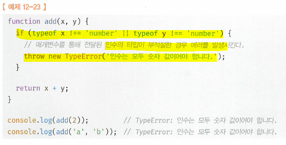
  - 방법1. 하지만, 이렇게 확인하더라도, 부적절한 호출을 사전에 방지할 수는 없고 에러는 런타임에 발생 > so, 정적타입을 선언할 수 있는 typescript를 선택, **컴파일 시점에서** 에러 잡기
  - 방법2. arguments 객체를 통해 인수 개수를 확인할 수
  - 방법3. 인수가 전달되지 않은 경우 단축 평가를 사용해 매개변수에 기본값을 할당히는 방법  
    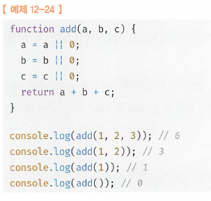
  - 방법4. ES6에서 도입된 매개변수 기본값 (인수가 전달되지 않아 매개변수가 `undefined`일 경우에만 유효)  
    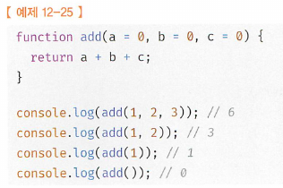

## 12.5.3 매개변수의 최대 개수

- 함수의 매개변수는 코드를 이해히는 데 방해되는 요소이므로 이상적인 매개변수 개수는 0개이며 적을수록 좋다.
- 매개변수의 개수가 많다는 것은 함수가 여러 가지 일을 한디는 증거이므로 바람직하지 않다. (이상적인 함수는 한 가지 일만 해야 하며 가급적 작게 만들어야)
- 3개이상 넘지 않는 것을 권장. 그 이상이면 1개로 만들고 객체로 넘기기
  - 객체 인수 예시
    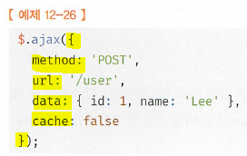
  - 프로퍼티 키만 정확히 지정하면 **매개변수 순서** 신경 안써도 된다.
  - 함수 외부에서 함수 내부로 전달한 객체를 함수 내부에서 변경하면 함수 외부의 객체가 변경 되는 부수 효과(side effect)발생

## 12.5.4 반환문

- 함수의 반환값: `return` 키워드와 표현식(반환값)으로 이뤄진 반환문
- 함수의 호출은 반환값으로 평가
- 5.3절 표현식에서 보았듯이 함수 호출은 표현식. '함수 호출 표현식'은 `return` 키워드가 반환한 표현식의 평가 결과. 즉 반환값으로 평가된다.
- 반환문의 두가지 역할과 특징
  - 첫째. 반환문은 함수의 실행을 중단하고 함수 몸체를 빠져나감. 이후 코드 실행 x
  - 둘째. 반환문은 return 키워드 뒤에 오는 표현식을 평가해 반환. return뒤의 반환값으로 사용할 표현식을 명시적으로 지정하지 않으면 undefined가 반환
  - 셋째. 생략가능. 함수 몸체의 마지막 문까지 실행한 후 암묵적으로 undefined를 반환
  ```js
  function foo() {}
  console.log(foo());
  ```
  - 넷째. `return`키워드와 반환값으로 사용될 표현식 사이에 줄바뀜 있을시, ASI에 의해서 `;` 삽입으로 인해 의도치 않은 결과 발생할 수.
    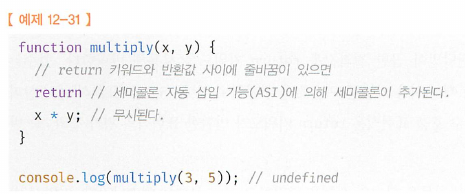
  - 다섯째. 함수내부에서만 사용. 전역에서 사용시 SyntaxError. Node.js에서는 모듈 시스템에 의해 파일별로 독립적인 파일 스코프를 갖는다. 파일의 가장 바깥 영역에 반환문을 사용해도 에러가 발생하지 않음.

## 12.6 참조에 의한 전달과 외부 상태의 변경

- 원시 값은 값에 의한 전달 `pass by value`, 객체는 참조에 의한 전달 `pass by relerence` 방식.(11장) '매개변수' 또한 타입에 따라 '값에 의한 전달', '참조에 의한 전달' 방식을 그대로 띠른다. (매개변수도 함수 몸체 내부에서 변수와 동일하게 취급)  
  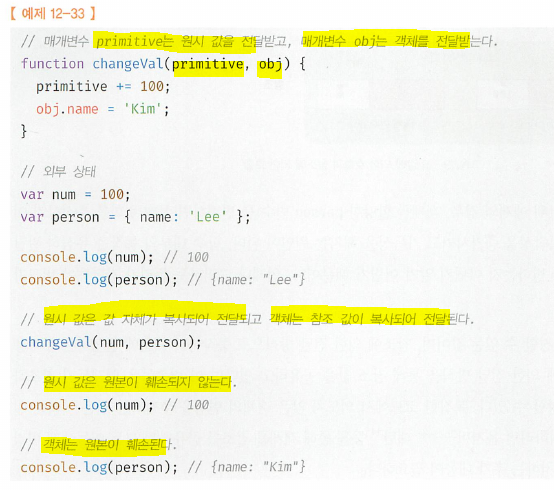

1.  원시 타입 인수는 값 자체가 복사되어 매개변수에 전달되기 때문에 함수 몸체에서 그 값을 변경(재할당을 통한 교체)해도 원본은 훼손되지 않는다. (부수효과 없음)
2.  객체 타입 인수는 참조 값이 복사되어 매개변수에 전달되기 때문에 함수 몸체에서 참조 값을 통해 객체를 변경할 경우 원본이 훼손 (부수효과 발생)

- 객체의 변경을 추적하려면 옵저버 `Obsewer` 패턴 등을 통해 객체를 참조를 공유히는 모든 이들에게 변경 사실을 통지하고 이에 대처하는 추가 대응이 필요.
- 이런 객체의 부수효과를 해결하기 위한 방안으로는 immutable object를 만들어서 사용 (객체 복사본을 만드는데 비용은 들지만, 객체를 원시값처럼 불변 + 재할당을 통해서만 변경하므로 좋다) > 객체의 상태변경을 원천봉쇄
- 함수형 프로그래밍: 외부상태를 변경하지 않고, 외부 상태에 의존하지 않는 함수를 순수 함수. 순수 함수를 통해 부수효과를 최대한 억제하여 오류를 피하고 프로그램 안정성을 높이는 패러다임 (12.7.5)

## 12.7 다양한 함수의 형태

## 12.7.1 즉시 실행함수

- 즉시 실행 함수(`Immediately invoked function expression`): 함수를 정의와 동시에 즉시 호출이 되는 함수. 단 한번만 호출되며 다시 호출 x
- 보통 익명의 함수를 사용. 기명함수도 사용은 가능. 하지만 그룹연산자`(...)`내의 기명함수는 함수 선언문이 아니라, '리터럴'로 평가되며 함수이름은 함수 몸체에서만 참조할 수 있는 식별자 이므로 즉시 실행함수를 다시 호출할 수는 없다.

  ```js
  // 익명함수 선언문
  (function () {
    var a = 3;
    var b = 4;
    return a8b;
  })()(
    // 기명함수 선언문
    (function foo() {
      // 함수 선언문이 아니라 함수 리터럴로 평가, 다시 호출 할 수 없다.
      var a = 3;
      var b = 5;
      return a * b;
    })()
  );

  foo(); // ReferenceError: foo is not defined
  ```

- `IIFE`는 `그룹연산자` `(...)`로 반드시 감싸야하면 그렇지 않으면 에러 발생

  ```js
  // 함수 선언문은 함수명을 생략할 수 없다.
  function (){ // SyntaxError
  }();

  // so, then 기명함수를 그룹연산자 없이 사용해보자
  function foo(){
  }(); // SyntaxError: Unexpected token ')'

  // 원인: js engine이 암묵적으로 수행하는 세미콜론 자동 삽입기능에 의해 함수 선언문이 끝나는 위치({ }블록문)뒤에 ';'를 암묵적 추가해서
  // function foo(){};();
  // 함수 선언문 뒤의 (...)는 함수 호출 연산자가 아니라 그룹연산자로 해석, 그룹연산자에 피연산자가 없기 때문에 에러가 발생
  ```

  - 그룹연산자(...)의 피연산자는 값으로 평가. 기명 또는 무명 함수를 그룹연산자로 감싸면 함수리터럴로 평가되어 함수 객체가 된다.  
    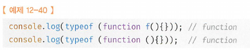
  - 그룹 연산자로 함수를 묶은 이유는 먼저 함수 리터럴을 평가해서 함수 객체를 생성하기 위해서.  
    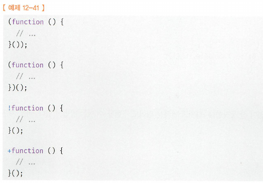

  - 즉시 실행함수도 일반함수처럼 값을 반환할 수 있고, 인수를 전달할 수 있다.

    ```js
    // 값을 반환하는 경우
    var res = (function () {
      var a = 3;
      var b = 5;
      return a * b;
    })();

    console.log(res);

    // `argument`를 전달하는 경우
    res = (function (a, b) {
      return a * b;
    })(3, 5);

    console.log(res); // 15
    ```

## 12.7.2 재귀함수

- 재귀호출(recursive call): 함수가 자기 자신을 호출하는것
- 재귀함수(recursive function): 재귀호출을 수행하는 함수
- 재귀함수(재귀호출)을 사용하면, 반복문 없이 반복처리를 구현할 수 있다.
- 재귀호출을 할때의 식별자
  - 함수표현식 호출
    - 함수 안에서는 함수 이름은 물론(foo), 함수를 나타내는 식별자(factorial) 둘다 사용가능
    - 함수 밖에서는 함수를 나타내는 식별자(factorial)만 가능  
      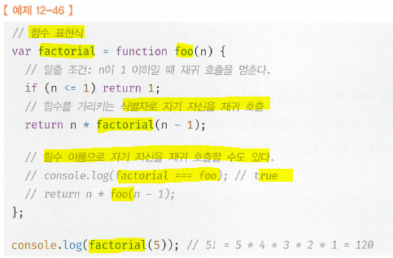
- 재귀함수는 자신을 무한재귀를 호출(stack overflow 발생) > 탈출조건 반드시 작성 필요
- 재귀 함수를 사용하는 편이 더 직관적으로 이해하기 쉬울 때만 한정적으로 사용

## 12.7.3 중첩함수

- 외부함수: outer function
- 내부함수: inner function = (중첩함수: nested function)
  - 외부함수 내에서만 호출 할 수 있다.
  - 주로 helper 함수 역할
- ES6부터 함수 정의는 문이 위치할 수 있는 문맥이라면 어디든지 기능하다.
  - 함수 선언문의 경우 ES6 이전에는 코드의 최상위 또는 디른 함수 내부에서만 정의할 수 있었으나 ES6부터는 if 문이나 for 문 등의 코드 블록 내에서도 정의할 수 있다. (단, 호이스팅으로 인해 혼란 발생할 수 있으므로 비추)
- 중첩함수는 `scope`와 `closure`와 연관

## 12.7.4 콜백함수

- 함수 repeat가 for문안에 console.log나 다른 일에 강하게 연결되어 다른일이 필요할때마다, 함수를 재정의 해야한다.  
  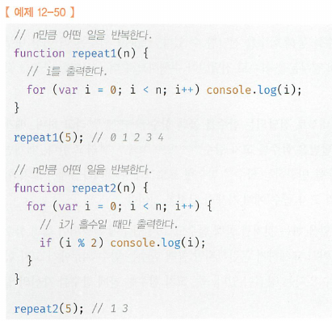
- 함수를 인수로 넘겨서 그 함수를 주어진 횟수 n만큼 실행시키도록 refactoring하자.
  - 변경되는(인수 function) 부분을 `f`로 추상화 > 외부에서 받도록 한다. (함수는 일급객체 in js) : logic을 외부에서 주입받아 좀 더 유연한 구조로 만들은것임  
    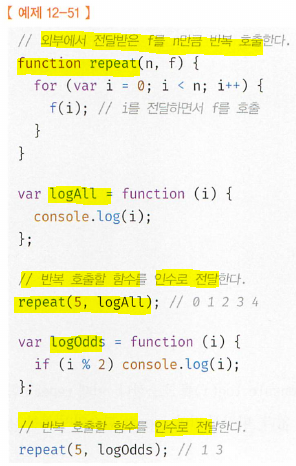
- 콜백 함수(Callback function): 함수의 매개변수를 통해 다른 함수의 내부로 전달되는 함수
- 고차 함수(HIgher-Order Function): 변수를 통해 함수의 외부에서 콜백 함수를 전달받은 함수, 또는 반환값으로 함수를 반환하는 함수 in FP paradigm.
- 콜백 함수도 마찬가지로 헬퍼함수의 역할을 한다. (차이점은 inner함수는 fixed, 콜백함수는 flexible-자유롭게 교체가능: 고차함수는 콜백함수를 자신의 일부분으로 합성)
- 고차함수는 콜백 함수를 자신이 원하는 시점에 호출하므로 함수자체를 그냥 전달해야한다.(우리가 호출해서는 안된다.) 이때 고차 함수는 필요에 따라 콜백 함수에 인수를 전달할 수 있다
- 콜백함수가 고차함수 내부에서만 호출된다면, 콜백함수를 `익명함수 리터럴`로 정의해 곧바로 전달하는게 일반적

```js
// 콜백함수가 내부에서만 호출되므로 `익명` `리터럴`함수로 정의 되어 직접 주입
repeat(4, function () {
  if (i % 2) console.log(i);
});
```

- **고차함수가 호출될때마다 평가되어 콜백함수 객체를 생성**. 그러므로
  - 콜백함수가 다른곳에서도 호출되거나,
  - 콜백함수를 전달받은 고차함수가 자주 호출된다면 > **외부에서 콜백함수를 정의한 함수를 참조하여 고차함수에 전달하는게 효율적**

```js
// logOdds 함수는 **단 한번만 생성**
var logOdds = function (i) {
  if (i % 2) console.log(i);
};

// 고차 함수에 함수 참조를 전달
repeat(5, logOdds);
```

- 콜백함수는
  1. FP과 비동기처리(이벤트처리, Ajax 통신, timer 함수 등..)에 활용되는 중요한 패턴
     <!-- 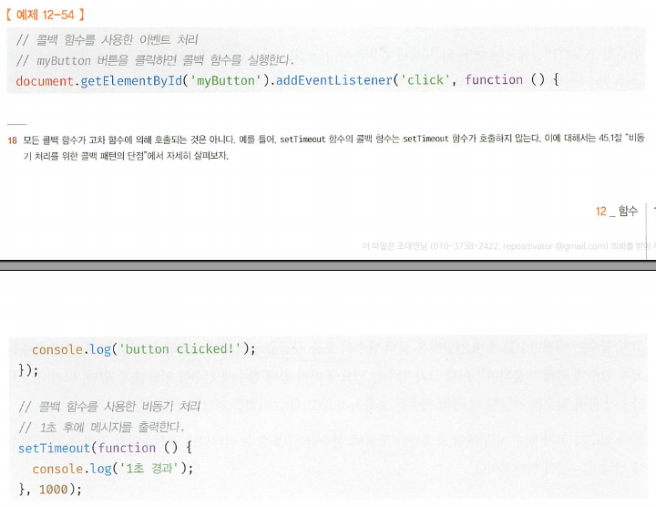 -->
  2. 배열 고차 함수에도 사용된다(27.9 참고)  
     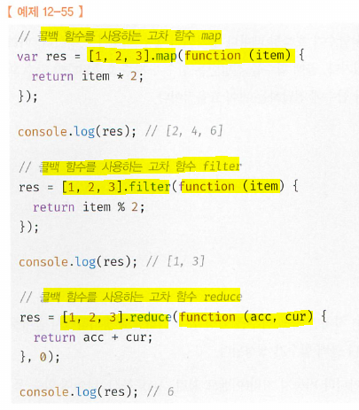

## 12.7.5 순수함수와 비순수

- 순수함수(pure function): 부수효과가 없는 함수 (외부상태 의존 x, 외부상태 변경 x)

  - 동일 인수 전달시 언제나 동일한 값을 반환하는 함수.
  - 어떤 상태에도 의존하지 않고, 오직 매개변수를 통해 함수 내부로 전달된 인수에게만 의존해 반환값 만듦

- 비순수함수(impure function): 부수효과가 있는 함수 (외부상태 의존, 외부상태 변경)
  - 함수의 외부상태에 의존하는 함수는 외부 상태에 따라 반환값이 달라진다.

```js
var count = 0; // 현재 count를 나타내는 상태

// 순수 함수: 동일한 인수가 전달되면 언제나 동일한 값 반환
function increase(n) {
  return ++n;
}
// 순수함수는 반환하는 결과값을 변수에 재할당해서 상태를 변경
count = increase(count);
console.log(count);

count = increase(count);
console.log(count);

// 비순수함수: 외부상태 count를 변경하므로 상태 변화를 추적하기 어려워진다.
function increase() {
  return ++count;
}

increase();
console.log(count);
increase();
console.log(count);
```

- 순수함수의 사용을 권장 (비순수 함수는 외부상태를 변경시키므로 상태변화 추적이 어렵다)
- FP
  - 순수 함수와 보조 함수의 조합을 통해 외부 상태를 변경하는 부수효과를 최소화해서 불변성(immutable)을 지향하는 프로그래밍
  - 조건문과 반복문 제거하여 복잡성 해결
  - 변수 사용을 억제하여 생명주기를 최소화하여 상태변경 피해 오류 최소화
