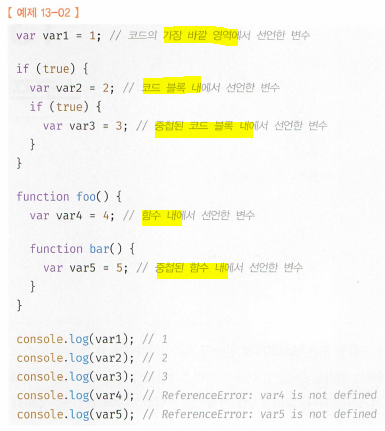
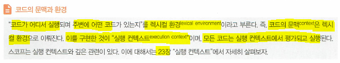
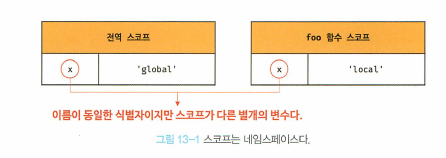
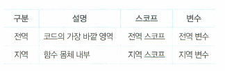
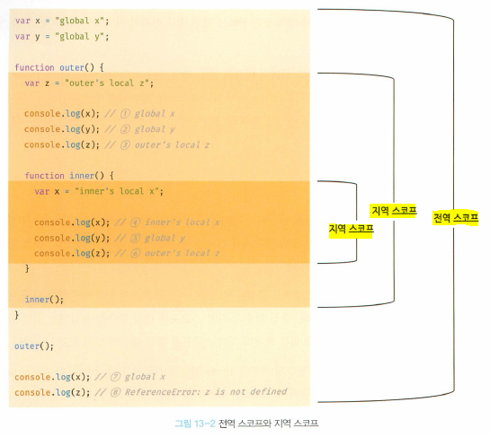
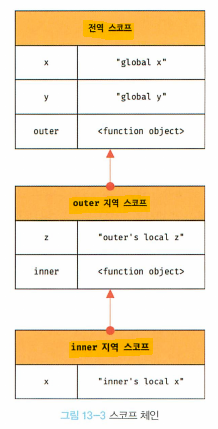
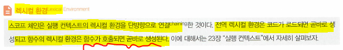

# 13. 스코프 (Done)
#### [13.1 스코프란?](#131-스코프란-1)
#### [13.2 scope의 종류](#132-scope의-종류-1)
#### [13.2.1 전역과 전역 scope](#1321-전역과-전역-scope-1)
#### [13.2.2 지역과 지역 scope](#1322-지역과-지역-scope-1)
#### [13.3 scope chain](#133-scope-chain-1)
#### [13.3.1 scope chain에 의한 변수 검색 (이미지 13-2)](#1331-scope-chain에-의한-변수-검색-이미지-13-2-1)
#### [13.3.2 scope chain에 의한 함수 검색](#1332-scope-chain에-의한-함수-검색-1)
#### [13.4 함수 레벨 scope](#134-함수-레벨-scope-1)
#### [13.5 lexical scope](#135-lexical-scope-1)

<hr>

## 13.1 스코프란?
- 변수는 어디든 선언될 수 있다.
  - 코드의 가장 바깥 영역
  - 코드 블록(중첩가능)
  - 함수 몸체 내부(중첩가능)  

- scope: 모든 식별자(변수 이름, 함수 이름, 클래스 이름)는 자신이 선언된 위치에 의해서 다른 코드가 식별자 자신을 참조할 수 있는 유효 범위가 결정된다. 즉, **<u>스코프는 식별자가 유효한 범위</u>**

- 식별자 결정: js engine이 scope를 통해 어떤 변수를 참조하는지 결정하는것 = 식별자를 검색할때 사용하는 규칙
  - 식별자: 변수나 함수의 이름과 같은 식별자는 어떤 값을 구별하여 식별해 낼 수 있는 고유한 이름. 구별해야하므로 '유일(unique)'해야한다. 즉, 하나의 값은 유일한 식별자에 연결되어야 함 (4.2절), 같은 이름(식별자)이 사용될 수 있는 이유는 scope를 사용하기 때문이다. **<u>그래서 scope내에서의 식별자는 유.일.해.야.한.다.</u>** 다른 scope내에서는 같은 식별자 존재 가능. 즉, scope는 `namespace` 이다. https://ko.wikipedia.org/wiki/이름공간

- js engine은 코드를 실행할때 코드의 context를 고려해서 실행. 같은 코드라도 어디서 실행되며 어떤 코드가 있는지에 따라 동일한 코드라도 다른 결과

- 변수 x는 

  ```js
  var x = 'global';
  
  function foo(){
      var x = 'local';
      console.log(x); // 'local'
  }
  
  foo();
  
  console.log(x); // 'global'
  ```
- `var` 키워드는 같은 scope내에서 중복 선언 가능(밑에 있는 var는 js엔진에 의해서 없는것처럼 작동)
- `let`, `const` 키워드는 같은 scope내에서 중복선언 불가: `SyntaxError`

## 13.2 scope의 종류
- scope의 종류
  - 전역(global)
  - 지역(local)
- 변수는 자신이 선언된 위치(전역, 지역)에 의해서 자신이 유효한 scope가 결정 및 갖게된다.  


## 13.2.1 전역과 전역 scope
- code의 가장 바깥쪽 영역. 전역은 전역 scope를 만든다. 전역에 변수를 선언하면 전역 scope를 갖는 global variable이 된다.
- 전역변수는 어디서든지 참조할 수 있다. (함수 내부, 또는 코드 블록 내에서 참조 가능)


## 13.2.2 지역과 지역 scope
- 지역: 함수 몸체 내부
- 지역은 local scope를 만든다.
- local scope에서 선언하면, local variable이 된다.
- inner 함수 내부의 x vs 전역 x
  - inner 함수에서 x 참조: 지역변수 x 호출
  - inner 함수 외부에서 x 참조: 전역 변수 x 호출

## 13.3 scope chain
- 함수의 선언  
  - 전역에 선언
  - 함수 내부에 선언(nested function) - 밖에 있는 함수(outer function)
    - scope가 중첩된다.(계층적 구조가 된다는 의미)
    - outer function의 scope는 inner function scope의 상위 scope
    - 전역 scope는 outer function가 만든 지역 scope의 상위 scope  

- 이렇게 모든 scope는 하나의 계층적 구조로 연결(이렇게 연결된 것을 scope chain) > 모든 지역 스코프의 최상의 연결 스코프는 전역 스코프
- 변수를 참조할 때 js engine은 scope chain을 통해 '변수를 참조하는 코드의 스코프에서 시작'하여 상위 스코프 방향으로 이동하여 선언된 변수를 검색한다. (이를 통해서 하위 스코프에서 상위 스코프에 선언된 변수를 참조 가능)
- scope chain은 물리적인 실제로 존재
  - js engine은 코드를 실행하기 앞서 위의 그림과 같은 lexical environment를 실제로 생성  - 변수 선언이 실행되면 변수의 식별자가 이 자료구조(lexical environment)에 key로 등록, 변수 할당이 일어나면 이 자료구조의 변수 식별자에 해당하는 값을 변경. 변수의 검색도 이 자료 구조상에서 이뤄진다.
  

## 13.3.1 scope chain에 의한 변수 검색 (이미지 13-2)
- 4번, 변수를 참조하는 스코프에 해당 변수가 선언되었는지 검색 > 찾고(x) > 종료
- 5번, 변수를 참조하는 스코프에 해당 변수가 없기 때문에 > 상위스코프인 outer 함수 지역 스코프로 이동 > 없음 > 전역 scope로 이동 > 찾고(y) > 종료
- 6번, 변수를 참조하는 스코프에 해당 변수가 없기 때문에 > 상위스코프인 outer 함수 지역 스코프로 이동 > 찾고(z) > 종료
- 이렇게 js는 scope chain을 따라 변수를 참조하기 위해 이동(하.위.로.내.려.가.지.않.는.다.) : 하위 스코프 유효 변수를 상위스코프에서 참조할 수 없다는 의미
- 상속의 개념과 비슷
  
## 13.3.2 scope chain에 의한 함수 검색

  ```js
  // 전역함수
  
  function foo(){
      console.log('global funciton'); 
  }

  function bar(){
    // 중첩함수
    function foo(){
      console.log('local function foo'); 
    }

    foo(); // 1
  }
  
  bar();
  ```
- **<u>함수 선언문으로</u>** 함수를 정의하면 **<u>'`runtime`' 이전에 함수 객체가 먼저 생성.</u>** 그리고 **<u>js engine은 함수의 이름과 동일한 이름의 식별자를 암묵적으로 선언하고 생성된 함수 객체를 할당</u>** > **<u>따라서 모든 함수는 함수의 이름과 동일한 이름의 식별자에 할당</u>** > **<u>함수도 scope를 갖는다.</u>** > 그러므로 scope는 변수 뿐만 아니라, '식별자'를 검색하는 규칙이라고 하는것이 더 적합
- **<u>1에서 foo()를 호출하면 js engine은 함수를 호출하기위해 함수를 가르키는 식별자 foo를 찾는다.</u>**
  
## 13.4 함수 레벨 scope
- 지역: 함수 몸체 내부(`var`) > 지역 스코프를(local scope) 만든다
- 코드 블록이 아닌 함수에 의해서만 지역 스코프가 생성(var 키워드로 선언된 변수 only - 함수 레벨 스코프(function level scope))
- 타 언어(+ js const, let 키워드)에서는 모든 코드블록(`if`, `for`, `while`, `try`/`catch`)이 local scope을 만든다.

## 13.5 `Lexical scope`
```js
var x = 'global';

function foo(){
  var x = 'local';
  bar();
}
function bar(){
  console.log(x);
}

foo();
bar();
```
- 실행결과는 bar 함수의 상위 스코프가 무엇인지에 따라 결정된다.
  1. 함수를 어디서 호출 했는지에 따라 상위스코프 결정 한다면 (동적 스코프: `dynamic scope`): foo() function scope > global scope  
  2. 함수를 어디서 정의 했는지에 따라 상위스코프 결정 한다면 (정적 스코프: `lexical scope`, `static scope`): global scope
- 특징  
  1. 함수 정의 시점에서는 함수가 어디서 호출될지 알 수 없다. 따라서 함수가 호출되는 시점에 동적으로 상위 스코프를 결정해야해서 동적 스코프라고 부름  
  2. 상위스코프가 동적으로 변하지 않고, 함수가 정의 되는 시점에 상위스코프가 정적으로 결정되기 때문에 정적스코프라고 부른다. (js및 대다수의 여러프로그래밍 language가 정적 스코프를 따름)
- js는 static(lexical) scope를 따르기 때문에 상위 스코프는 함수가 정의가 실행될때 정적으로 결정된다. 그리고 상위 스코프를 기억한다. > 그래서 어디서 호출되건 상관없이 자신이 기억하는 상위 스코프를 참조하여, 변수를 참조하고는 한다. 위의 답은 "global", "global"을 두번 return한다.
- lexical scope는 closure와 깊은 관계(24장)