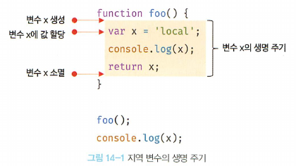
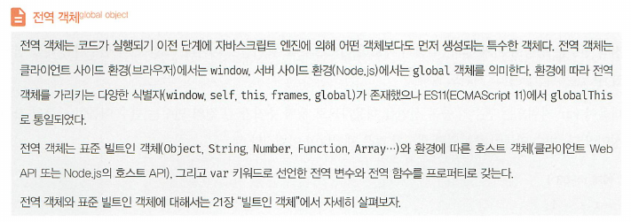
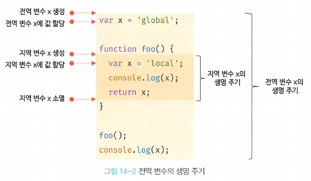
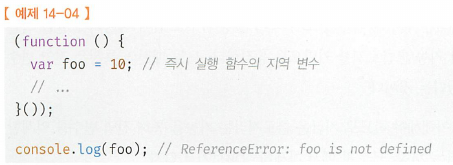
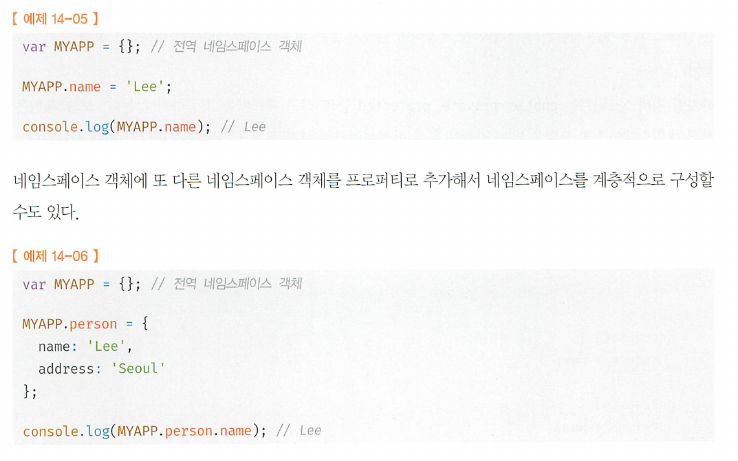
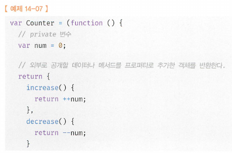
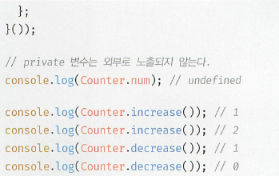
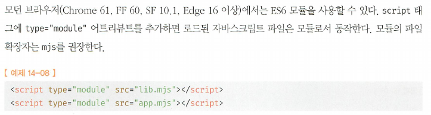

# 15. var 키워드로 선언한 변수의 문제점
#### [14.1 지역변수의 생명주기](#141-변수의-생명-주기)
#### [11.1.1 변경 불가능한 값](#1111-변경-불가능한-값-1)
#### [11.1.2 문자열과 불변성](#1112-문자열과-불변성-1)
#### [11.1.3 값에의한 전달](#1113-값에의한-전달-1)
#### [11.2 객체](#112-객체-1)
#### [11.2.1 변경 가능한 값](#1121-변경-가능한-값-1)
#### [11.2.2 참조에 의한 전달 (여러개의 식별자가 하나의 객체를 공유)](#1122-참조에-의한-전달-여러개의-식별자가-하나의-객체를-공유-1)
<hr>

## 15.1 var 키워드로 선언한 변수의 문제점
## 15.1.1 변수의 중복 선언 허용
- 변수는 선언에 의해 생성, 할당을 통해 값을 갖고, 언젠가는 소멸 > 생명주기가 있다. (자신이 있는 위치에서 생성과 소멸)
- 전역변수의 생명주기는 애플리케이션의 생명 주기와 같다 vs 지역변수는 함수가 호출되면 생성되고 함수가 종료하면 소멸
- 전역변수: 변수 선언은 선언문이 어디에 있든 상관없이 가장 먼저 실행(4.4절): 즉, 변수 선언은 런타임에서 실행되는게 아니라, 런타임 이전 단계에서 먼저 실행 by 자바스크립트 엔진 (호이스팅)
- 지역변수: 함수가 실행되면 runtime이전에 똑같이 함수내의 선언문이 어디에 있던지 먼저 실행되고, 그다음 차례로 함수내부의 코드 실행 > 지역변수는 함수의 생명주기와 일치  (대부분 일치, 더 오래 생존하는 경우도 있다.)
  
  - 변수의 생명주기: allocate ~ release ~ memory pool에 반환
  - 지역변수는 함수가 생성한 스코프에 등록(함수가 생성한 스코프는 렉시컬 환경이라 부르는 물리적인 실체가 있다. 13.3 > 변수는 자신이 등록된 스코프가 소멸될때까지 유효하다. 스코프도 변수와 마찬가지로 누군가 스코프를 참조하면 소멸하지 않고 생존)
  - 일반적으로 함수가 종료하면 함수가 생성한 스코프도 소멸 (누군가 스코프를 참조하면 스코프는 해제x 생존 > closure)
  - hoisting은 scope단위로 동작
    - 전역변수는 전역 scope 단위에서 실행
    - 지역변수는 함수 scope 단위에서 실행
    - 즉, hoisting은 scope에서 runtime이전에 먼저 최상위로 끌어올려 등록하는 특징을 말한다.  
        ```js
        var x = 'global';
        function foo(){
            console.log(x); // undefined
            var x = 'local';
        }
        foo();
        console.log(x); // 'global'
        ```
## 14.1.2 전역 변수의 생명주기
- 함수와는 달리 전역코드는 명시적인 호출 없이 실행
- 전역코드는 함수 호출과 같이 전역코드를 실행하는 특별한 진입점이 없고(main), 코드가 로드되자 마자 실행, 해석됨. 전역코드는 return이 없으므로 마지막 문이 실행되면 종료
- 함수는 마지막 문 or return이 실행되면 종료
- var 키워드로 선언한 전역변수는 전역객체의 프로퍼티가 된다. > 전역변수 생명주기가 전역객체의(global object) 생명주기와 일치  
  
- window: 브라우저 환경에서의 전역객체. var 키워드로 선언한 전역변수는 전역객체 window의 프로퍼티다. 전역객체 window는 웹페이지를 닫기전까지 유효. > var로 선언한 전역변수 생명주기는 전역객체 생명주기와 일치  
  
## 14.2 전역 변수의 문제점
- 암묵적 결합
  - 전역변수 선언한 의도는 코드 어디서든 참조하고 할당할 수 있는 변수를 사용하겠다는 것 > 암묵적 결합(implicit coupling)
  - 변수의 유효범위가 크면 클수록 코드의 가독성은 나빠지고, 의도치 않게 상태가 변경될 수 있는 위험성도 높아짐
- 긴생명주기
  - 생명주기 길다 > 메모리 리소스도 오랜기간 소비한다 vs 지역변수는 짧다, 리소스도 짧게소비
  - 상태를 변경할 수 있는 시간도 길고 기회도 많다 vs 생존시간 극히 짧다, 변경 기회 적다
  - 더욱이 var키워드는 변수의 중복 선언도 허용 > 의도치 않는 재할당 발생
- 스코프 체인상에서 종점에 존재
  - 스코프 체인 상에서 종점에 존재 > 변수 검색시 전역변수가 가장 마지막에 검색된다는것 = 검색속도가 가장 느리다.
- 네임스페이스 오염
  - js는 파일이 분리되어 있어도 하나의 전역 scope를 공유한다. (한 파일내에 전역변수 명이 동일한 변수가 다른 파일의 전역변수로 존재시 재할당된다는 의미)
## 14.3 전역 변수의 사용을 억제하는 방법
- 변수의 scope는 적으면 적을수록 좋다 (필요는 하지만 무분별한 남발은 no no)
## 14.3.1 즉시실행함수
- 함수 정의와 동시에 호출되는 즉시 실행함수는 단 한번만 호출된다
- 모든 코드를 즉시 실행함수로 감싸면 모든 변수는 즉시실행 함수의 지역변수가 됨 > 라이브러리에서 자주 사용된다.  
- 
## 14.3.2 네임스페이스객체
- 전역에 네임스페이스 역할을 담당할 객체를 생성하고 전역변수처럼 사용하고 싶은 변수를 프로퍼티로 추가하는 방법
- 식별자 충돌을 방지하는 효과는 있으나, 네임스페이스 객체 자체가 전역 변수에 할당되므로 그닥..  
## 14.3.3 모듈패턴
- 모듈
  - 클래스를 모방해 관련변수와 함수를 모아 즉시 실행함수로 감싸 하나로 만든것
  - 클로저 기반으로 동작
  - 전역변수의 억제는 물론 캡슐화까지 구현할 수 있다는것
  - 캡슐화
    - 프로퍼티: 객체의 상태
    - 메서드: 프로퍼티를 참조하고 조작할 수 있는 동작
    - 프로퍼티와 메서드를 하나로 묶는것, 프로퍼티와 메서드를 감출 목적으로 사용하기도 함(정보은닉)
    - 대부분 객체지향 언어에서 public, private, protected등의 접근제한자 사용해서 공개범위 한정 > js에서 제공 않하므로 모듈패턴으로 전역네임스페이스 오염 막을 뿐만 아니라 정보은닉 구현위해 사용  
        
        
        즉시 실행함수는 객체를 반환하는데,  
              - 객체 외부에서 노출해서 쓰고 싶은 변수나 함수를 담아서 반환
              - 반환되는 객체의 프로퍼티는 외부에 노출되는 퍼블릭 멤버
              - 외부로 노출하고 싶지 않은 변수나 함수는 return하는 객체에 추가 x, 얘들은 외부에서 접근할 수 없으므로 private 멤버
## 14.3.4 ES6의 모듈
- ES6 모듈을 사용하면 더는 전역변수를 사용할 수 없다.
- ES6 module은 파일 자체의 독자적인 모듈 스코포를 제공
- 모듈내에서 var 키워드로 선언한 변수는 더는 전역변수가 아니며, window 객체의 프로퍼티도 아니다.
- 