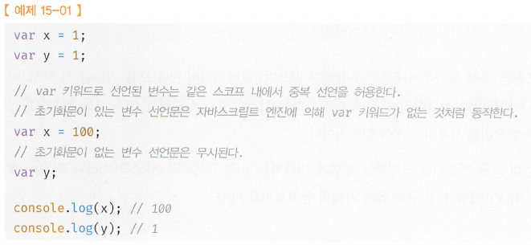
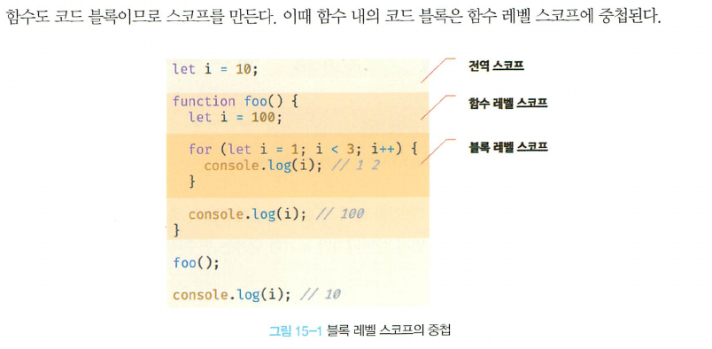
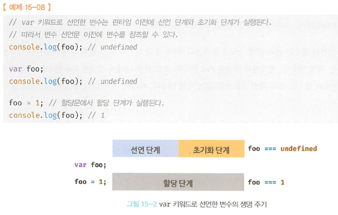
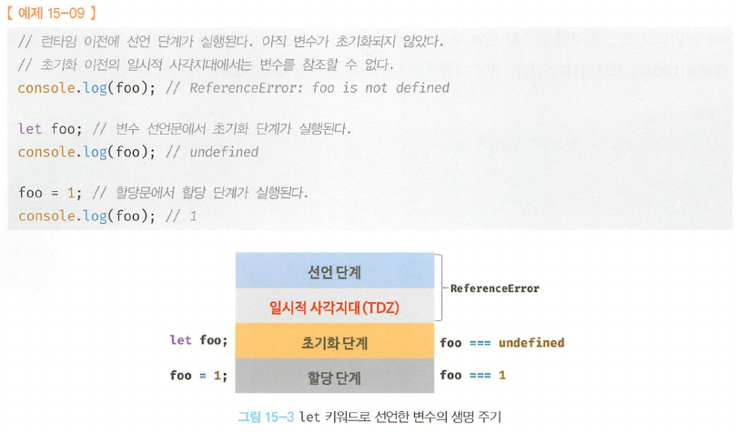
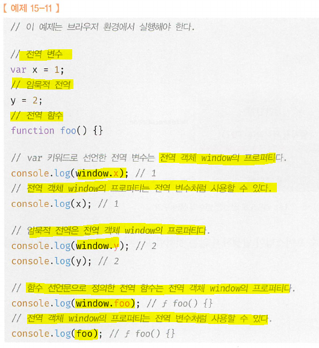
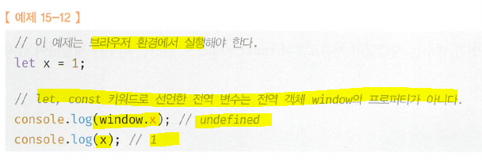
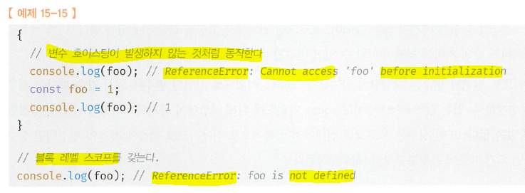
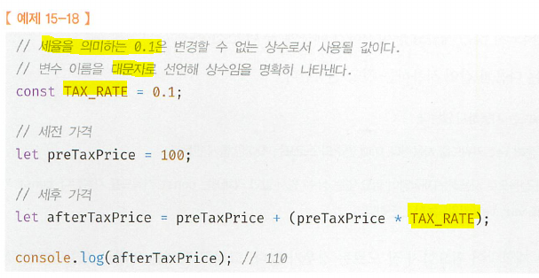

# 15. let, const 키워드와 블록 레벨 스코프 (Done)
#### [15.1 var 키워드로 선언한 변수의 문제점](#151-var-키워드로-선언한-변수의-문제점-1)
#### [15.1.1 변수의 중복 선언 허용](#1511-변수의-중복-선언-허용-1)
#### [15.1.2 함수레벨 스코프](#1512-함수레벨-스코프-1)
#### [15.1.3 변수 호이스팅](#1513-변수-호이스팅-1)
#### [15.2 let 키워드](#152-let-키워드-1)
#### [15.2.1 변수의 중복 선언 금지](#1521-변수의-중복-선언-금지-1)
#### [15.2.2 블록레벨 스코프](#1522-블록레벨-스코프-1)
#### [15.2.3 변수 호이스팅](#1523-변수-호이스팅-1)
#### [15.2.4 전역 객체와 let](#1524-전역-객체와-let-1)
#### [15.3 const 키워드](#153-const-키워드-1)
#### [15.3.1 선언과 초기화](#1531-선언과-초기화-1)
#### [15.3.2 재할당 금지](#1532-재할당-금지-1)
#### [15.3.3 상수](#1533-상수-1)
#### [15.3.4 `const`키워드와 객체](#1534-const키워드와-객체-1)
#### [15.4 `var` vs. `let` vs. `const`](#154-var-vs-let-vs-const-1)

<hr>

## 15.1 var 키워드로 선언한 변수의 문제점
- ES5까지 변수는 오직 var keyword 사용  

## 15.1.1 변수의 중복 선언 허용
- var 키워드로 선언한 변수는 중복 선언이 가능  
  
  - 초기화문이 있다면(x) var는 없는것 처럼 간주  
  - 초기화문이 없는 변수 선언문은 무시

## 15.1.2 함수레벨 스코프
- var 키워드로 선언한 변수는 오직 **<u>함수의 코드 블록만 지역스코프로 인정</u>**
- var 키워드로 선언한 변수는 함수가 아닌 코드블럭 내에서 선언해도 **<u>전역변수 인정</u>**
- 함수레벨 스코프는 전역변수 남발을 유발(의도치 않게 (for문, if문) 전역변수가 중복선언되는 경우 발생)

## 15.1.3 변수 호이스팅
- var 키워드로 선언된 변수는 hoisting에 의해서 **<u>선언 전에 참조가 가능하지만</u>** 언제나 undefined를 반환 (에러를 발생시키지는 않는다.)

## 15.2 let 키워드
- ES6에서 새로운 변수 선언 키워드 `let`, `const` 도입

## 15.2.1 변수의 중복 선언 금지
- `let` 키워드는 문법에러(SyntaxError발생)

## 15.2.2 블록레벨 스코프
- `let` 키워드로 선언한 변수는 모든 코드블록(`if`, 함수, `for`, `while`, `try`/`catch` ..)을 지역 스코프로 인정하는 블록레벨 스코프(block-level scope)를 따른다.  
    

## 15.2.3 변수 호이스팅
```js
  // 선언
  let x;
  //  초기화
  x = undefined;
  // 할당
  x = 'test';
  ```
- let으로 선언한 변수는 변수 호이스팅이 발생하지 않는것 처럼!! 동작한다. (참조 에러가 발생한다.)
  ```js
  console.log(foo); // ReferenceError: foo is not defined :아예 변수가 선언되지 않은것처럼
  let foo;
  ```
- 복습하자면, var로 선언된 변수는 `runtime`이전에 js engine에 의해서 암묵적으로 '선언단계'와 '초기화단계(`undefined`)'가 한번에 실행. 즉, 선언 단계에서 스코프(실행 컨텍스트의 lexical environment)에 변수를 등록해 js engine에 알리고, 즉시 `undefined`로 초기화 한다는 의미. **<u>그래서 변수 선언 이전에 참조를 해도 에러 발생 안되는것임. (`undefined` 반환은 덤 + 실제 `runtime`에서 할당되어야 실제값 가짐)</u>**  
  

- `let` 키워드로 선언한 변수는 "선언단계", "초기화단계" 분리되어 있다.
  - 선언단계가 `runtime`이전에 먼저 실행은 되지만, 초기화 단계는 '`runtime`이전'에 이뤄지지 않고(`undefined`로 초기화 해주지 않는다.) **<u>변수 선언문에 도달했을때 실행.</u>** 초기화 단계 이전에 접근했을때 `referenceError`발생. 즉, `let` 키워드로 선언한 변수는 scope 시각지점부터 ~ 변수의 초기화 단계지점까지 변수를 참조할 수 없다. (이 구간을 일시적 temporal dead zone)
  

- 하지만, `let`으로 선언한 변수도 hoisting이 진행된다.
  ```js
  var foo = 'let hoisting';
  {
      console.log(foo); // ReferenceError: Cannot access 'foo' before initialization
      // 만일 hoisting이 일어나지 않는다면 전역변수 foo의 'let hoisting'이 출력되어야함. 
      // 하지만 ReferenceError가 일어난다는 것은 이곳 scope에 foo가 hoisting이 일어나기 때문임
      let foo = 'local foo';
  }
  ```
- ES6에 도입된 `let`, `const`를 포함한 모든 선언 (`var`, `let`, `const`, `function`, `function*`, `class`)은 hoisting되며, 단, `let`, `const`, `class`를 사용한 선언문은 hoisting안되는것처럼 행동

## 15.2.4 전역 객체와 let
- **<u>`var` 키워드로 선언한 전역변수, 전역함수, 선언하지 않은 변수에 값을 할당하는 '암묵적 전역'은 전역객체 `window`의 프로퍼티가 된다.</u>** (전역객체 프로퍼티 참조시 `window`는 생략가능)  


- **<u>`let` 키워드로 선언한 전역변수는 전역객체의 프로퍼티가 아니다.</u>** let 전역변수는 보이지 않는 개념적인 블록(전역 렉시컬 환경의 선언적 환경 레코드 - 23장)  


## 15.3 const 키워드
- constant 선언을 위해 있지만, 반드시 상수만을 위해 사용하지는 않는다.

## 15.3.1 선언과 초기화
- `constant`키워드로 선언한 변수는 **<u>반드시 선언과 동시에 초기화가 되어야한다. </u>** (그렇지 않으면 문법에러 발생)
- block-level scope, hoisting 발생하지 않는것처럼 동작


## 15.3.2 재할당 금지
- `let`이나, `var`와는 달리 `const`는 재할당 금지

## 15.3.3 상수
- `const`키워드로 선언한 변수에 '원시값'을 할당한경우 변수 값을 변경할 수 없다. **<u>(원시값은 immutable이므로 재할당 없이 값을 변경할 수 없으므로..`const`는 재할당 금지)</u>**
- 상수: 재할당이 금지된 변수 (상수도 값 저장을 위한 메모리 공간이 필요하므로 변수라 할 수 있다. 하지만 재할당 금지.)  


## 15.3.4 `const`키워드와 객체
- `const`로 선언된 **<u>'객체' 는 할당한 값을 변경할 수 있다.</u>**
- 변경 불가능한 원시값(primitive data types: immutable value)은 재할당 없이는 값 변경이 불가능해서 `const`로 선언되면 변경할 수 없지만, '객체'는 mutable value이기 때문에 재할당 없이도 값변경이 가능하기 때문이다. (변수에 할당된 참조값은 변경되지 않는다.)

  ```js
  const person = {
    name: 'Lee'
  }

  // 객체는 변경이 가능한 값이기 때문에 재할당 없이 변경이 가능하다
  person.name = 'Kim';
  // 객체에 대한 동적 '생성'도 가능하다(동적 '삭제'도 가능)
  person.age = 23;  
  console.log(person); {name: "Kim", age: 23} // const는 재할당을 금지할뿐 '불변'을 의미하지 않는다.
  ```
  - **<u>const는 재할당을 금지할뿐 '불변'을 의미하지 않는다.</u>**

## 15.4 `var` vs. `let` vs. `const`
- `const`: 변수 선언에 기본으로 사용. 변경발생 x, 읽기 전용 o일때 사용하는 원시값, 객체에 사용 (의도치 않는 재할당 방지때문에 좀 더 안전) > 변수재할당은 은근 없으니까 default로 `const`를 사용하자!!
- `let`: 재할당이 필요한 경우에 한정해서 사용 (변수 scope을 최대한으로 좁게해서 사용)
- `var`: ES6를 사용하면 사용하지 말것