# 16. 프로퍼티 어트리뷰트
#### [16.1 내부 슬롯과 내부 메서드](#161-내부-슬롯과-내부-메서드-1)
#### [16.2 프로퍼티 어트리뷰트와 프로퍼티 시스크립터 객체](#162-프로퍼티-어트리뷰트와-프로퍼티-시스크립터-객체-1)
#### [16.3 데이터 프로퍼티와 접근자 프로퍼티](#163-데이터-프로퍼티와-접근자-프로퍼티-1)
#### [16.3.1 데이터 프로퍼티](#1631-데이터-프로퍼티-1)
#### [16.3.2 접근자 프로퍼티](#1632-접근자-프로퍼티-1)
#### [16.4 프로퍼티의 정의](#164-프로퍼티의-정의-1)
#### [16.5 객체변경 방지](#165-객체변경-방지-1)
#### [16.5.1 객체확장 금지](#1651-객체확장-금지-1)
#### [16.5.2 객체밀봉](#1652-객체밀봉-1)
#### [16.5.3 객체동결](#1653-객체동결-1)
#### [16.5.4 불변객체](#1654-불변객체-1)

<hr>

## 16.1 내부 슬롯과 내부 메서드
- 내부 슬롯과 내부 메서드는 js engine의 구현 알고리즘을 설명하기 위해 ECMAScript 사양에서 사용하는 의사 프로퍼티, 의사 메서드
- 내부 슬롯과 내부 메서드는 js engine 내부의 로직이므로 원칙적으로 내부 슬롯과 내부 메서드를 직접적으로 접근 및 호출할 수 있는 방법 제공 x.
- 단, 일부 내부 슬롯과 내부 메서드는 간접적으로 접근할 수 있는 수단을 제공: e.g. js 모든 객체는 내부 슬롯 [[Prototype]]를 가지고 있지만 __proto__를 통해 간접적으로 접근할 수 있음

```js
  const o = {}
  o.[[Prototype]] // Uncaught SyntaxError: Unexpected token: '['
  o.__proto__ // Object.prototype
```

## 16.2 프로퍼티 어트리뷰트와 프로퍼티 descriptor 객체
- js engine은 property를 생성할때 property상태를 나타내는 property attribute를 기본값으로 자동 정의한다. 
- 프로퍼티 상태: property 값, property 갱신 가능여부(writable), property 열거 가능여부(enumerable), property 재정의 가능여부(contigurable)
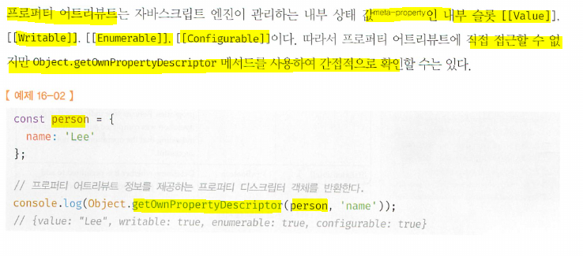  
  - 만일 존재하지 않는 property나 상속받은 property에 대한 property descriptor를 요구하면 undefined를 return한다.  
- Object.getOwnPropertyDescriptor: 하나의 property에 대해 property descriptor반환
- Object.getOwnPropertyDescripters: 모든 property의 property attribute 정보를 제공하는 프로퍼티 디스크립터 객체들을 반환 (ES8)  
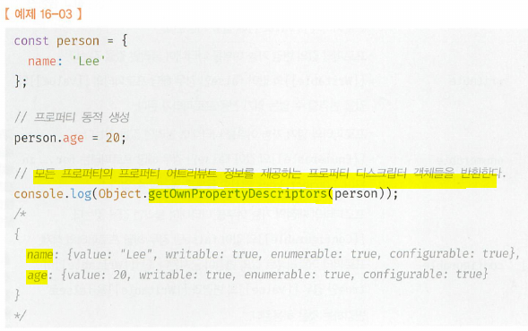

## 16.3 데이터 프로퍼티와 접근자 프로퍼티
- 프로퍼티 (종류 2개)
  - 데이터 프로퍼티: key and value로 구성된 일반적 프로퍼티
  - 접근자 프로퍼티: 자체적 값을 갖지 않고 다른 데이터 프로퍼티 값을 읽거나 저장할 때 호출되는 접근자 함수(accessor function)로 구성된 property

## 16.3.1 데이터 프로퍼티
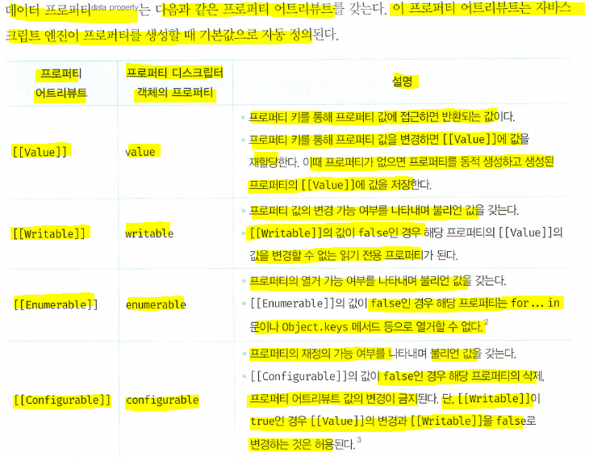

```js
  const person = {
    name: 'Lee'
  };

  person.age = 12;

  console.log(Object.getOwnPropertyDescriptor(person, 'name'))
  console.log(Object.getOwnPropertyDescriptor(person, 'age'))
  // {value: "Lee", writable: true, enumerable: true, configuration: true}
  // {value: 12, writable: true, enumerable: true, configuration: true}
```
  - 이처럼 property가 생성될 때, [[value]]값은 property값으로 초기화, [[writable]], [[enumerable]], [[configuration]]는 true로 초기화 (c.f. 동적으로 추가해도 마찬가지)

## 16.3.2 접근자 프로퍼티
- 접근자 프로퍼티: 자체적으로 값을 갖지 않고 다른 데이터 property값을 읽거나 저장할때 사용하는 '접근자 함수(accessor function)'으로 구성된 property
- 접근자 프로퍼티는 다름과 같은 property attribute를 갖는다.  
  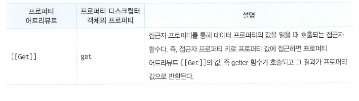  
  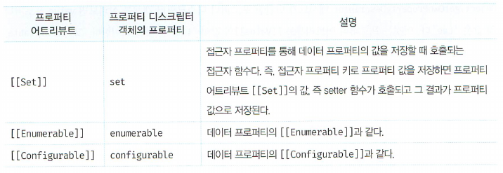
- 접근자 함수는 `getter`/`setter` 함수라고도 부른다.
- 접근자 프로퍼티는 `getter`와 `setter` 함수를 모두 정의할 수 있고 하나만 정의할 수도 있다.
- 접근자 프로퍼티는 자체적으로 값을 가지고 있지 않고, 데이터 프로퍼티의 값을 읽거나 저장할때 관여할 뿐이다.
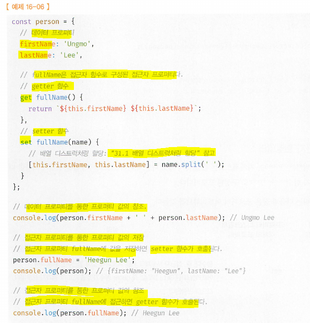
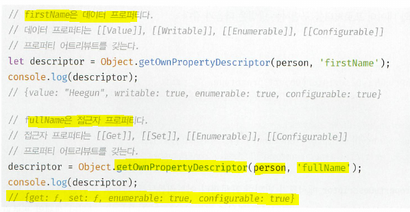  

- 내부 슬롯/메서드 관점에서 설명: 접근자 프로퍼티 fullName으로 프로퍼티 값에 접근하면 [[Get]] 내부 메서드가 호출되어 다음과 같이 동작
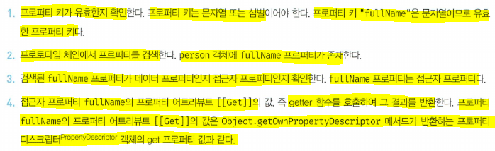

- prototype 참고  
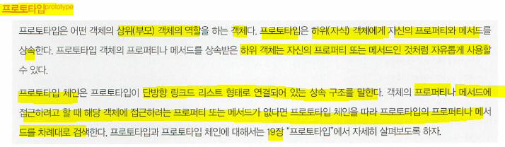

- 접근자 프로퍼티와 데이터 프로퍼티를 구별하는 방법  
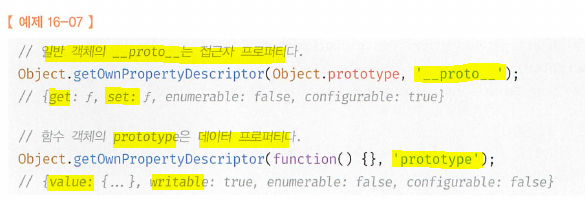

## 16.4 프로퍼티의 정의
- 프로퍼티 정의란 '새로운 프로퍼티를 추가하면서, 프로퍼티 어트리뷰트를 명시적으로 정의하거나, 기존의 프로퍼티의 프로퍼티 어트리뷰트를 재정의' 를 의미
  - 갱신 가능하도록?(wriable)
  - 열거 가능하도록?(enumeratable)
  - 재정의 가능하도록?(configurable) //확실치 않음 ㅋㅋ
- `Object.defineProperty`메서드를 사용하면, 프로퍼티의 어트리뷰트 정의 할 수 있다.   
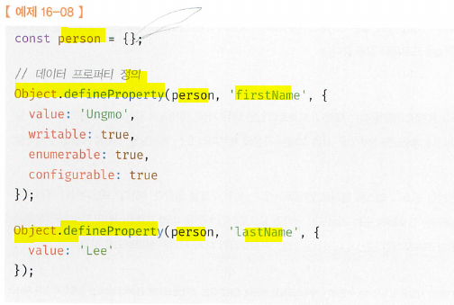
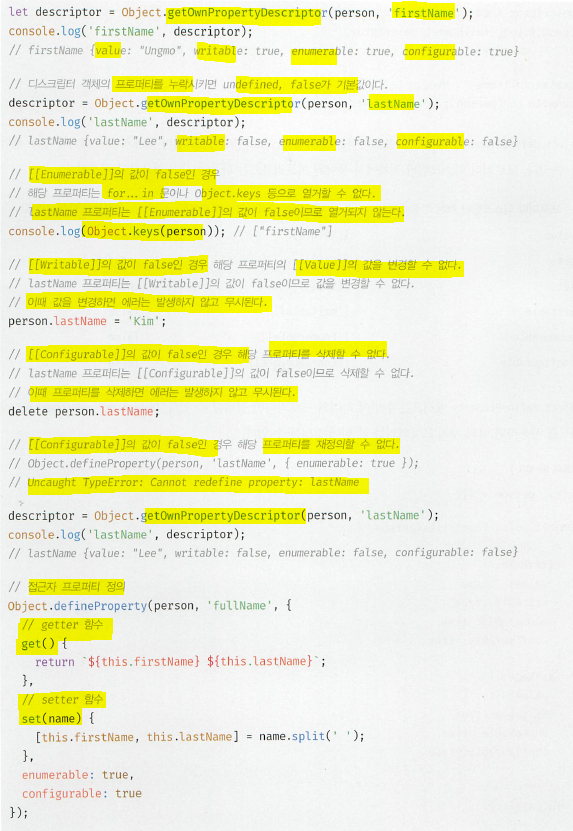
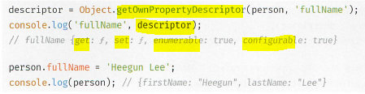
- `Object.defineProperty`(`Object.defineProperties`)메서드로 정의 때, 프로퍼티 디스크립터 객체의 프로퍼티를 일부 생략할 수 있다. default값은 다음과 같음
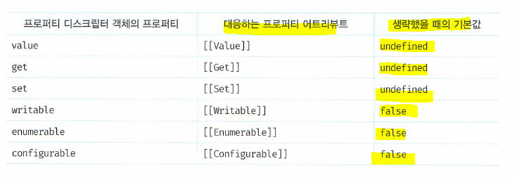
// 여러개 정의  
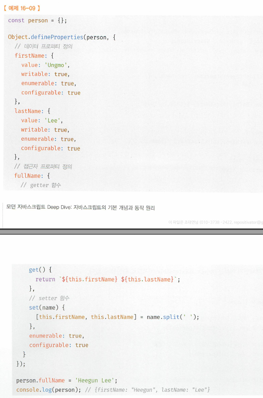  

## 16.5 객체변경 방지
- 객체특성은!
  - value 변경 가능(재할당 없이 직접 변경 가능)
    - 프로퍼티 추가, 삭제, 갱신
  - property attribute도 재정의 가능
    - Object.defineProperty 또는 Object.defineProperties 메서드를 이용
  - 객체 변경 방지 메서드 제공(강도가 전부 다름)  
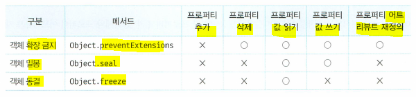  

## 16.5.1 객체확장 금지 (`Object.preventExtensions`)
- `Object.preventExtensions`: 객체 확장 금지, 프로퍼티 추가 금지 (즉, 확장이 금지된 객체는 프로퍼티 추가가 금지)
- 프로퍼티는
  - 동적추가
  - Object.defineProperty 메서드로 추가
  두가지 방법으로 할 수 있는데, 이 두가지 방법 모두 금지
- 확장 가능한 객체인지 여부는 `Object.isExtensible` 메서드로 확인  

## 16.5.2 객체밀봉
- `Object.seal`메서드는 객체를 밀봉함
- 프로퍼티 추가 및 삭제와 프로퍼티 어트리뷰트 재정의 금지 (즉, 밀봉된 객체는 읽기와 쓰기만 가능)
- 밀봉된 객체의 여부는 `Object.isSealed` 메서드로 확인  

## 16.5.3 객체동결
- `Object.freeze`메서드는 객체를 동결함
- 프로퍼티 추가 및 삭제와 프로퍼티 어트리뷰트 재정의 금지, 프로퍼티 값 갱신금지  (즉, 동결된 객체는 읽기만 가능)
- 밀봉된 객체의 여부는 `Object.isFrozen` 메서드로 확인  

## 16.5.4 불변객체
- 위의 3개의 변경 방지 메서드: 얕은 변경 방지(shallow only)로 직속 property 변경이 방지되고, 중첩객체까지는 영향을 주지 못한다. `Object.freeze` 메서드로 객체를 동결해도 중첩객체까지 동결할 수 없다. 
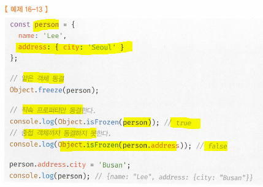
- 객체의 중첩객체까지 동결하여 변경이 불가능한 읽기 전용의 불변 객체를 구현하려면 객체를 값으로 갖는 모든 프로퍼티에 대해 재귀적으로 `Object.freeze`메서드를 호출해야한다.  
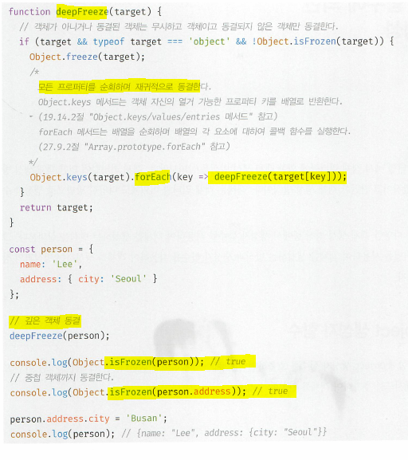