#### [17. 생성자 함수에 의한 객체 생성](#17-생성자-함수에-의한-객체-생성)

#### [17.1 Object 생성자 함수](#171-object-생성자-함수-1)

#### [17.2 생성자 함수](#172-생성자-함수-1)

#### [17.2.1 객체 리터럴에 의한 객체 생성 방식의 문제점](#1721-객체-리터럴에-의한-객체-생성-방식의-문제점-1)

#### [17.2.2 생성자 함수에 의한 객체 생성방식의 장점](#1722-생성자-함수에-의한-객체-생성방식의-장점-1)

#### [17.2.3 생성자 함수의 인스턴스 생성 과정](#1723-생성자-함수의-인스턴스-생성-과정-1)

#### [17.2.3.1 인스턴스 생성과 this 바인딩](#17231-인스턴스-생성과-this-바인딩-1)

#### [17.2.3.2 인스턴스 초기화](#17232-인스턴스-초기화-1)

#### [17.2.3.3 인스턴스 반환](#17233-인스턴스-반환-1)

#### [17.2.4 내부메서드 call과 Construct](#1724-내부메서드-call과-construct-1)

#### [17.2.5 constructor와 non-constructor의 구분](#1725-constructor와-non-constructor의-구분-1)

#### [17.2.6 new 연산자](#1726-new-연산자-1)

#### [17.2.7 new.target](#1727-newtarget-1)

<hr>

## 17. 생성자 함수에 의한 객체 생성

- 객체 생성 방식
  - 객체 리터럴 이용
  - 생성자 함수를 이용한 객체 생성

## 17.1 Object 생성자 함수

- `new` 연산자 + `Object()` 생성자 함수: 빈 객체를 생성하여 반환. 빈객체 생성한 이후에 프로퍼티 또는 메서드를 추가하여 객체를 완성. Object 생성자 함수를 사용해 객체를 생성하는 방식은 특별한 이유가 없다면 그다지 유용하지 않음  
  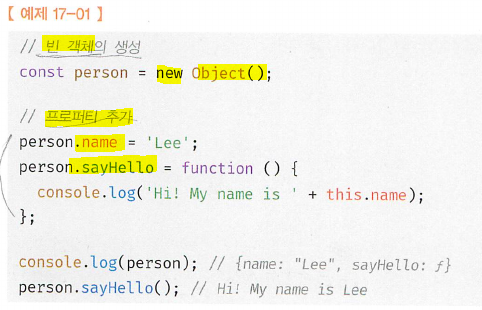
- 생성자 함수: `constructor`란 `new` 연산자와 함께 호출하여 객체(인스턴스)를 생성하는 함수

  - `Object`, `String`, `Number`, `Boolean`, `Function`, `Array`, `Date`, `RegExp`, `Promise`: built-in 생성자 함수 제공
    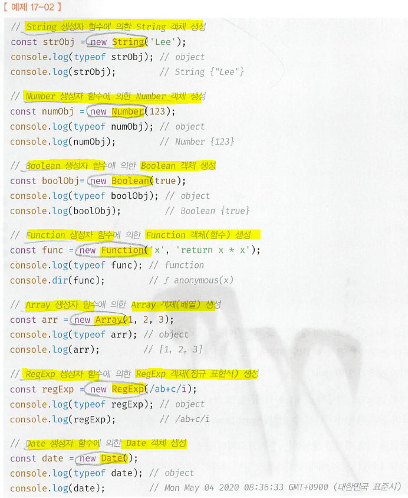

- 인스턴스: 생성자 함수에 의해 생성된 객체

## 17.2 생성자 함수

## 17.2.1 객체 리터럴에 의한 객체 생성 방식의 문제점

- 객체리터럴로 객체 생성하는것은 직관적임
- 단점: 단 하나의 객체만 생성. so 동일한 프로퍼티를 갖는 여러 객체를 생성해야하는 경우는 매번 같은 프로퍼티를 기술해야 하므로 비효율적. 객체 리터럴에 의해 객체를 생성하는 경우 프로퍼티 구조가 동일함에도 불구하고 매번 같은 프로퍼티와 메서드를 기술해야. (프로퍼티 값은(state: 상태) 다를 수 있지만, 메서드는(동작: behavior) 동일한 경우가 많다.)  
  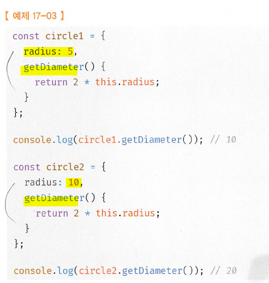

## 17.2.2 생성자 함수에 의한 객체 생성방식의 장점

- 객체(인스턴스)를 생성하기 위한 템플릿(클래스)처럼 생성자 함수를 사용하여 프로퍼티 구조가 동일한 객체 여러 개를 간편하게 생성
  

  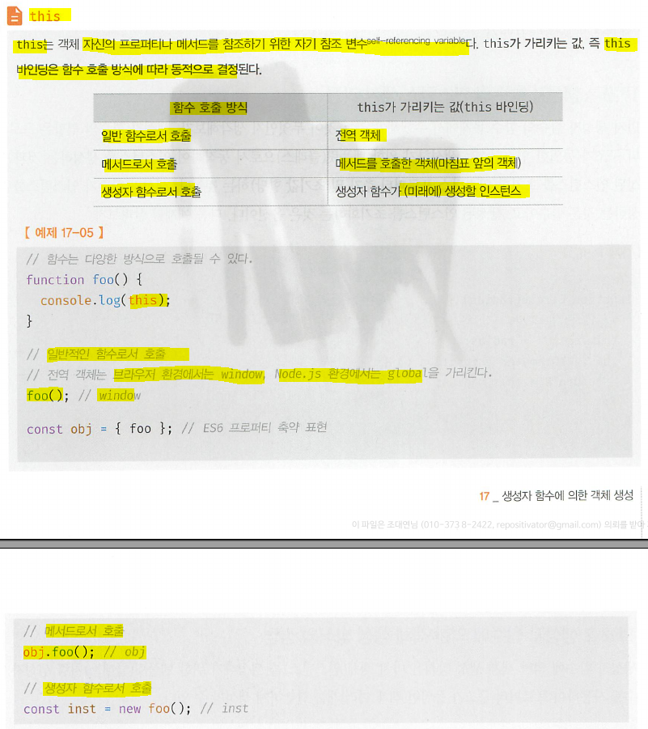 (22장)

- 생성자 함수
  - 형식이 정해져 있지 x
  - 일반 함수와 동일한 방법으로 생성자 함수를 정의하고 new 연산자와 함께 호출하면 해당 함수는 생성자 함수로 동작한다. 만약 new 연산자와 함께 생성자 함수를 호출하지 않으면 생성자 함수가 아니라 일반 함수로 동작: 즉, new 와 함수 같이 쓰면 생성자 함수로 쓰이고 new와 함께 쓰이지 않으면 그냥 일반 함수로 쓰인다.

## 17.2.3 생성자 함수의 인스턴스 생성 과정

- 생성자 함수의 역할:
  1. 필수역할: 프로퍼티 구조가 동일한 인스턴스를 생성하기 위한 템플릿(클래스)으로서 동작하여 인스턴스를 생성
  2. 옵션: 생성된 인스턴스를 초기화(인스턴스 프로퍼티 추가 및 초기값 할당)하는 것

```js
function Circle(radius) {
  // 생성된 인스턴스에 radius property 추가하고 초기화 한다.
  this.radius = radius;
  this.getDiameter = function () {
    return 2 * this.radius;
  };

  // 인스턴스를 생성하고 반환하는 코드는 없다: js engine이 암묵적으로 생성 및 반환
}

const circle = new Cricle(4); // js engine이 암묵적으로 객체 생성 및 반환
```

## 17.2.3.1 인스턴스 생성과 this 바인딩

- 암묵적으로 빈 객체가(아직 완성 x) 생성. 이 빈 instance는 this에 바인딩.(생성자 함수의 this가 생성자 함수가 생성할 인스턴스를 가르키는 이유)
  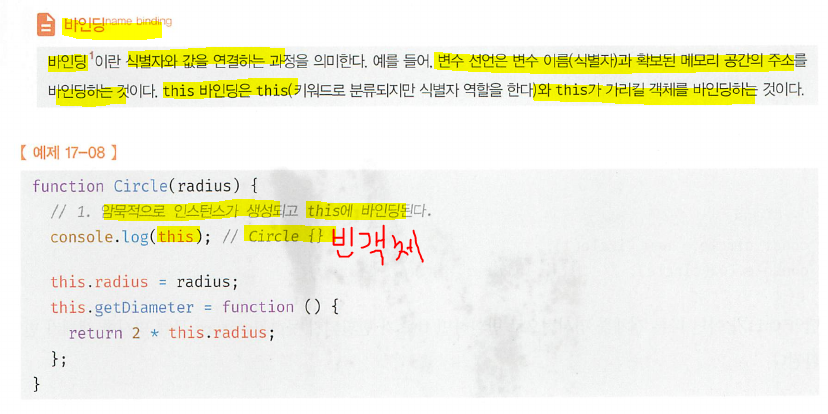

## 17.2.3.2 인스턴스 초기화

- this에 바인딩되어 있는 인스턴스(빈객체)에 개발자가 코딩한대로 프로퍼티나 메서드를 추가하고 생성자 함수가 인수로 전달받은 초기값을 인스턴스 프로퍼티에 할당하여 초기화하거나 고정값을 할당
  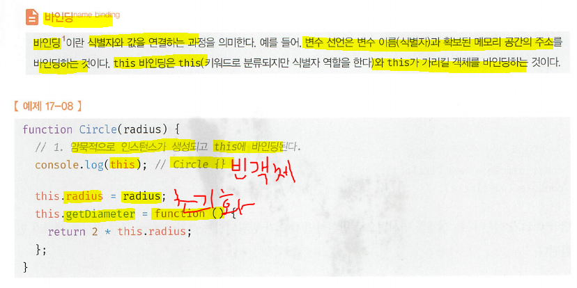

## 17.2.3.3 인스턴스 반환

- 생성자 함수 생성 및 초기화 작업이 모두 끝나면 인스턴사가 바인딩된 this가 암묵적으로 반환
  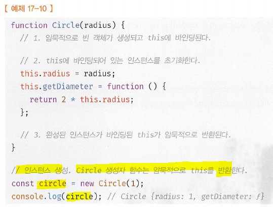
  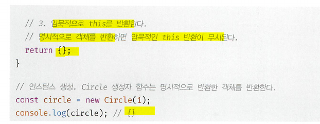
- 하지만 원시값을 반환하면 원시값 반환은 무시되고 암묵적으로 this가 반환
  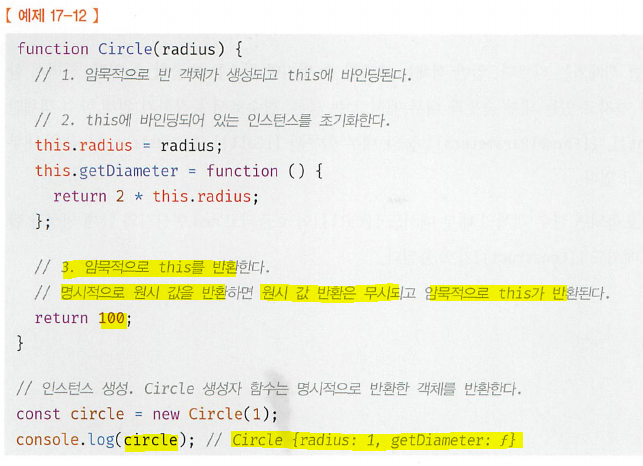

- 이처럼 생성자 함수 내부에서 명시적으로 this가 아닌 다른 값을 반환하는 것은 생성자 함수의 기본 동작을 훼손. 따라서 생성자 함수 내부에서 return 문을 뱐드시 생략!

## 17.2.4 내부메서드 call과 Construct

- 함수 선언문 + 함수 표현식 > 모두 생성자 함수로 호출 가능
- 함수는 객체이므로 일반 객체와 동일 = 일반 객체가 가지고 있는 내부슬롯, 내부 메서드 모두 가지고 있음
  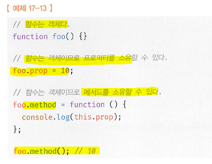
- 단, 일반 객체와의 차이점
  - 일반 객체는 호출 불가
  - 함수는 호출 가능: so, 객체가 가지는 모든 내부 슬롯과 내부 메서드를 가지고 있지만, 함수로 동작하기 위해 함수 객체만을 위한
    - 내부 슬롯: [[Environment]], [[FormalParameters]]
    - 내부 메서드: [[Call]], [[Construct]] 를 추가로 갖는다.
- 함수가

  - 일반함수로 호출시 [[Call]] 호출
  - 생성자 함수로 호출시 [[Construct]] 호출

- 내부 메서드 [[Call]]을 갖는 함수 객체를 `callable`
- 내부 메서드 [[Construct]]를 갖는 함수 객체를 `constructor`// 갖고 있지 않는 함수 객체를 `non-constructor` (생성자 함수로써 호출 할 수 없는 함수)  
  결론적으로 함수 객체는 모두 callable이면서 constructor이거나 non-callalble일수도.
  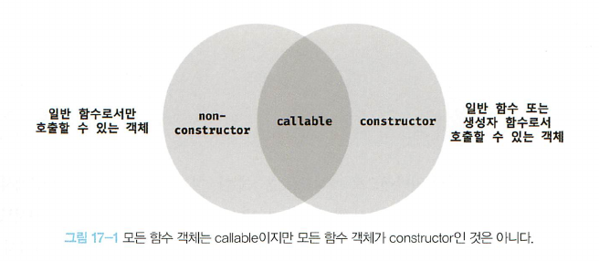

## 17.2.5 constructor와 non-constructor의 구분

- js engine은 함수 정의 방식에 따라 함수를 constructor와 non-constructor로 구분

  - constructor:함수선언문, 함수표현식, 클래스(클래스도 함수다)
  - non-constructor:메서드(ES6메서드축약표현),화살표함수  
    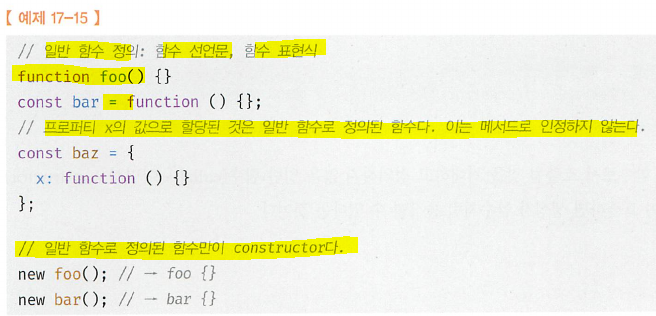
    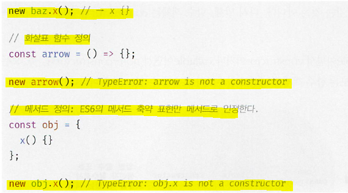

- 함수를 `프로퍼티 값`으로 사용하면 일반적으로 `메서드`로 통칭. But `ECMAScript` 사양에서 `메서드`란 ES6의 메서드 축약 표현만을 의미. 즉, 어디에 할당이 된게 문제가 아니라, 함수의 **'정의 방식'**에 따라서 constructor와 non-constructor로 구분

## 17.2.6 new 연산자

- 일반 함수와 생성자 함수에 특별한 형식적 차이는 없다. 단, 객체를 return해야한다. (리터럴 또는 this): 따라서 생성자 함수의 이름은 첫글자 대문자(파스칼 케이스)로 하여 일반 함수와 구분하도록 하자  
  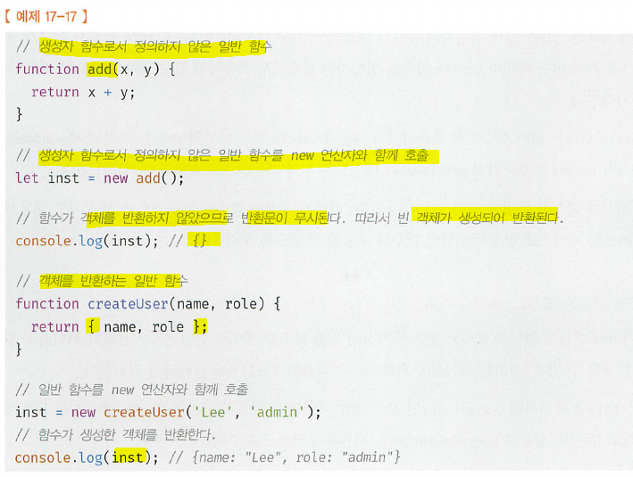
- new 없이 생성자 함수를 호출하면 일반 함수로 호출(this는 전역객체 window나 global을 가르킨다.)  
  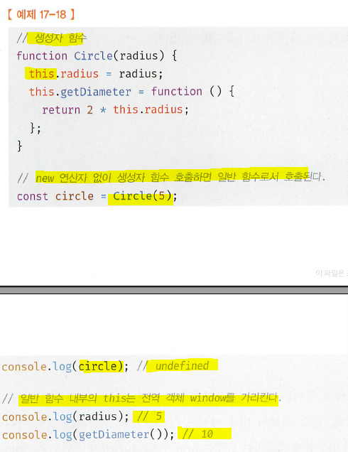

## 17.2.7 new.target

- 파스칼 케이스를 사용해도 실수는 언제나 발생(생성자 함수가 new없이 호출된다.)
- ES6는 new.target을 지원한다.
- new.target:
  - meta-property
  - this와 유사하게 constructor인 모든 함수 내부에서 암묵적인 지역 변수와 같이 사용(IE는 지원x)
  - 따라서 함수 내부에서 new.target을 사용하여 new 연산자와 생성자 함수로서 호출했는지 확인하여 그렇지 않은 경우 new 연산자와 함께 재귀 호출을 통해 생성자 함수로서 호출
  -

```js
// 생성자 함수. 파스칼 케이스 사용
function Circle(radius) {
  // 이 함수가 new 연산자와 사용되지 않았다면 new.target은 undefined이다.
  if (!new.target) {
    // new 연산자와 함께 생성자 함수를 재귀 호출하여 생성된 인스턴스를 반환
    return new Circle(radius);
  }

  this.radius = radius;
  this.getDiameter = function () {
    return 2 * this.radius;
  };
}

// new 연산자 없이 생성자 함수를 호출하여도 new.target을 통해 생성자 함수로써 호출
const circle = Circle(5);
console.log(circle.getDiameter());
```


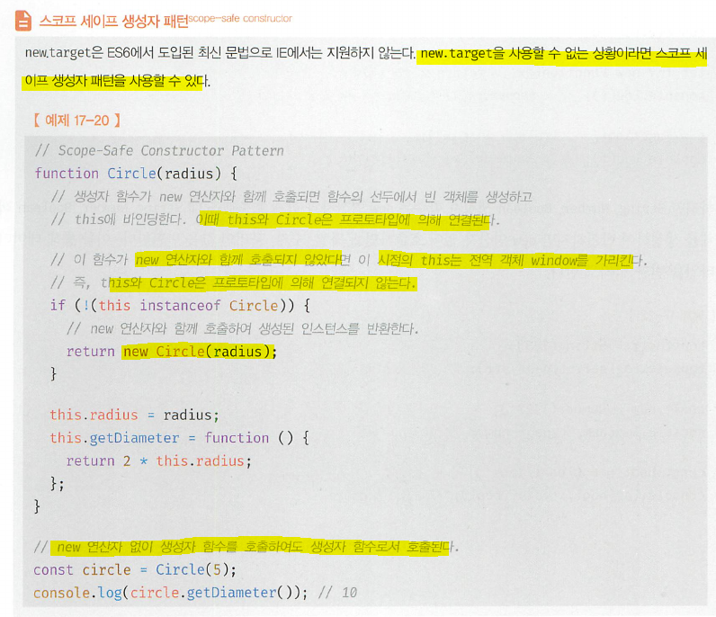

- 대부분의 빌트인 생성자 함수(Object. Strlng. Number Boolean Function. Array. Date, RegExp, Promise 등)는 new 연산자와 함께 호출되 었는지를 확인한 후 적절한 값을 반환한다.
- Object와 Function 생성자 함수: new 연산자 없이 호출해도 new 연산자와 함께 호출했을 때와 동일하게 동작  
  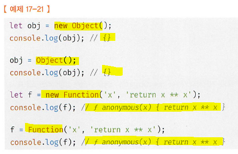

- String. Number Boolean: 이들의 생성자 함수는 new 연산자와 함께 호출했을 때 String. Number BooIean 객체를 생성하여 반환하지만 new 연산자 없이 호출하면 문자열, 숫자, 불리언 값을 반환. 이를 통해 데이터 타입을 변환하기도 한다.  
  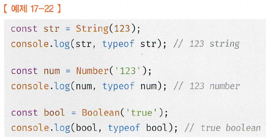
