#### [18. 함수와 일급 객체](#18-함수와-일급-객체-1)

#### [18.1 일급 객체](#181-일급-객체-1)

#### [18.2 함수 객체의 프로퍼티](#182-함수-객체의-프로퍼티-1)

#### [18.2.1 `arguments` 프로퍼티](#1821-arguments-프로퍼티-1)

#### [18.2.2 `caller` 프로퍼티](#1822-caller-프로퍼티-1)

#### [18.2.3 `length` 프로퍼티](#1823-length-프로퍼티-1)

#### [18.2.4 `name` 프로퍼티](#1824-name-프로퍼티-1)

#### [18.2.5 `__proto__` 접근자 프로퍼티](#1825-__proto__-접근자-프로퍼티-1)

#### [18.2.6 `prototype` 프로퍼티](#1826-prototype-프로퍼티-1)

## 18. 함수와 일급 객체

## 18.1 일급 객체

- 일급객체 조건
  1. 무명의 리터럴로 생성할 수 있다 즉 런타임에 생성이 가능하다
  2. 변수나 자료구조(객체, 배열 등)에 저장할 수 있다.
  3. 함수의 매개변수에 전달할 수 있다 (함수형 프로그래밍이 가능)
  4. 함수의 반환값으로 사용할 수 있다 (함수형 프로그래밍이 가능)
  - js에서는 1~4 조건을 모두 만족하므로 일급 객체
  - 함수가 일급 객체리는 것은 함수를 객체와 동일하게 시용할 수 있다는 말
  - 객체는 값이므로 함수는 값과 동일하게 취급
  - 함수는 값을 사용할 수 있는 곳
    - 변수 할당문
    - 객체의 프로퍼티 값
    - 배열의 요소
    - 함수 호출의 인수
    - 함수 반환문  
      이라면 어디서든지 리터럴로 정의 가능, 런타임에서 함수 객체로 평가
- 함수는 객체이지만 차이점
  - 일반객체는 호출 할 수 없다 vs 함수는 호출할 수 있다
  - 함수는 객체가 가지고 있지 않는 함수 고유한 프로퍼티를 가지고 있다.

## 18.2 함수 객체의 프로퍼티

- 함수는 객체이므로 함수 고유한 프로퍼티를 가지고 있다. (with condole.dir 메서드 사용)  
  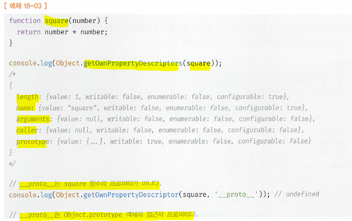
  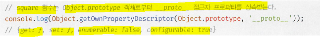
- arguments, caller, length, name, prototype 프로퍼티는 일반 객체에는 없고 함수에만 있는 함수 고유의 데이터 프로퍼티다.
- `__proto__`
  - Object.prototype 객체의 접근자 프로퍼티
  - 함수 객체 고유의 프로퍼티가 아니다
  - Object.prototype 객체의 프로퍼티를 상속받아 모든 함수객체가 사용할 수 있는 Object.prototype 객체의 접근자 프로퍼티

## 18.2.1 `arguments` 프로퍼티

- 함수 객체의 `arguments 프로퍼티 값`은 `arguments 객체`
- 함수 호출 시 전달된 인수 (argument)들의 정보를 담고 있는 순회 가능한(iterable) 유사 배열 객체
- 함수 내부에서 지역변수처럼 사용(함수 외부에서는 참조할 수 없다)
- 함수객체의 `arguments 프로퍼티`는 일부 브라우저를 제외하고는 ES3부터 표준에서 폐지. So, 함수 내부에서 지역변수처럼 사용할 수 있는 `arguments 객체`를 참조하자!
- js는 매개변수와 인수의 개수 일치를 확인하지 않음 (숫자 맞지 않아도 에러 발생 없다.) > So, 함수가 호출되면 인수 개수를 확인하고 이에 따라 함수 동작을 달리 정의할 필요도 있음 (이때 arguements 객체가 유용히 사용된다.)
- 함수의 매개변수는 지역변수와 같이 함수 호출되면 함수 몸체 내에서 암묵적으로 매개변수가 선언되고 `undefined`로 '초기화'된 이후 인수가 할당
  - 선언된 매개변수 > 인수: 할당되지 않아 `undefined`유지
  - 선언된 매개변수 < 인수: 초과된 인수는 무시 - 단, 초과된 인수가 버려지는것이 아니라 '**모든 인수는 arguments 객체의 property' 보관**된다.
    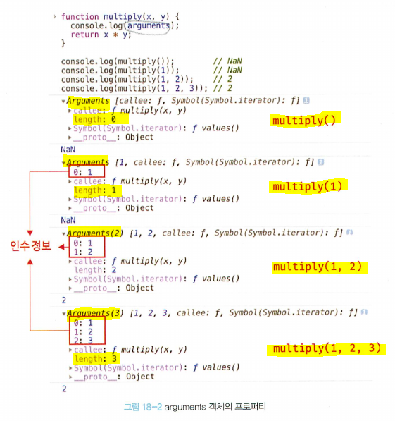
- `arguments 객체`
  - 인수를 프로퍼티 값으로 소유
  - 프로퍼티 키는 인수의 순서를 나타낸다
  - arguments 객체의 `callee 프로퍼티`는 호출되어 arguments 객체를 생성한 함수, 즉, 함수 자신을 가리킴
  - arguments 객체의 `length 프로퍼티`는 '인수의 개수'를 가리킨다.  
    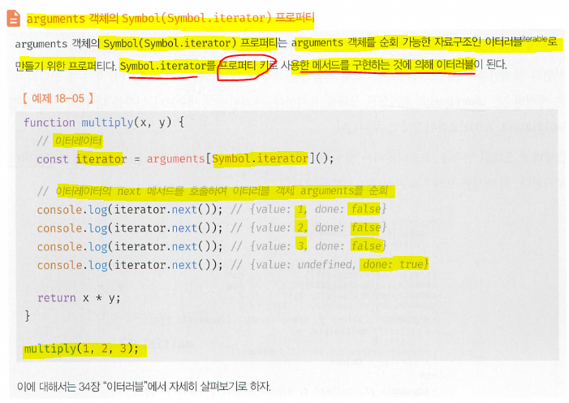
- `arguments 객체`는 매개변수 개수를 확정할 수 없는 '가변 인자 함수'를 구현할 때 유용  
  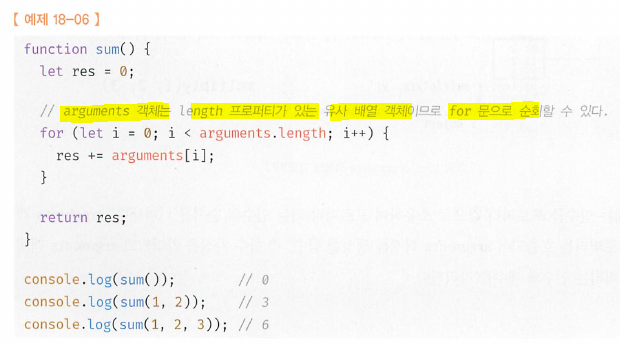
- `arguments 객체`는 배열 형태로 인자 정보를 담고 있지만 실제 배열이 아닌 유사 배열 객체 (array-like object). 유사 배열 객체란 length 프로퍼티를 가진 객체로 for 문으로 순회할 수 있는 객체를 말한다.

- 유사배열과 이터러블  
   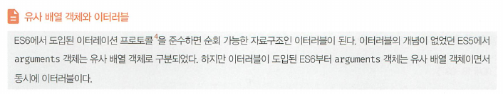
  - 유사 배열 객체는 배열이 아니므로 배열 메서드를 사용할 경우 에러가 발생한다. 따라서 배열 메서드를 사용하려면 `Function.prototype.call`, `Functlon.prototype.apply`를 사용해 간접 호출해야 하는 번거로움
  - 간접호출: 22.2.4절
  - 배열: 27장
    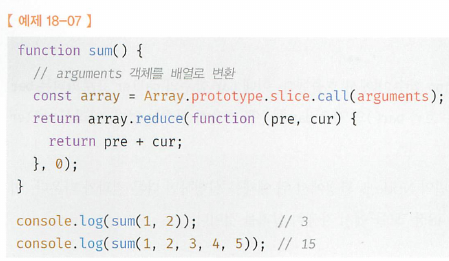
  - 이런 번거로움을 해결하고자 `rest parameter` 도입
    - `rest parameter`의 도입으로 모던 자바스크립트에서의 `arguments`객체의 중요성은 떨어졌지면 ES6를 사용하지 않을때가 있기 때문에 알아둘 필요는 있다. (`rest parameter`: 26.4절)  
      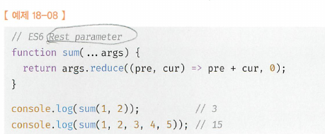

## 18.2.2 `caller` 프로퍼티

- caller 프로퍼 티는 ECMAScrlpt 사양에 포함되지 않은 비표준 프로퍼티.
- 관심없어서 지나칩니다.

## 18.2.3 `length` 프로퍼티

- 함수 객체의 length 프로퍼티
  - 함수를 정의할 때 선언한 매개변수의 개수
  - `arguments 객체`의 `length` 프로퍼티와 `함수 객체`의 `length` 프로퍼티의 값은 다를 수 있으므로 주의
  - `arguments 객체`의 `length` 프로퍼티는 'arguments의 개수'를 가리키고, `함수 객체`의 `length` 프로퍼티는 '매개변수(parameter)의 개수'를 가리킨다.  
    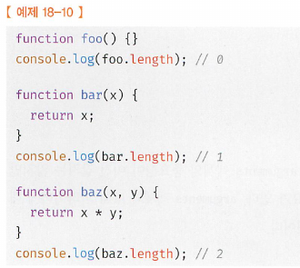

## 18.2.4 `name` 프로퍼티

- `name` 프로퍼티: 함수 객체에서 함수 이름을 나타냄
- ES6 이전까지는 비표준이었다가 ES6에서 정식 표준
- name 프로퍼티는 ES5와 ES6에서 동작을 달리하므로 주의
- 익명 함수 표현식의 경우 ES5에서 name 프로퍼티는 빈 문자열을 값으로 갖음 vs ES6에서는 함수 객체를 가리키는 식별자를 값으로 갖음  
  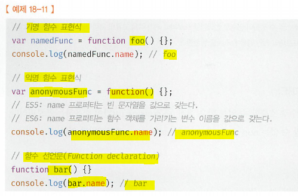

## 18.2.5 `__proto__` 접근자 프로퍼티

- `[[Prototype]]`
  - 모든 객체가 가지고 있는 `내부 슬롯`
  - 객체지향 프로그래밍의 상속을 구현하는 **프로토타입 객체**를 가리킴. (프로토타입 객체: 19장 “프로토타입")
  - `__proto__` 프로퍼티는 `[[Prototype]]` 내부슬롯이 가리키는 `프로토타입 객체`에 접근하기 위해 사용하는 `접근자 프로퍼티`
  - 내부 슬롯에는 직접 접근할 수 없고 간접적인 접근 방법을 제공하는 경우에 한하여 접근할수 있다: `[[ Prototype]]` 내부 슬롯에도 직접 접근할 수 없으며 `__proto__` 접근자 프로퍼티를 통해 간접적으로 프로토타입 객체에 접근할 수 있다.
    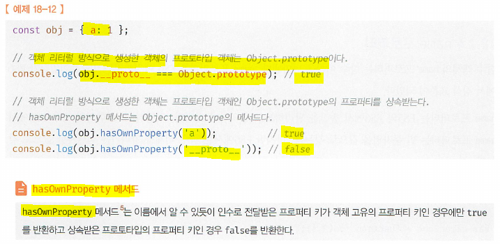

## 18.2.6 `prototype` 프로퍼티

- prototype 프로퍼티
  - 생성자 함수로 호출할 수 있는 함수객체. 즉 **constructor만**이 소유하는 프로퍼티
- 일반 객체와 생성자 함수로 호출할 수 없는 non-constuctor에는 `prototype` 프로퍼티가 없다
- 생성자 함수로 호출될 때 생성자 함수가 생성할 인스턴스의 프로토타입 객체를 가리킴
