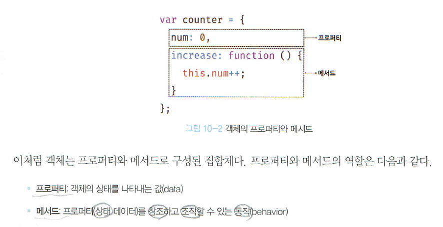
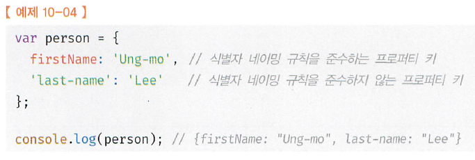
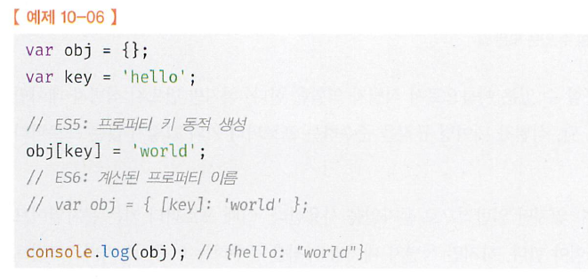

# 10. 객체 리터럴
#### [10.1 객체란?](#-101-객체란-1)
#### [10.2 객체 리터럴에 의한 객체 형성](#-102-객체-리터럴에-의한-객체-형성-1)
#### [10.3 프로퍼티](#103-프로퍼티-1)
#### [10.4 메서드](#104-메서드-1)
#### [10.5 프로퍼티 접근](#105-프로퍼티-접근-1)
#### [10.6 프로퍼티 값 갱신](#106-프로퍼티-값-갱신-1)
#### [10.7 프로퍼티 동적생성](#107-프로퍼티-동적생성-1)
#### [10.8 프로퍼티 삭제](#108-프로퍼티-삭제-1)
#### [10.9 ES6에서 추가된 객체 리터럴의 확장 기능](#109-es6에서-추가된-객체-리터럴의-확장-기능-1)
#### [10.9.1 프로퍼티 축약표현](#1091-프로퍼티-축약표현-1)
#### [10.9.2 계산된 프로퍼티 이름](#1092-계산된-프로퍼티-이름-1)
#### [10.9.3 메서드 축약 표현](#1093-메서드-축약-표현-1)
<hr>

## 10.1 객체란?
1. 원시값을 제외한 나머지값(함수, 배열, 정규표현식)은 모두 객체다.
2. 객체타입은 다양한 타입의 값(원시값 또는 다른 객체)을 하나의 단위로 구성한 복합적인 자료구조(data structure) vs 원시타입의 값은 단 하나의 값
3. 객체(객체타입의 값)은 mutable vs 원시타입의 값은 immutable (11장)
4. 객체는 0개 이상의 property로 구성된 집합(key-value)
   1. 자바스크립트에서 사용하는 모든값은 property로 사용할 수 있다.
   2. 함수도 일급 객체이므로 값으로 취급할 수 있으니 property로 쓸 수 있다. (property로 함수가 쓰이면 구분을 위해 method로 부른다.)  
   3. 
  1. 명시적 타입변환 explicit coercion or type casting
  2. 암묵적 타입변환 implicit coercion 또는 type coercion(타입 강제 변환: 의도와는 상관없이 표현식을 평가하는 도중에 js engine에 의해서 암묵적 타입이 자동으로 변환
     * 명시적 타입변환  

     * 암묵적 타입변환  
  
  3. 두개의 타입변환 모두 기존 원시 값을 직접 변경하는것이 아니라 타입이 변환된 새로운 값을 return하는것이다. - 재할당 되는것이 아니다. 평가가 끝나면 아무도 참조하지 않으므로 가비지콜렉터에 의해서 해제됨. (immutable value)
  4. 꼭 명시적만 해야하는것은 것은 아님. 가독성측면서 암묵적 형변환이 더 나을수도 있다.  
## 10.2 객체 리터럴에 의한 객체 형성
- 객체의 생성: 객체 리터럴
  - Java, C++같은 클래스 기반 객체: new constructor()
  - JS 프로토타입 기반 객체지향 언어
    - 객체 리터럴
    - Object 생성자 함수
    - 생성자 함수
    - Object.create()
    - Class(ES6)
  - 리터럴: 사람이 이해할 수 있는 문자 또는 약속된 기호를 사용하여 값을 생성하는 표기법(5.2)
  - 객체리터럴: `{...}`내에 0개 이상의 프로퍼티를 정의. 변수에 할당되는 시점에 자바스크립트 엔진은 객체 리터럴을 해석해서 객체 생성
    - 객체 리터럴 중괄호는`{...}`는 코드 블럭을 의미하지 않는다. 하지만 객체 리터럴은 값으로 평가되는 표현식. > 세미콜론을 붙임
    - 객체리터럴은 유연함과 강력함을 대표하는 객체생성방식(new가 필요없다.) > 그냥 숫자값이나 문자열을 만드는것과 유사하게 만들 수 있고, 만든 후 프로퍼티를 동적으로 추가 가능
    - 객체 리터럴 이외의 모든 생성 방식은 모두 함수 객체를 이용해서 객체 생성
## 10.3 프로퍼티
  - 객체는 프로퍼티의 집합이며, 프로퍼티는 키와 값으로 구성
  - 프로퍼티를 나열할때는 쉼표(,), 마지막 프로퍼티 뒤에 쉼표를 사용하지 않으나 사용해도 된다.
  - 프로퍼티 키와 값의 사용범위
    - key: 빈 문자열을 포함하는 모든 문자열 또는 심볼 값
      - 식별자 역할
      - 일반적으로는 문자열을 key로. (심볼도 사용할 수는 있다.) > 따옴표로 묶는다.
      - 식별자 네이밍 규칙을 따르지 않는 이름에는 반드시 따옴표 붙인다.  
    
  firstName은 식별자 네이밍 규칙 준수로 인해 `''` 생략가능, last-name은 식별자 네이밍 규칙 준수를 않해서 `''` 생략불가
      - 문자열 또는 문자열로 평가할 수 있는 표현식을 사용해 property key를 동적으로 생성할 수 있으며 있대는 표현식을 대괄호`[]`로 묶는다.  
  
  c.f. 빈 문자열을 프로퍼티 키로 사용해도 에러가 나지는 않으나, 키로서 의미를 갖지 못하므로 비권장  
  c.f. key에 문자열이나 심벌 값 외에 값을 사용하면 암묵적 타입 변환을 통해 문자열이 된다.
  c.f. var, function같은 예약어를 key로 잡아도 되지만 예상치 못한 에러가 발생되므로 비추
  c.f. property 중복 key를 선언하면 나중에 선언한 property가 먼저 선언한 property를 덮어쓴다.
  ```js  
  var foo = {
    '':'', // ''를 key로 잡을 수 있다.
    0:1, // 문자열로 인식
    1:2, //
    var: '', // 예약어 ok
    function: '',
    name: 'Peter',
    name: 'Marc' // Marc가 나온다 단, strict mode에서 에러
  }
  ```  
    - property: 자바스크립트에서 사용할 수 있는 모든 값
## 10.4 메서드
- JS에서 함수는 1급 객체 > 값으로 취급 가능
- JS에서 값으로 취급할 수 있는 모든 값 > property 값으로 사용 가능
## 10.5 프로퍼티 접근
- property의 key가 naming 규칙 준수 시 > 접근 방법 두가지 모두 사용 가능하다.
  - 마침표 표기법(dot notation)
  - 대괄호 표기법(bracket notation)
```js
var person = {
  name: 'Peter', // 마지막 property에 ,를 써도 된다.
  'last-name': 'Jacobs',
  1: 10,
}
// dot notation
console.log(person.name);
// bracket notation
console.log(person['name']); //bracket notation에서는 반드시 ''를 써줘야한다.
console.log(person[name]); // ReferenceError: name is not defined > bracket 방식에서 ''안쓰면 식별자로 해석한다.
console.log(person.age); // undefined 객체에 존재하지 않는 property에 접근하면 `undefined`
person.'last-name'; // syntaxError: Unexpected string
person.last-name; // 브라우저 환경: NaN, Node.js환경: ReferenceError: name is not defined
person['last-name']; // Jacobs 제대로 나옴

// 프로퍼티 키가 숫자로 이뤄진 경우 문자열인 경우 따옴표 생략가능
// 반드시 bracket notation 써야한다.
person.1; // SyntaxError: Unexpected number
person.'1'; // SyntaxError: Unexpected string
person[1]; // 10: person[1] > person['1']
person['1']; // 10
```
  ## 10.6 프로퍼티 값 갱신
  - 이미 존재하는 프로퍼티에 값을 할당하면 프로퍼티 값이 갱신
  ```js
  var person = {
    name: 'Peter',
  }

  person.name = 'Jack';
  console.log(person); // {name:'Jack'}
  ```
  ## 10.7 프로퍼티 동적생성
  - 존재하는 프로퍼티에 값을 할당하면 프로퍼티가 동적으로 생성, 값이 할당된다.
  
  ## 10.8 프로퍼티 삭제
  - delete 연산자는 객체의 프로퍼티를 삭제한다.
  - delete 연산자의 피연산자는 프로퍼티 값에 접근할 수 있는 표현식이어야한다.
  - 존재하지 않는 프로퍼티를 삭제하면 에러없이 삭제
  ```js
  var person = {
    name: 'Peter',
  }

  person.age = 20;
  console.log(person); // {name:'Peter', age:20}

  delete person.age; // property age 삭제
  delete person.address; // 존재하지 않는 property라서 삭제 불가(에러는 발생하지 않는다)
  ```
  ## 10.9 ES6에서 추가된 객체 리터럴의 확장 기능
  ### 10.9.1 프로퍼티 축약표현
  - ES6에서는 프로퍼티의 값으로 사용되는 변수의 이름과 키값이 동일한경우 프로퍼티 키를 생략할 수 있다.
  ```js
  let x = 1, y = 2;
  const obj = {x, y};

  console.log(obj);
  ### 10.9.2 계산된 프로퍼티 이름
  - 문자열 또는 문자열로 타입 변환할 수 있는 값으로 평가된 표현식을 사용해 프로퍼티 키를 동적으로 생성 할 수도 있다. 단, 프로퍼티 키로 사용할 표현식을 대괄호([...])로 묶어야한다.
  ```
  - ES6에서는 객체 리터럴 내부에서도 계산된 프로퍼티 이름으로 프로퍼티 키를 동적으로 생성가능(ES5에서는 외부에서 가능)

```js
const prefix = 'prop';
let i = 0;

// ES6에서는 obj내부에서 해도 된다. ES5에서는 obj외부에서 했어야함
const obj = {  
  [`${prefix}-${++i}`]: i,
  [`${prefix}-${++i}`]: i,
  [`${prefix}-${++i}`]: i
}
```

### 10.9.3 메서드 축약 표현
- ES6에서 메서드를 정의할때 function 키워드를 생략한 축약표현을 사용할 수 있다.

```js
console.log(obj); // {prop-1: 1, prop-2: 2, prop-3: 3}  
const obj = {  
  name: 'Peter',
  // ES6: function 키워드 생략
  sayHi(){
    console.log('Hi!' + this.name);
  },

  // ES5: property 값으로 함수를 할당해야했어
  sayHi: function(){
    console.log('Hi!' + this.name);
  }

}
```