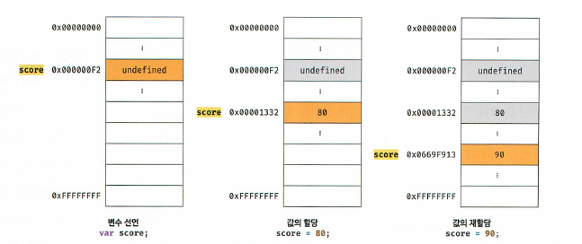
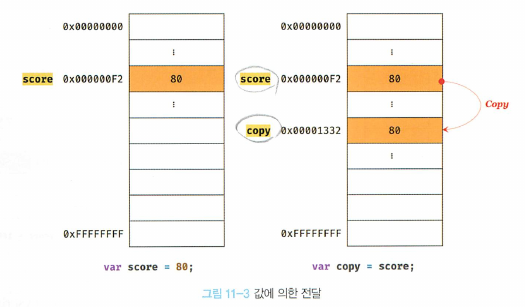
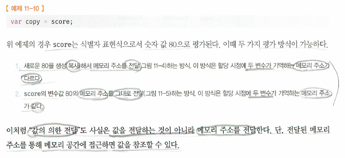
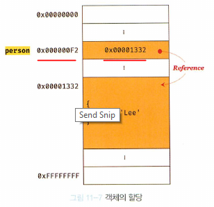
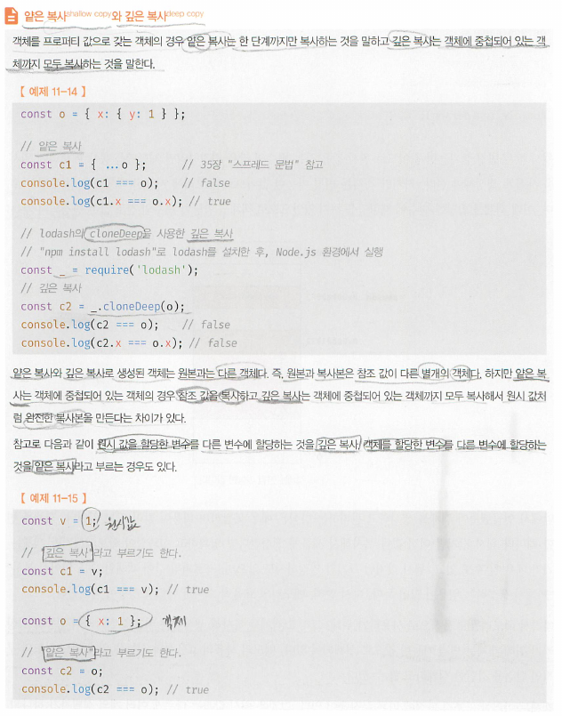

# 11. 원시 값과 객체의 비교
#### [11.1 원시값](#111-원시값-1)
#### [11.1.1 변경 불가능한 값](#1111-변경-불가능한-값-1)
#### [11.1.2 문자열과 불변성](#1112-문자열과-불변성-1)
#### [11.1.3 값에의한 전달](#1113-값에의한-전달-1)
#### [11.2 객체](#112-객체-1)
#### [11.2.1 변경 가능한 값](#1121-변경-가능한-값-1)
#### [11.2.2 참조에 의한 전달 (여러개의 식별자가 하나의 객체를 공유)](#1122-참조에-의한-전달-여러개의-식별자가-하나의-객체를-공유-1)
<hr>

## Intro
- JS의 7가지 데이터타입
  - 숫자, 문자, 불리언, null, undefined, symbol, 객체
  - primative type // object(reference) type 으로 나뉜다.
  - 차이점 1: primitive = immutable, obj = mutable
  - 차이점 2: primative = 메모리 공간에 실제값이 저장, obj = 메모리 공간에 참조값
  - 차이점 3: primive = pass by value, obj = pass by reference
  
## 11.1 원시값
## 11.1.1 변경 불가능한 값
- 원시타입값은..
   1. immutable, 한번 생성되면 읽기 전용(read only)
   2. immutable이란 말은 생성된 값이 불변. 값이 할당되는 변수가 불변이라는 말이 아님
   c.f. 상수: 변수이긴 하지만 재할당 금지, 변수: 재할당 가능
   c.f. 상수가 재할당이 불가능한것은 primitive type, 상수에 할당한 obj는 변경할 수 있다.
   ```js
   const = {};
   o.a = 1;
   console.log(o); // {a:1}
   ```
   1. 변수에 새로운 값을 할당하면(primitive type value), 값이 바뀌는게 아니라 새로운 공간에 새로운 값을 넣고 해당변수가 새로 생긴 공간으로 재 참조를 하게된다.
   

## 11.1.2 문자열과 불변성
- 숫자는 1도, 1000000도 동일한 8바이트가 필요
- 문자는 0개 이상의 문자로 이뤄진 집합을 말하며, 1개의 문자는 2바이트의 메모리 공간에 저장
```js
var str1 = ''; // 0개의 문자열
var str2 = 'Hello'; // 5개의 문자열
```
- 문자열: 유사배열객체, 이터러블
  - 유사배열객체: 마치 배열처럼 인덱스로 프로퍼티 값에 접근할 수 있고, length property를 가지고 있는 객체
  - **<u>문자열은 primitive type이지만, 유사배열객체</u>** : 원시값을 객체처럼 사용하면 원시값을 감싸는 래퍼객체로 자동 변환된다.(21.3)
  ```js
  var str = 'string';

  console.log(str[3]); // i
  console.log(str.length); //6, str은 유사배열객체처럼 length property를 가짐
  console.log(str.toUpperCase()); STRING
  str[0] = 'S';
  console.log(str) //string 바뀌지 않는다. read only!
  ```

## 11.1.3 값에의한 전달
- 변수에 변수를 할당했을때?
  - 변수에(target) 변수가(source)가 할당될때 원리
  - target 변수에 source 변수의 값이 copy되어 전달된다. (값에 의한 전달)
  - 다른 메모리 공간에 저장된 별개의 값  

  - 식별자는 메모리 주소에 붙인 이름이라고 할 수 있다.
```js
var x = 10; // 할당연산자는 10이 저장된 메모리 공간의 주소를 변수 x에 전달한다.
```

- 위의 어떤 방식으로 되던, 중요한것은 결국 두 변수의 원시 값은 서로 다른 메모리 공간에 저장된 별개의 값이 되어, 어느 한쪽의 변수에서 재할당을 통해 값을 변경해도 서로 영향을 주지 않는다는것.

## 11.2 객체
- 객체
  - 프로퍼티의 개수가 정해져있지 않다.
  - 동적으로 추가 삭제 가능하다
  - 프로퍼티 값에도 제약이 없다 (원시값처럼 사전에 확보해야할 공간의 크기를 정해둘 수 없다)

## 11.2.1 변경 가능한 값
- 객체(참조) 타입의 값은 변경 가능한 값이다.(mutable)
- 객체를 할당한 변수의 메모리 공간에는 참조값이 들어가있다. (primitive type 변수는 해당 변수 공간 자체에 primitive type value가 그대로 들어가 있음)  

- primitive type value와 같이(immutable) 재할당 할 필요없이, mutable이기 때문에 객체를 직접 변경이 가능함. 동적 추가, 갱신, 삭제 가능
- 객체 변수 값(reference value)는 객체를 변경해도 재할당이 필요 없으므로 reference(참조값)는 변하지 않는다.
- 객체를 생성하고 관리하는 방식은 매우 복잡하고 비용이 많이 듦. 객체는 프로퍼티로 객체도 가능하기때문에 매우 balky할 수 있어서 primitive처럼 변경할때마다 새로생성 및 재할당하면 매모리 효율이 극히 나빠질 수 있어서 곧장 수정이 가능하게 함.
- **<u>so, primitive와는 달리 여러개의 식별자가 하나의 객체를 공유할 수 있다</u>**
- 얕은 복사와 깊은 복사


## 11.2.2 참조에 의한 전달 (여러개의 식별자가 하나의 객체를 공유)
- primitive의 복사는 값복사
- obj의 복사는 참조값 복사 > 복사를 하면 서로 다른 변수는 다른 주소에 존재하더라도, 그 안의 참조값은 같기 때문에 같은 obj를 가르킨다.
- 값복사 vs 참조값복사
  - 식별자가 기억하는 메모리 공간에 저장되어 있는 값을 복사해서 전달(공통점)
  - 해당 메모리 공간에 'primitive'값이 존재하는지, reference 값이 존재하는지가 차이.