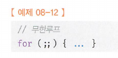

# 08장 제어문

#### [8.1. 블록문](#8-1-블록문-1)
#### [8.2. 조건문](#82-조건문)
#### [8.3. 반복문](#83-반복문)
#### [8.4. break문](#84-break문)
#### [8.5. continue문](#85-continue문)

<hr>

## 8.1. 블록문
- { }: 블록문(block statement)
- 제어문
  ```
  if( ){
    var a = 1;
  } 
  ```
- 반복문
  ```
  for( ){ 
    var b = 1;
  } 
  ```
- 함수 선언문
  ```
  function( ) {
    var a = '1';
  } 
  ``` 
- statement의 끝은 세미콜론을 붙이는게 일반적이지만, { }는 자체 종결의미가 있어서 세미콜론 x
## 8.2. 조건문
- js는 두가지 조건문 제공
  + if...else, switch
### 8.2.1. if...else
- if...else는 삼항연산자로 바꾸어 쓸 수 있다. (값을 할당할때는 삼항연산자쓰자)
- if...else의 3가지 case
  + **if**
  + **if else**
  + **if...else if...else**
### 8.2.2. switch문
- 주어진 표현식을 평가, 그 값과 일치하는 표현식을 갖는 case문으로 실행 흐름을 옮긴다.
```js
switch(표현식){
	case(표현식):
		ㅇㅇㅇ;
	break;
	
case(표현식):
		ㅇㅇㅇ;
	break;
}
```
~~귀차니즘으로 그냥 ㅇㅇㅇ 써본거에요~~
- if...else는 조건식이 boolean값으로 vs switch문은 표현식이 boolean값보다 숫자나 문자열인 경우가 많음
- 반드시 실행시키는 문장 뒤에 ‘break’를 써야한다. 그렇지 않으면 끝까지 실행(fall through). 하지만, fall through를 유용하게 사용할수도 있다.
- switch는 case, default, break등 다양한 키워드를 사용해야하고, 문법도 복잡하지만, 너무 조건이 많아 if else의 가독성이 떨어지면 switch를 사용하자.
## 8.3. 반복문
- 조건식의 평가결과가 참이면 코드블록을 실행
- 실행 후, 조건식을 재평가, 참이면 계속 실행
- 기본 제공문
  + for
  + while
  + do...while
- 대체문
  + forEach: 배열
  + for...in: 객체 프로퍼티 열거시
  + for...of: 이터러블을 순회 할 수 있음.
### 8.3.1. for 문
- 반복횟수가 명확할때
- 선언문, 조건문, 증감식 모두 옵션이라서 반드시 사용할 필요 x.  
  단, 어떤 식도 선언하지 않으면 무한루프됨.  
   
### 8.3.2. while 문
- 반복횟수가 불명확할때
```
while (count < 3) { 
  console.log(count); 
  count++;
  } //3보다 작을때까지 계속 돌림
  ```
- 탈출
  - if문으로 탈출조건 만들고, break문으로 코드블록 탈출
### 8.3.3. do...while문
- 먼저 한번 실행하고, 조건식 평가.
- 무조건 한번은 실행이 된다.
## 8.4. break문
- 코드블록을 탈출한다!
- 좀 더 정확히, label문, 반복문, switch문의 코드블럭{ }을 탈출한다!
- 중첩 for문의 내부 for문에서 break를 실행하면 내부 for문 탈출 >> 외부 for문 진입
- 외부 for 문을 탈출하려면 label문을 사용하자!
- label문은 중첩for문의 외부 for문의 탈출을 위해서 용이하지만 일반적으로 추천되지 않음(흐름도 나빠지고, 가독성도 나빠진다)
- label 사용하기 참고 블로그
  Click [here](https://ojava.tistory.com/163)
## 8.5. continue문
- continue문은 반복문의 코드블럭 실행을 현 시점에서 중단하고, 반복문의 증감식으로 실행 흐름을 이동시킨다. break문처럼 반복문을 탈출하지 않는다.
- 즉, continue문이 실행되면 continue 키워드 그 위치에서 곧장>> 평가식으로 이동한다.