# 9. 타입 변환과 단축평가
#### [ 9.1 타입 변환이란?](#-91-타입-변환이란-1)
#### [ 9.2 암묵적 타입변환](#-92-암묵적-타입변환-1)
#### [ 9.3 명시적 타입변환](#-93-명시적-타입변환-1)
#### [ 9.4 단축평가](#-94-단축평가-1)
<hr>

## 9.1 타입 변환이란?
- 자바스크립트의 모든 값은 타입이 있다.  
  1. 명시적 타입변환 explicit coercion or type casting
  2. 암묵적 타입변환 implicit coercion 또는 type coercion(타입 강제 변환: 의도와는 상관없이 표현식을 평가하는 도중에 js engine에 의해서 암묵적 타입이 자동으로 변환
     * 명시적 타입변환  
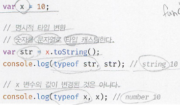
     * 암묵적 타입변환  
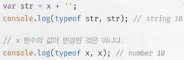  
  3. 두개의 타입변환 모두 기존 원시 값을 직접 변경하는것이 아니라 타입이 변환된 새로운 값을 return하는것이다. - 재할당 되는것이 아니다. 평가가 끝나면 아무도 참조하지 않으므로 가비지콜렉터에 의해서 해제됨. (immutable value)
  4. 꼭 명시적만 해야하는것은 것은 아님. 가독성측면서 암묵적 형변환이 더 나을수도 있다.  
## 9.2 암묵적 타입변환
### 9.2.1 문자열 타입으로 변환
- js engine이 표현식을 평가할때 코드 문맥에 부합하도록 암묵적 타입 변환을 실행
  ```js  
  1 + '2' // '12' 가된다.
  ```
  ```js  
  // ES6에서 도입된 template literal
  `1 + 1 = ${1 + 1}` // 2' 가된다.
  ```
- 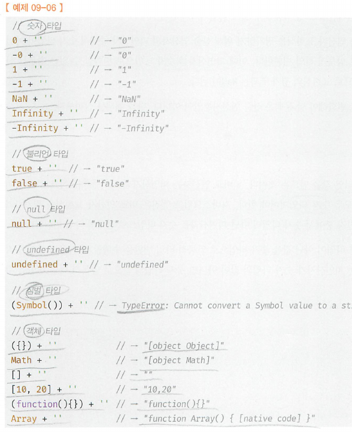 

### 9.2.2 숫자타입으로 변환
- **+을 제외한 산술연산자** **(이항연산자 +는 피연산자가 문자열이면 concat기능)**  
  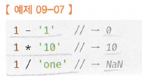  
  피연산자를 숫자로 평가할 수 없으면 `NaN`이 뜬다.
- **비교연산자**도 문맥상 숫자타입 이어야 한다.
- **`+` 단항연산자**  
  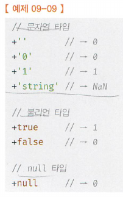
  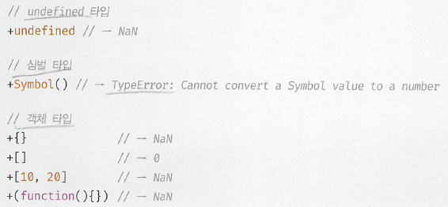
### 9.2.3 boolean타입으로 변환
- js engine은 boolean 타입이 아닌 값을 truthy 값 또는 falsy 값으로 구분
- **falsy(나머지는 모두 truthy)** 
  - `false`
  - `undefined`
  - `null`
  - `0, -0`
  - `NaN`
  - `'' //빈 문자열`
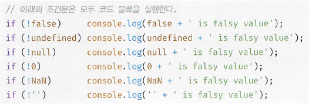
## 9.3 명시적 타입 변환
- 방법에 따라서 다양
  - 표준 빌트인 생성자 함수(String, Number, Boolean)를 new 연산자 없이 호출
  - 빌트인 method를 호출하는 방법
  - 암묵적 타입변환을 이용하는 방법 ([ 9.2 암묵적 타입변환](#-92-암묵적-타입변환-1))
### 9.3.1 문자열 타입으로 변환
1. String 생성자 함수를 new 연산자 없이 호출
2. `Object.prototype.toString()` 호출
3. 문자열 연결 연산자를 이용하는 방법
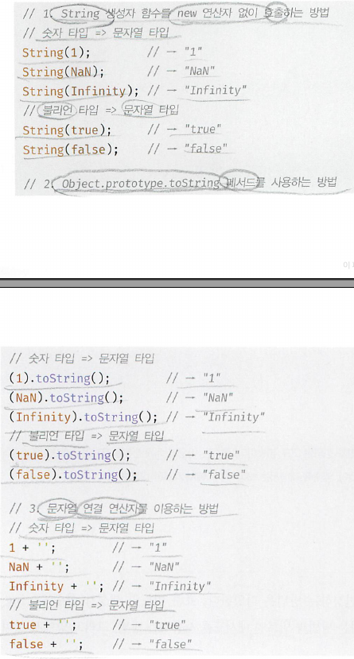
### 9.3.2 숫자 타입으로 변환
1. Number 생성자 함수를 new 연산자 없이 호출
2. `parseInt()`, `parseFloat()` 호출 **(<u>이 함수들로는 오직 문자열만 >> 숫자타입 으로 가능</u>)**
3. 문자열 연결 연산자를 이용하는 방법
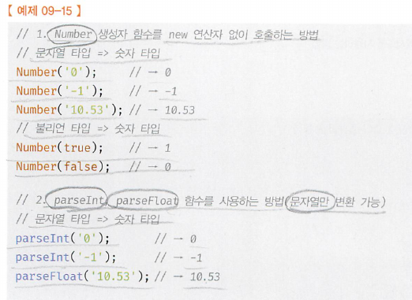
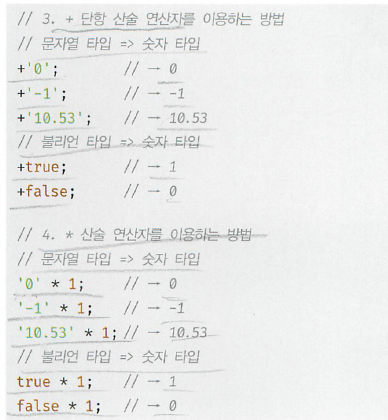
### 9.3.3 불리언 타입으로 변환
1. Boolean 생성자 함수를 new 연산자 없이 호출
2. !부정논리 연산자를 두번 사용하는 방법
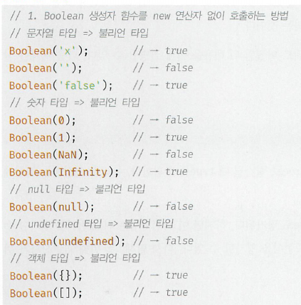
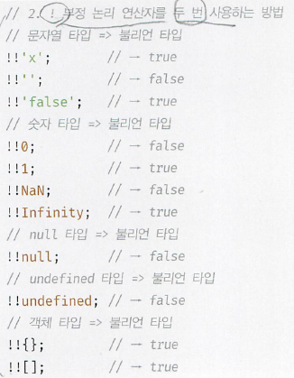
## 9.4 단축평가
- **(7.5 논리연산자 확인)**
### 9.4.1 논리연산자를 사용한 단축평가
- short-circuit evaluation: 논리 연산의 결과를 결정하는 피연산자를 타입 변환하지 않고 그대로 반환한다.
- `||` 또는 `&&` 연산자 표현식의 평가 결과는 boolean값이 아닐 수 있다. `||` 또는 `&&` 연산자 표현식은 언제나 2개의 피연산자 중 어느 한쪽으로 평가된다.  
  ```
  'Cat' && 'Dog' // 'Dog' return
  'Cat' || 'Dog' // 'Cat' return
  ```
  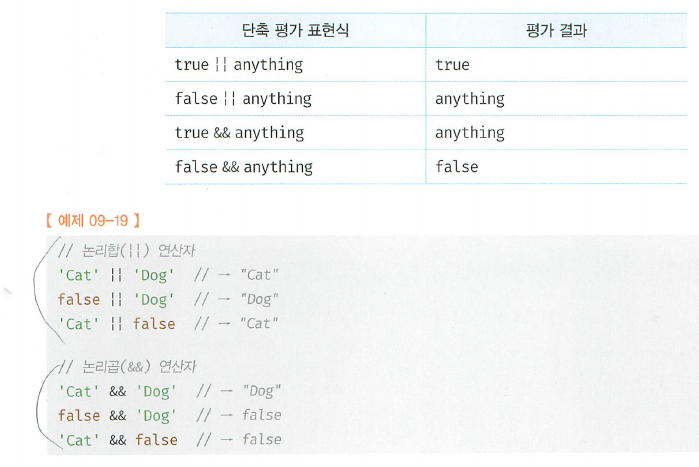
- if문의 대체가 가능하다
  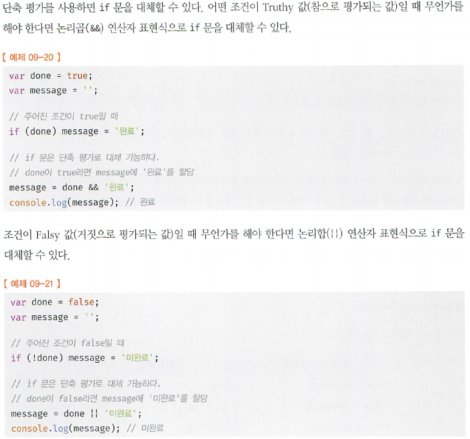
- 단축평가가 유용하게 쓰이는 case 3가지
  - 객체를 가르키기를 기대하는 변수가 `null`또는 `undefined`가 아닌지 확인하고 프로퍼티를 참조할때 **(에러발생 안시킴)**
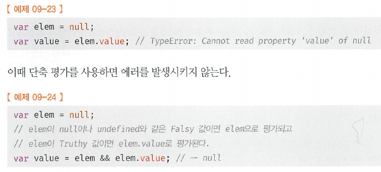
  - 함수 매개변수에 기본값을 설정할 때 (`undefined`방지가능)
  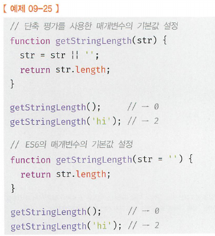
### 9.4.2 옵셔널 체이닝 연산자
- **ES11에서 도입**된 optional chaining 연산자 `?.`는 좌항의 피연산자가 <u>**오직 `null` 또는 `undefined`인 경우 `undefined`를 반환**</u>, 그렇지 않으면 우항의 property를 참조 - 하지만, `null` 또는 `undefined`가 아니면 우항의 프로퍼티 참조를 이어감!!!  
(`?.`도입되기 이전에는 `&&`, `||`를 이용한 단축평가를 사용했음)  
(optinal chaining)
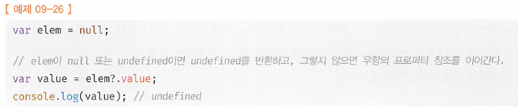
(이전)
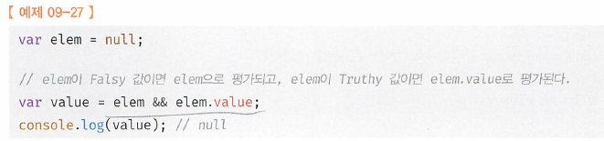 
(`undefined`또는 `null`이 아닌경우)
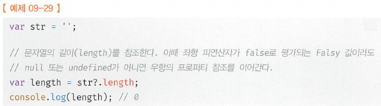
### 9.4.3 null 병합 연산자
- **ES11에서 도입**된 null병합 연산자 `??`는 좌항의 피연산자가 <u>**오직 `null` 또는 `undefined`인 경우**</u> 우항의 피연산자를 반환, 그렇지 않으면 좌항의 피연산자를 반환. null병합 연산자는 변수에 기본값을 설정할때 유용하다.
- null병합 연산자 이전에는 `||`를 통한 단축평가를 이용해서 해결했지만, `''` 또는 `0`같은 falsy값이 기본값으로 유용하다면 초난감  
(`||`의 단축평가를 이용한 변수의 기본값 설정)
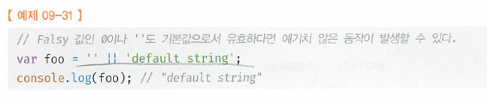
(null 병합 연산자를 이용한 변수의 기본값 설정)
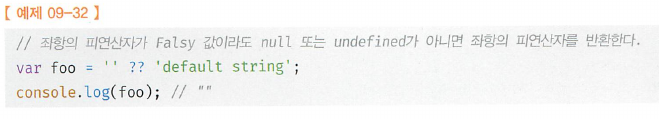


